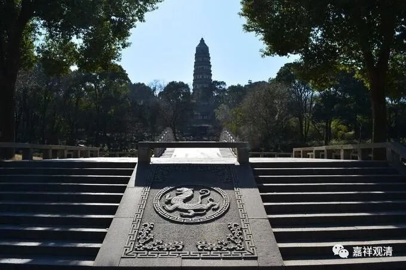

**《微课中观史》43·3
**

前面我们也讲了，鸠摩罗什法师翻译了很多的经典、很多的文献，其实他说过《成实论》是小乘的，不是大乘的，是属于经部系统的，是小乘的空宗。他自己这样讲过的，是有文字记载的。但是很多人在学习的时候呢，没有关注到这一点，这有几方面的原因。

首先就是我经常会提到的一个问题：大乘佛教缺乏阿毗达磨。或者说，在那个时代的大乘佛教的阿毗达磨是欠缺的，大家能够得到的都是小乘的阿毗达磨。当时曾经流行的是什么呢？比较流行的是有部的阿毗达磨——毗昙。当时一提到毗昙师，基本上就是指的有部。其实毗昙——阿毗达摩——是每个佛教宗派都有的。（同样，汉地喜欢管唯识宗叫“法相宗”，这里的“法相”类似于名词，其实，法相、阿毗达摩只是唯识比较强一点，每个宗派也都有各自的法相。）

在汉地也好，在藏地也好，在印度也好，好像有一个近似于“传统”的“习惯”背景，就是好像有部就等于小乘或者等于声闻乘的这样一种观点。所以，一旦出现了批评有部的另外一种阿毗达磨或者一个流派，大家就自然而然地认为这个似乎就是大乘了。恰巧《成实论》正好是批评有部的，所以自然有人把它当成了大乘。

那么，《成实论》又是一部什么样的论著呢？《成实论》是一部经部的阿毗达磨性质的著作，是经部宗的辞典性的著作。更精确点说，是初期经部师的《阿毗达摩》类的作品。

而比较完善的大乘的辞典性的著作，要到后来的真谛法师和玄奘法师那个时代才出现比较完整的翻译。可能之前也有，即使有的话也比较少。在大乘的阿毗达磨还没有翻译过来的时候，大家需要了解佛教的名词，而当时鸠摩罗什法师是大家一致公认的一位很重要的大乘法师，于是就会出现把他所翻译的经典《成实论》当作是大乘的论典。

另外还有一个原因，是什么呢？就是当时佛教界流行的“话题”，或者说流行的方向，已经发生了变化。我们讲过，在《中观论》被翻译过来之前，中国佛教所流行的方向主要是般若学，对吧？鸠摩罗什法师来了以后，翻译了几部经典，其中比较重要的或者说比较受到大家重视的一部经典就是《法华经》，对中国佛教后来的发展产生了很重要的影响。

