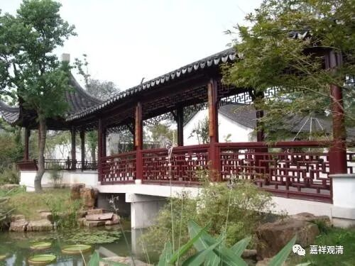

**《微课中观史》46·2**

我们再看，三论师承当中比较重要的吉藏大师，他的老师又是谁呢？是兴皇法朗法师，三论宗的重要人物。如果以传记来看，法朗禅师或者法朗法师在摄山系统里面的地位要比慧布大师低一点。僧诠法师的门下，慧布法师应该算是第一位的，当时被称为“得意布”，意思就是他得到了最根本的内容。兴皇法朗法师被称为“四句朗”，可能是“四句”说得比较多，兴皇是他长居的寺院的名字。僧诠大师门下，慧布第一，法朗其次。

兴皇法朗禅师门下** 最有名**的当然是吉藏大师，但是兴皇法朗禅师在圆寂之前却把他的领众的位置交给了谁呢？交给了旻法师，或者称为小明法师。据考证，旻法师就是后来的茅山明法师。在当时法朗法师的僧团当中，明法师是名不见经传的人物，是不怎么起眼的。兴皇法朗法师在圆寂之前，大家就问他：“您圆寂之后，您的僧团由谁来带呢？”兴皇法朗法师居然指向了后来被称为茅山明法师的小明法师，大家都觉得很诧异：“居然是他？！”没想到交给了这么默默无闻的一个人。

后来茅山明法师又把大家带回了山林。我们说摄山宗或者三论宗的僧诠法师、慧布法师这一系，包括再往前的辽东道朗禅师，都是在摄山——就是栖霞山，在山里面讲学、禅修比较多。兴皇法朗法师则去到城市里面讲经、破他显正，而他的弟子，或者说晚年最重要的弟子，又把僧团带回了山里。带回了哪里呢？茅山，就是在摄山的东边，在镇江。我专门去考察了一下这个地方，茅山就是我们现在说的茅山道士的那个茅山，这个地方以前曾经有很多很多的寺院，不过现在已经没有寺院了。

茅山明法师又有哪些比较出名的弟子呢？其中之一就是我们在禅宗故事中经常听到的牛头法融禅师。我去过当地，就发现牛头法融禅师的故乡是在镇江的延陵，就是润州的延陵。延陵究竟在什么地方呢？到当地一看就明白了，延陵就在茅山脚下，所以牛头法融禅师就是在山里跟随三论系的茅山明法师学习的。后来牛头法融禅师又去了什么地方弘化呢？他又去到现在的牛头山一带。最近南京有一个比较大的工程，准备开发牛头山，好像已经有好几个亿砸进去了，还有什么舍利子等等。

牛头山最有名的就是这位牛头法融法师，禅宗是把他放在四祖——道信禅师别开的宗门里面，作为别开的一个旁支。实际上他是属于三论宗的禅师系统，是属于中观禅的。他的家在南京的东边，后来他弘化，也就是以禅修的方式带众的地方在哪里呢？就是在南京南面的牛头山。现在好像马上要开放了，那里建造了一个很大很大的佛教主题公园。

