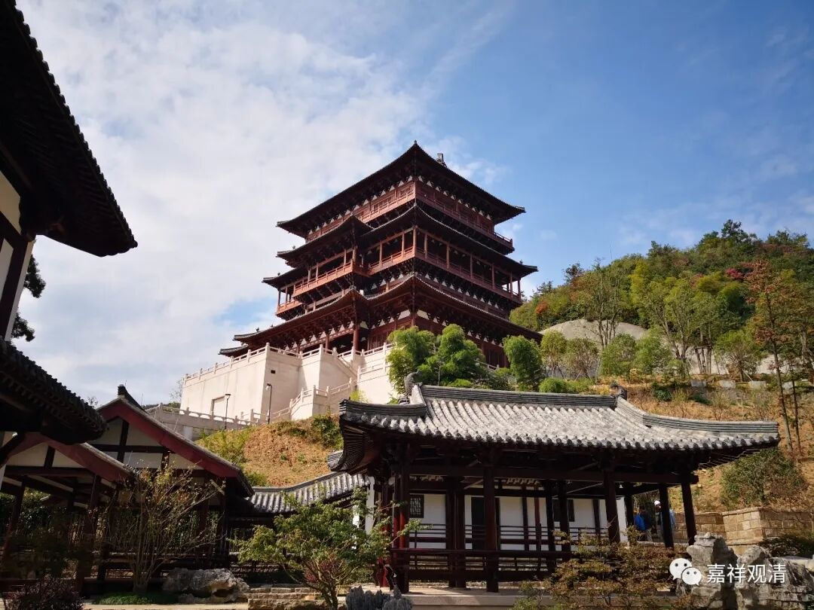

**《微课中观史》46·3**

我们由此可知，三论这一系和观行、观修的关系是非常深厚的，不是像我们一般所以为的仅仅是钻研学术和学问的流派。我刚才一个一个地点名了，僧诠、慧布、保恭、明法师、法融，这一系的主流都是往修行上去靠的。我们也可以看中观派的很多早期的经典，比如《四百论》，很明显的，它实际上就是《瑜伽行四百论》，它的名字也是这样的。《中观论》，这个“观”字在三论的一些注疏当中就说是观察、修观的意思。所以三论师的系统中出现了很多有名的禅师——这里的“禅师”的意思不是后来禅宗的“禅师”。

再往后呢，这一支实际上走向了杭州这一带。杭州边上有个天目山，一直到宋朝、一直到明初都非常有名的一个地方叫径山。三论的禅修的这一支就一直来到径山这个地方。在西天目有一座径山寺，这是他们的大本营。现在径山寺也恢复了，也建的很大。径山寺在南宋至明初都是全国级别的寺院，是“五山十刹”之首，元代以前，是排名第一的寺院，元代以后排名第二，位列天界寺之后。

我们现在所说的四大名山的兴起，实际上是在明末前后，而中国以前重要的大寺院是被称为五山十刹的。灵隐寺是一个，净慈寺是一个，径山寺是一个，天童寺、阿育王寺，排名顶尖的五山十刹里面，并没有今天所谓的四大名山——四大名山信仰形成很晚。

我们又讲了一大堆的背景知识，这个背景知识要说明的是什么呢？其实在前面也稍微提到过，三论的禅修系统当中出了很多禅师，因此我们可以往前推论，就是在辽东或者高丽道朗禅师之前，他所跟从的老师有可能或者甚至多分是隐居修行、教禅并重的一类人。也正因为他的老师们可能是这样的一类人，他们在《高僧传》当中未见记载。

包括三论师当中比较著名的几个人物，其实都没有直接出现在僧传当中，只是在附录当中被记录了名字，比如保恭禅师。刚才讲了保恭禅师和吉藏法师一样，都曾经被尊为唐初的“十大德”，就是和尚当中被请到京师里面最重要的十个人。当时三论系统好像有四个人成为“十大德”的，保恭禅师也是其中之一。保恭禅师是没有专门的传记的，他的传记好像是在别人传记后面的附录里有一小段而已。僧诠法师的师父道朗法师也是附在法度传后面的，两三行字。

