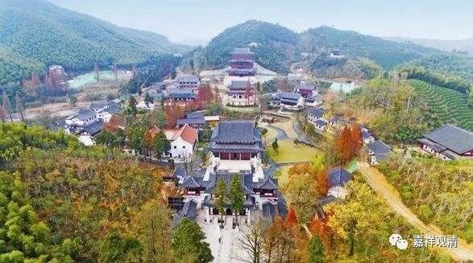

**《微课中观史》46·4**

那么，这就是我们可以看得出来的三论师系自身和禅修有关的这一部分。至于三论系和禅宗的关系，下面会单独再讲。

另外，三论师系和律宗这一系也有密切关系。

在禅宗出现以前，如果有大型的寺院，有大量的僧人聚在一起，是一定要符合一些戒律方面的规定，这些就被称为“律寺”，这也是印度佛教的重要组织形式。理论上来说，寺院的组织都需要照抄这种形式。但佛教传入中国，就有些“中国化”的东西，比如说，寺院的“山林化”也是“中国化”的其中表现之一。后来禅宗出现以后，基于历史的、经济的原因，有形成的禅宗特色的丛林制度。刚才谈到的“五山十刹”也属于禅宗的丛林制度的一部分。在禅宗丛林制度出现以后，其他宗派也仿照禅宗的组织形式，形成了自己宗派的各种寺院制度……

三论师最兴盛的时候，今天意义上独立的禅宗尚未形成，也还没有后期的各种丛林制度，所以三论师的组织形式还是律寺的制度。加入我们把律寺大致配合“律宗”来说的话，那么，这一时期的三论师和律师、三论宗和律宗就可以很明显地看到其相关性。

前后看起来，三论宗流行的主要区域或者一些主要的寺院，都曾经出现过大量的和中国律宗有关的名僧。而且三论师系和律师系统地学问都非常丰富（比如我们讲过吉藏大师是被称为“目力第一”的，好像和他喜欢收集、整理经典有关），都很注意收罗典籍。这种对佛教典籍的收罗，在律宗或者三论宗的系统，还说不清楚到底是以哪个为主，谁是更主动些的，不知道。当时吉藏法师收集了很多书，而律宗的法师也很喜欢收集书来写《高僧传》——写《高僧传》需要收集很多碑文、传记。

举个例子，会稽（绍兴）秦望山南麓的嘉祥寺，先有《高僧传》的作者慧皎律师，后有嘉祥吉藏大师，此后嘉祥寺又陆续“输出”了三论师和律师，又有律师允文，同时精相部律和《中观论》。

那么今天先到这里吧，谢谢大家。

