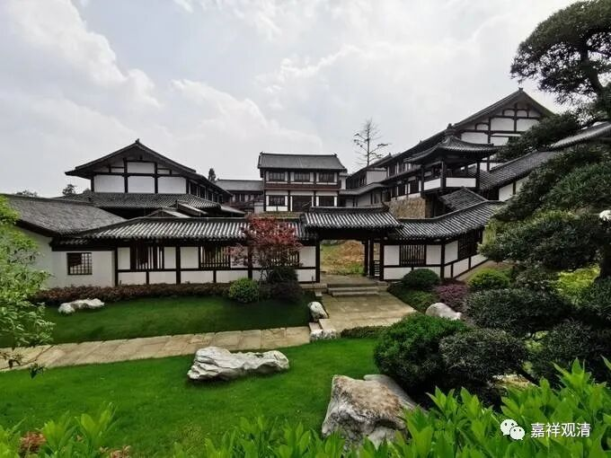

《微课堂佛教史》047·1

我们继续讲中观派在中国的历史，现在讲到了三论宗。

我们说三论这一系呢，在鸠摩罗什法师以后，有一段时间在很多地方都有不少人传习，但是这当中名头很响的人，或者说在《高僧传》当中名头很响的人，好像是没有的。这是什么原因呢？

我们上次也提到过了，中观这一系从一开始就比较强调禅观，我们现在称为打坐。从另外一个角度来讲，中观这一系的名僧很多都是出自北方，因为鸠摩罗什法师到了长安，很多过去学习的法师都是北方的一些高僧。虽然也有从南方过去的，但是以北方居多，甚至如道生法师以前的家族也是在北方的。

应该说，在南北朝时期的早期，北方佛教的义理学相对来说是比较发达的，是因为有这几位北方的大师，而且那个时候儒学中心、经济中心也都在北方。那么到了后期呢，士族大量南渡以后，相对来说反而是南方的义理比较发达，而北方的义理则明显衰弱了。背后的原因是什么呢？

因为北方的局势比较混乱，战乱也比较多，“五胡乱华”嘛。大型的学习义理的僧团只能在一段相对和平的时间内出现，比如像鸠摩罗什法师及其门下，当时就赶上了一个相对的稳定期。

那么南北朝时期，整个佛教界、甚至整个中华文化的情况都出现一股从北往南发展的趋势，而北方的后期则“转而”注重禅观的，专注义理的人群数量明显下降。而南方的后期呢，是比较注重义理的。这是在佛教史上经常会出现的一种说法，就是在南北朝时期北方重禅观，南方重义理。

这里面其实也有另一个现象，但是这个现象不是主要的。很多人会推理说，北方重禅观而南方重义理是由于南北方人的气质所决定的。即使这种说法有一定的道理，我们也觉得应该是占很小一部分的道理，并不占主要的地位，南北方佛教风格的差异更重要的是受到了当时历史政治形势的挤压。

如果我们仔细观察的话可以发现，南方比较重义理的这种说法当中的所谓的南方名僧，其实大多也是从北方过来的，或者说占比比较高的是具有北方背景的。而真正南方土生土长的义理方面的名僧，却不是很多，在人数上并不多。还是应该这么说，在南北朝时期，南方是属于刚刚开发的新的疆域，南方很多的知识分子都是从北方过来的，所以在整个僧团或者说佛教界出现这种情况也就比较自然。

