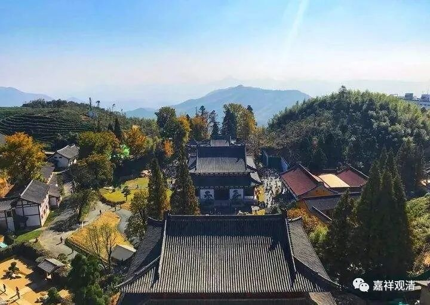

**《微课中观史》47·2**

我们之所以介绍这些个背景，主要是想讲三论宗为什么在一段时间当中没有出现义理方面的高僧，没有出现被历史记录下来的讲义理的高僧。我们认为从三论宗的发展来看，中间绝对不应该是断层了然后再出现、复兴的。我们也看到，中观派当时已经在中国的各个地方都有开花，都发展了一些很重要的寺院和一些小型的僧团。甚至还出现了我们说到过的另一个问题，成实宗或者成实师在讲经的时候，包括后来的法华宗也有这种情况，就是在他们自己的宗派背景下，也在讲三论，也在讲般若。当然，这也在程度上说明了，三论虽然在一定的情况下，在一段时间内没有成为像《成实》那样的显学，但是大家对三论还是都有所关注的。

我觉得在这个时期呢，对三论宗来说，就有点像太虚法师说的印度佛教的“小行大隐”时期，因为当时的成实宗实在是太强了。而中观宗呢（应该说是以宗派形式存在的中观宗），当时好像基本上都没怎么发挥出来。那么，在这种情况下会出现什么呢？就会出现在中观宗的发展过程当中，必须要有一种和成实宗进行对抗的背景。

这个时期，除了三论宗在对抗成实师以外，还有一个宗派，也在主动向成实师“开火”，就是大家比较熟悉的天台宗，或者叫法华宗，他们也在对抗成实师。那个时候正逢天台宗的智者大师出现，智者大师和他的师兄弟们包括他的弟子们对成实宗进行了大量的批判或者说是对《成实》的小乘的说法进行了大量的批判。这个批判的原因是什么呢？就是成实师们把大小乘夹杂在一起讲，把《成实》说成是大乘的，然后站在《成实》的角度去说大乘的教理，在纯正大乘看来，这锅饭有点夹生了。三论——中观宗系统也是一样，对《成实》师进行了批判。这是一个大历史下的协同作战。

一开始的时候，三论系统的一些高僧不算很有名，但是他们在传播的过程当中已经受到了一些南朝王室的注意。我们可以发现，佛教的各宗在发展的过程中多多少少都受到了政治和经济方面的影响，这一点从历史的角度几乎可以说是绝对的。那个时代，三论宗也受到了王室的关注，特别是宋齐梁陈的梁朝的梁武帝，他本身是信佛的，包括他的儿子昭明太子也是信佛的——其实他们整个王室都信佛，而且名声在外，当时东南亚一带都知道，知道中国有个菩萨皇帝（奉行大乘佛教的皇帝）。

