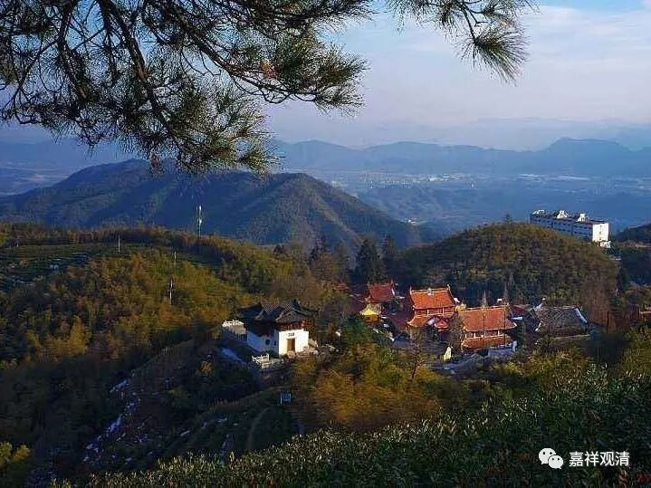

**《微课中观史》47·3**

此时，南北朝后期的南朝佛教那么就出现了一个什么情况呢？上层对三论系统或者中观系统已经瞩目了，然后就想运用他们的政治力量来扶植三论或者打压成实——“打压”这个词可能不太好，意思就是他们希望小乘的成实可以弱一点，所以在当时也有过大型的辩论和讨论等等。到最后，当然还得有新的书出来。是什么书呢？因为《成实》的篇幅相对来说比较大，就把它缩减出来一个略本在当时流行，意思就是说，学习《成实》也挺好，但不用那么认真。

关于《成实》我们还是要再补充说明一下，“成”就是“成就”的“成”，“实”就是“真实”的“实”。《成实论》是经部宗的一部著作，在汉地有译本，目前在其他地方都没找到有留存下来的版本。

萧梁皇家参与扶植三论系，但同时成实系却正如日中天地发展着……可以说，梁代推崇三论中观的效果并不明显——成实师那个时候实在是要人有人，要粮有粮。

另外一方面呢，可能是由于中观宗的义理确实太难了，在学习的时候顶尖的人才出的不是很多，或者说出了顶尖的人才之后，又去山里打坐修行了，这就造成三论宗在一段时间当中讲经的人才不是很多。

这样呢，我们慢慢地就要开始讲到三论系统或者中观系统的摄山的这一支，也就是栖霞山的这一支。我们上次谈到了这一支当中的高丽的朗法师，也称为道朗法师，也有一些日本的作品当中把他和河西道朗法师混淆起来，也有称他为僧朗法师。僧朗法师的名称就很少有人说，因为后面还有一个法朗法师。

道朗法师或者道朗禅师，现在也有对他专门的研究，是把他放在韩国人当中的。其实韩国或者说高丽这一系独立出来的时间是很晚的，应该说他是在中国的东北这一带或者说是现在的朝鲜韩国这一带，然后去到了长安附近学习。具体是跟从哪位老师学习呢，不得而知。但是从后来他的弟子们的一些情况来看，他应该是经过了非常正统的学习。他在学习之后呢，正如我们前面所讲到的，适逢当时的佛教界有一个从北向南的大趋势。身处其中的道朗法师也是一样，从河西也就是关河一带来到了南方的经济政治中心——南京。

