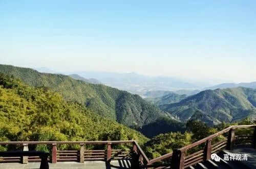

**《微课堂佛教史》048·1**

我们发现中观这一系，好像在某一段时间内有点刻意地避开大城市，所以朗法师去了哪里呢？他去了南京东面的栖霞山。大家有兴趣的话可以去看一下哦，我们在那里可以看到有一些南北朝时代的石窟。

当时朗法师的一个同乡法度法师在栖霞山结庐——我有点忘了法度法师到底是不是他的同乡，反正是法度法师已经在当地建造了寺院，寺院的大小倒是无所谓。以前的那个年代，想要靠一个人建多大的寺院是不太可能的，所以应该不会有很大的寺院，大概也就是几间草房吧。我们有时候在山里面看到一些小的茅棚，差不多就是这样的意思吧。像我们现代这种规模宏大的寺院，都是要依靠几代人，甚至几个朝代的人才能建起来的。

那么，僧朗法师就去到栖霞山，和法度法师在一起，后来呢，可以说是在管理寺院。刚才说的，现在我们看到的栖霞寺是大型的寺院，其实当时未见得是大型的寺院，都没几个人，怎么会建大型的寺院呢？但是僧朗法师的弟子当中出了一个很有名的人物，叫僧诠法师。

僧诠法师就跟从僧朗法师学习中观，后来他的名气非常大，连梁武帝也对他十分崇拜，专门给他送了十位水平很高的法师当徒弟。僧诠法师在山里讲课的时候，和他的老师一起被称为“山中师”。他们教学的主要内容是什么呢？我们把他们教学的主要内容称为“四部论”。

这和一般中国人的习惯是不一样的，是以论典为主的，称为“四部论”。是哪四部论典呢？第一部是《中观论》，我们以前学过的，《中观论》是龙树菩萨所著，鸠摩罗什法师翻译的。汉地所用的是青目论师对《中观论》的注疏，有四卷。

第二部是《百论》，这部论典也是只有汉地才有的，它的篇幅比《四百论》略小，但是内容和《四百论》差不多，或者说和《广百论》差不多。后来玄奘法师翻译过《广百论》，它实际上是《四百论》的后面一半。《百论》的作者是提婆论师或者圣天论师。

第三部是是《十二门论》，它也是唯独中国才有的一部中观派著作，篇幅很短。《十二门论》也是龙树菩萨所著，相当于《中观论》的一个略本。上面这三部论典加起来就是常说的“三论宗”的“三论”。

还有第四部是《大智度论》。

现在我们把他们摄山系称为三论宗，是有一些原因的，主要的原因就是前三部论典比较流行。其实历史上也有曾经有人称他们为“四论师”的，如果是说四论宗的话，就要加上《大智度论》。

