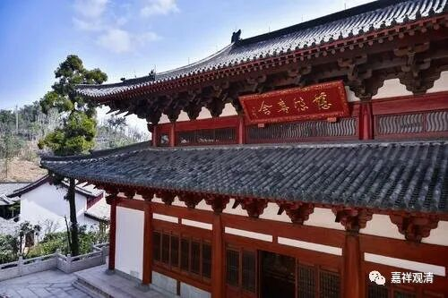

**《微课堂佛教史》049·1**

好，今天我们又开始佛教史，现在讲到了中国的三论宗这一系，是吧？

中国的三论宗如果往前推的话，最后是推到鸠摩罗什法师那里的，包括日本人也这样认为，因为三论宗是传到日本去的。但是从罗什到僧朗这中间的人名好像有点数不太清楚，虽然以前日本人是硬数出来的，但，随便那种都比较牵强……那我们就不管这推测的几种说法了。就历史的角度来看，罗什而道朗，是应该有传承关系的，但中间有一两个传承人物的传记不清楚。不清楚就让他不清楚吧，我们也不硬拗了……

如果中间一段的人名不太清楚的话，后面比较清楚的那几位又是谁呢?其中一位就是被称为高丽道朗法师的，日本人有时候把他称为河西道朗法师，其实这是两个人，不是同一个人。高丽道朗法师或者道朗禅师是有点禅师的味道，他从高丽（反正大家也知道是哪里）来到了中国的关河一带，也就是长安一带。那里曾经是鸠摩罗什法师待过很长时间的地方，也有一些人在弘扬中观，这一系的传讲内容被称为“关河旧义”，。

道朗法师在长安一带学习了中观、三论以后就来到了摄山，就是现在的栖霞山、棲霞山，在南京的东面（那里的枫树非常好，我在南京实习的时候经常去。现在开发了，变太大了）。山居日久，道朗法师的名声就慢慢出来了，大家都知道他在三论上是个权威。有了一点名气以后呢，他还得到了南朝的“菩萨皇帝”梁武帝的崇拜，梁武帝知道他水平的非常高，就给他送去十个弟子，不用说，都是一时的青年才俊。

历史的记载里，十个人当中有九个人湮没了，只有一个人在历史上留下了痕迹，而且学得非常好，这个人就是后来比较有名的僧诠法师。那么，僧诠法师是谁呢？僧诠法师是法朗法师的老师，而法朗法师又是吉藏大师的师父。以后吉藏大师出来的时候大家就知道了，按照学术界的说法，吉藏大师是三论宗的实际创立者。说是实际创立者，实际上就是写了几部重要的注疏（三论疏），固定了“三论宗”的核心文献——“历史”是看文献论主从的。

三论师的这一系，从长安到了南京附近，就是南渡以后，道朗法师算是第一代，僧诠法师作为第二代，这两代人物平时都是待在山里不出来的。我们已经讲过好几次了，三论师的这一系有很强的禅僧的背景，包括后来其核心寺院的建设也倾向于山林化。三论宗或者说中国的中观宗这一系的学习模式，有很强的印度背景，和后来大唐第一海归——玄奘法师这一系的做法差不多。

