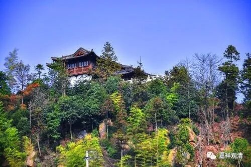

**《微课堂佛教史》050·1**

现在讲到三论系统，僧诠法师门下有四个比较重要的人物——“得意布（慧布法师）”、“四句朗（兴皇法朗法师）”、“领语辩（长干慧辩法师）”、“文章勇（慧勇法师）”。

对后世来说，这四位当中名气最响的是法朗法师，被称为“四句朗”或“兴皇法朗”。“兴皇”是指他住的寺院---兴皇寺，在现在的南京，当时的位置也差不多在南京或者南京的附近。

僧诠法师门下这四位最出名的弟子又被称为“诠公四友”，实力最强的又是谁呢？是“得意布”——慧布法师，或者称为慧布禅师也可以，因为他不讲课。“得意”是指得到真实的意义。慧布禅师按现在来讲，算是江北的扬州人，他们家是武将家庭。南北朝时期局势比较混乱，他很小的时候就发过愿：“如果能给我五千兵卒的话，我替国家荡平寇酋。”（有豪杰气！）大家都觉得这孩子很不错，很厉害。然后好像在他十八岁的时候，他的哥哥去世了，他就想出家，但是家人没同意，最后是在二十一岁的时候出家的，出家以后就去到了扬州的大寺院。

我在前面讲过，当时实力最强的，或者说成为当时显学的宗派是成实宗，所以慧布禅师在成实系统中学习过一段时间，也学得很好。当时僧诠法师去了摄山，就是现在的栖霞山，栖霞山在南京的东面一点、镇江的西面一点，离扬州也不远。慧布禅师当时是在扬州，他就去了僧诠法师那里学习，因为那时僧诠法师的名气太响了。很快地，慧布禅师也学得很好，他就又发愿，这个愿和我们一般的发愿有点不一样，是什么呢？他发愿不讲经，就是走禅师系统的道路。（有山林气。）

我们知道，三论系统其实和禅修、瑜伽行、修行很有关系，同时也和律宗、和律师很有关系。慧布禅师就是一个代表人物，他对戒律是非常非常严谨的，有一些这方面的故事。比如说，他吃饭的时候没注意，吃到了一点不合适的东西，他就马上忏悔，宁愿饿了也不吃。虽然当时还没有不吃肉的说法，但他也不吃肉，当时已经饿了三天了。你们要知道，关于不吃肉这个做法当时还没有在中国佛教流行，很少有人不吃肉，或者说南北朝时期，信佛+纯吃素的人不多。

在僧诠法师门下，慧布禅师的学习实力应该是最强的。根据僧传当中说，慧布禅师是开悟的人，在学习《大品般若经》的某一品的时候，说他“善达心开”，在天台宗可能就是“大开圆解”，在禅宗里面可能就是开悟的意思，至少文字上是这么说的，他在突然之间就非常厉害。

“开悟”这个东西，其实哪里都有的，不只是学佛。我一个弟子，中学时候就有这样的经历：同桌女学霸问他一道难题，他说“不会”！是真不会。女学霸一撒娇，胳膊肘点了他一下，电光火石间，整道题的解题思路和答案突然之间就全在脑子里了……（后来我问他：女学霸现在是你媳妇吗？答案好让人失望：不是。）

我自己也是。我们一个“滚法”的推拿手法，是滚法推拿流派的核心，很不容易上手的。我真是念念不忘、念兹在兹，“到底怎么才标准？……”不停地在琢磨，走路、洗澡都在琢磨……这样有大半个学期……一次在学校大澡堂子洗澡，热水淋下来……顿时就明白了！（但是你让我说我又说不出来，类似禅宗说的“描也描不成，画也画不就”。）从此我的推拿手法就没拿过第二名。（话说，一直到现在，淋浴一直是我灵感的源泉。嗯，下次我要在浴室准备防水的纸笔。）

