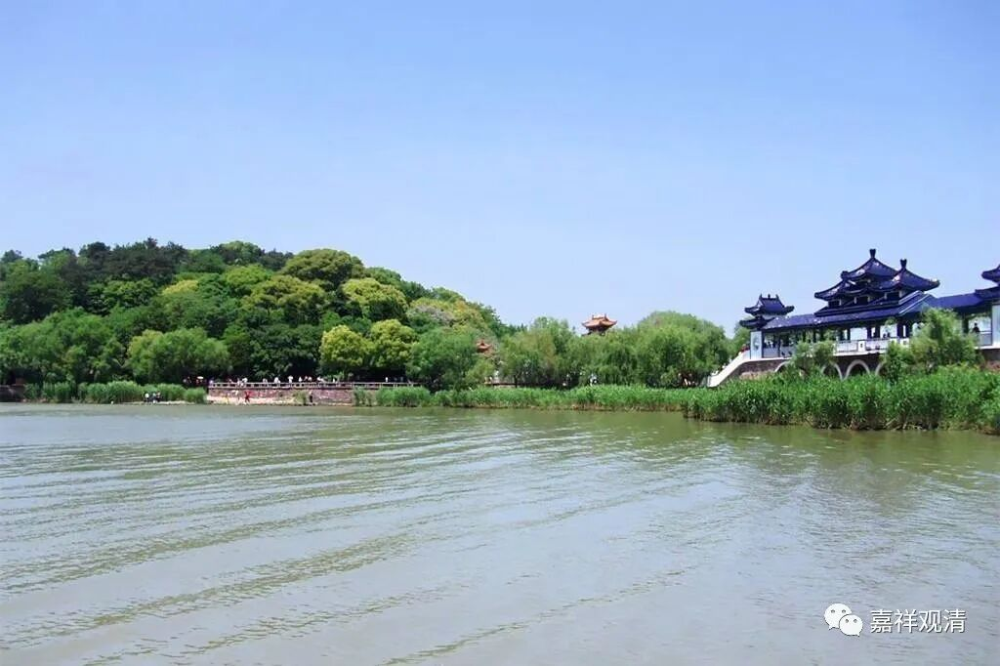
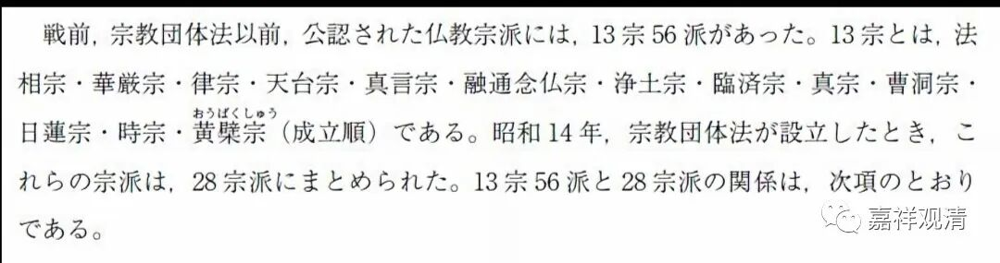

**《微课堂佛教史》051·1**

好，我们继续佛教史。

上回我们说到三论宗的历史，其实“三论宗”这个名词来自日本，是一个后期的说法。三论宗，差不多可以说是汉地的中观宗，它在后期也影响到了日本和韩国，——哦，不是韩国，那个时候是叫高丽。所以在日本和韩国这个流派是有继承发展的。

三论宗在吉藏之后传入日本，成为日本佛教“奈良六宗”之一。“奈良六宗”，就是日本奈良时期（大约相当于我们的初唐至盛唐时期）从中国传入的六个佛教学派——三论宗、法相宗、成实宗、俱舍宗、华严宗、律宗。

今天的日本奈良，三论系的寺院还有（古迹），但三论宗的名目已经没有了。原先属于三论宗的寺院现在都在烧护摩、供摩利支天、大黑天。我去奈良郊区的一个原先属于三论宗的皇家寺院，随行的翻译替我问他们“僧人”，说我是研究三论宗的……几个年轻的“和尚”急忙惶恐地撇清：我们不懂三论宗，我们住持懂一点，他今天不在……

今天的日本佛教有十三宗，这里面已经没有了“三论宗”。

奈良六宗剩华严宗、法相宗、律宗；（3）

始于平安初期之天台宗、真言宗；（2）

镰仓时期之后，禅宗系有临济宗、曹洞宗、黄檗宗；（3）

净土系统有净土宗、真宗、融通念佛宗、时宗等四宗；（4）

日莲宗；（1）

综上，为日本佛教十三宗。

日本现在的法相宗比三论宗幸运，还或者，是宗教法人，寺庙也不小、也不少，甚至还分派系……但也是烧护摩的多，学经教的少。反而是真宗，对俱舍和唯识像是真爱。日本佛教的学术传承，现实中大致是以各宗派的大学为核心在继承了。

上次讲的几个人物我们再稍微梳理一下。在鸠摩罗什法师以后，他最重要的几个弟子有僧睿法师、僧肇法师和道生法师。那么在这几位以后一直到摄山系之间，传承不明。这种情况（中间传承状况不明的情况）好像在印度和中国都发生过。中观宗经过开始的几代以后，就出现了一个好像是隐没的时期，在传承当中有几代人的名字我们都不知道，实际上是肯定有传承的。这其实和我们目前的历史研究的材料还是有关的，我们现在所能知道的基本上都是被文字记载下来的，文字记载说了算（你要是被催眠，看到前世，说中间一个祖师叫“观清大师”……也没人信不是，而且容易被送去600号），文字没有记载，只好暂时阙如了。

