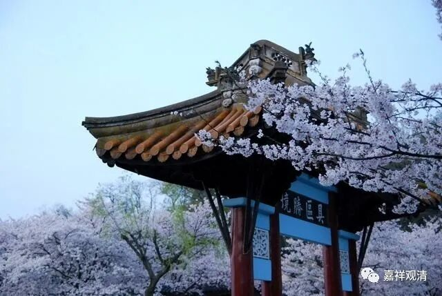

**《微课中观史》51·4**

现在我们就要讲这四位法师当中第二位比较重要的人物，就是兴皇法朗禅师或者兴皇法朗法师。

他和慧布大师有一个共同的特点，他们都是军旅出身或者说出自军人世家。这两位大师的家庭出身都是高级的将领，他们自己也有廓清宇内的气概。他们的年代正值南北朝时期，北方的局势是非常混乱的，这两位都出生在扬州，出家的年龄也差不多，都是二十岁左右。他们出家以后呢，先在寺院中学习了很长时间的禅修和戒律。汉地佛教的早期对禅修和戒律的内容都非常关注。我们可以想象，作为一个宗教传入中国，佛教的戒律和禅修是原先中国文化里所没有的，所以早期学习的内容有很多都是禅修和戒律方面的。

后来听说离得不远的摄山有一位非常有名的僧诠大师，几代皇帝都很崇拜的，于是法朗法师也去了摄山学习。刚才还漏了，他在去摄山学习之前，学过很长时间的《成实论》，也学习过一段时间有部的《毗昙》。《成实论》是经部的阿毗达磨，而《毗昙》是有部的阿毗达磨。道理上来说，毗昙就是阿毗达磨，应该是各个宗派都一样的叫法各个宗派都有毗昙。但是在中国，一谈到毗昙，基本上大家都知道这是指有部。那么，法朗法师对有部的阿毗达磨和经部的阿毗达磨都学习了很长的时间，都比较精熟，然后他再去学习中观。大家都知道龙树菩萨这一派是非常厉害的，又正好找到了可以学习的地方，不久呢，法朗法师就在老师这里也渐渐崭露头角。

刚才我们提到了“诠公四友”，就是僧诠法师门下的四位大弟子，他们都各有名号，也就是外号。法朗法师总共有三个外号，第一个被称为“四句朗”，“四句”就是只“有”、“无”、“非有非无”、“亦有亦无”。这个“四句”的意思就是夸奖他讲经非常的娴熟。第二个外号叫“兴皇法朗”，“兴皇”是指他主要所在的寺院。第三个外号呢，被称为“伏虎朗”，意思是说他讲经非常厉害，都能够制伏老虎，所以叫“伏虎朗”。

兴皇法朗法师学习的时候是非常出色的，也可以说是名动京师，在梁陈时代的京师就是金陵、建业，今天的南京嘛。他在当时也得到了高层的信仰，就在僧诠法师过世以后，被专程邀请到南京的兴皇寺来开演佛法。

