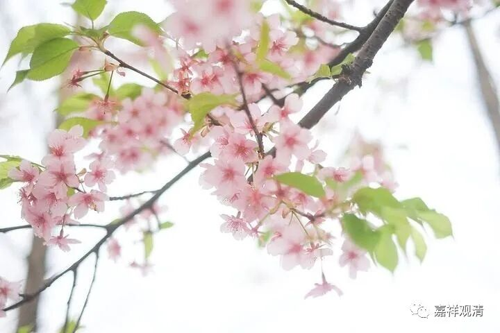

**《微课堂佛教史》052·1**

之前我们曾经提到过，僧诠法师基本上只讲三、四部经论，主要是般若经，也讲《华严经》，但是《涅槃经》这些他都不讲。论典主要是“四论”——《大智度论》、《中论》、《百论》、《十二门论》。《大智度论》里面全部包括了《大品般若经》。

法朗法师下山以后，他的讲经就不拘一格了，不仅仅局限于“四论”（也就是“三论”之外加上《大智度论》），他还讲了当时比较流行的《涅槃经》等等。兴皇法朗法师的讲经既不同于他以前的老师，因为他讲的很多内容老师都没讲过，也不同于他的同学。

慧布大师是不讲经的，他把自己整理好的资料都交给法朗法师。“长干辩”慧辩法师和“禅众勇”慧勇法师这两位在讲经的时候，主要基于他们早年的一些经验，经常会涉及到成实师的一些说法。那么法朗法师呢，在这方面是毫不留情的，而且表现为和他的师弟们的不同。这当然也很正常，可能是由于在《成实》当中浸淫久暂的差别，也可能是大家唱一出戏……总之，他讲经是非常厉害的，同门当中比较正统。

当时还有一些“背景板”我们也说一下，我们知道，那个时候天台宗的三祖或者说实际创始人智者大师也差不多已经到了南京，也开始开演。他开演的主要内容，也是《大智度论》，讲的东西呢，也主要是禅修，也就是说和法朗法师有撞车的地方。这两支宗派都远追龙树，近传并不相同，主要推送的经论也都很接近。不过，天台这一系不太强调“三论”，略强调《大智度论》。天台宗的很多教义是出自《大智度论》的，比如止观的很多内容，都是从《大智度论》里面摘录出来的，然后演化成他们自己的一个体系。

那么，天台宗和三论宗有着这种天然的“叔伯兄弟”般的背景，他们都奉龙树菩萨为祖师，所用的经典也差不多，又差不多同时批评成实师，所以两派的关系也比较好。在传记当中也有记载，天台宗的智者大师在讲经的时候，好像有比较重要的两次都有三论师去进行挑战的。

这个挑战呢，按照有些说法就是事先安排的，就是安排了三论师去对他挑战。这个挑战和我们现在理解的挑战有点不一样，这个挑战就是去捧场的。一直到唐代还有这种情况，实际上是一种捧场，水平也相当高。挑战的人里面就有真观法师，他是法朗法师的弟子。从今天的人来看像是法朗法师专门派了人去踢场子，实际上是当时的一种捧场的方式。

