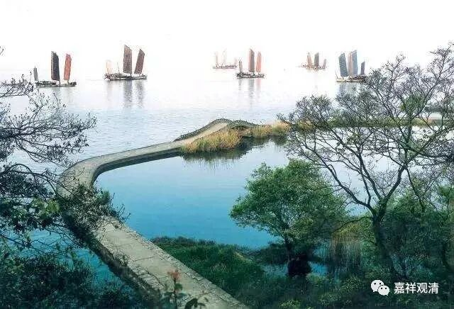

**《微课中观史》52·2**

我们现代人对当时的情况不是很了解，其实从魏晋时期就开始盛行清谈，而清谈是要两个人对谈的，一个人是谈不出来的，一个人叫演讲。就好像我们现在讲课，讲完之后有什么问题，要有人在下面问的，或者是要有人来辩难的。到了唐代的时候还有这种情况，有些讲经之后的“辩论”是事先安排好的。这个三论师（应该就是真观法师）和智者大师的辩难看起来也是安排的。到后来三论系和天台系的关系是非常好的，真观法师是进入天台宗传记中的，嘉祥吉藏大师也被天台视为旁支，而且，吉藏大师还正式借过天台宗的章疏来参考。

法朗法师到了兴皇寺讲经之后，就非常出名，常随众有一千多人，大家布施的法衣有“千领”——一千多件。就像现在我们给大昭寺的释迦牟尼等身像换衣服一样，每讲一次课就要换一身衣服。法朗法师讲的经呢，有《法华》、《华严》、《大品般若》、“三论”等等，每年要讲二十多遍。

这个呢，以我的理解，从头到尾讲二十多遍是不太可能的。

我们经常会提到一个情况，《高僧传》当中经常出现某某法师某经讲几十遍，某论讲上百遍blablabla……我们看来，这种“几十遍”“百余遍”应该是在讲“玄义”或者说“悬义”——就是经典里面的主要内容，不是讲科判那种，而是接近于导言、导论的性质。就是“三论”到底在讲什么，《中论》的主要内容是什么，这类“悬义”导论式地讲经。当然“玄义”也可以围绕科判来展开。如果是完全的讲经，别说其他的，就光是《中论》，一年讲二十遍——差不多半个月讲一遍，是不太可能的。如果每部经论一年要讲二十多遍的话，差不多就只能是讲导言、导论的性质。包括后来讲吉藏大师一辈子讲了几百遍《法华经》，也是不太可能的。他们讲的是叫导论，以前叫玄义、悬义，放在经论前面讲的，相当于我们现在说的前言、导言、导论。

