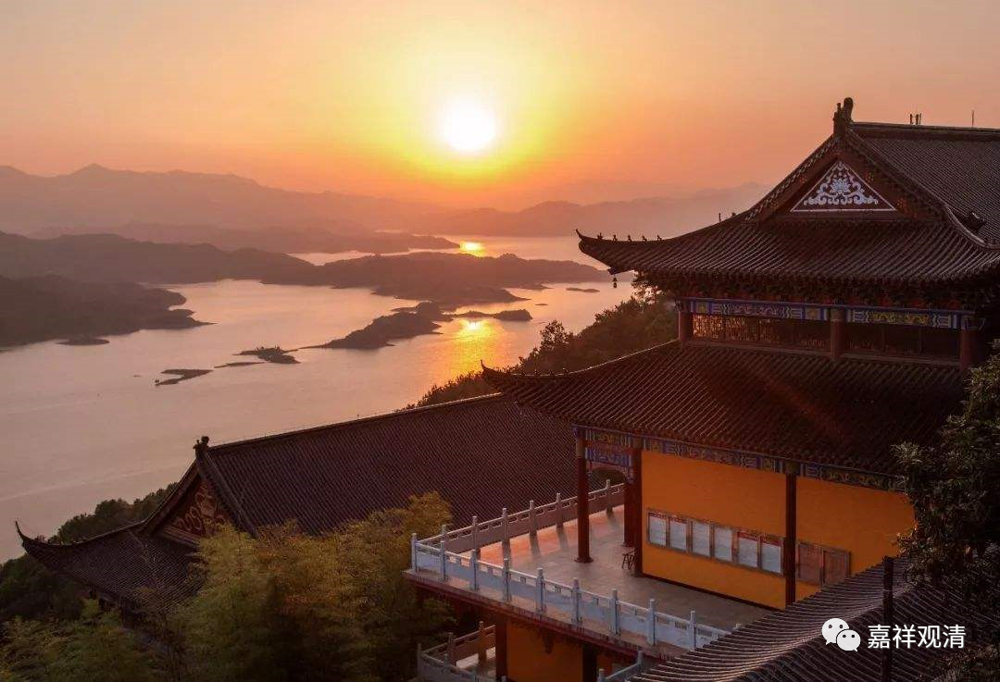

**《微课中观史》56·3**

三论宗在南北朝后期主要教化的地方是在南方（前期是在长安），经过战争以后，几位大师又都被北调，他们北调之后都没有出现过特别出色的弟子，可能是因为年纪大了（？），培养弟子也比较困难（？）。真的，实力派大师，都到了北方，但都没有继承人。倒是在南方，还有三论宗的弟子出现。后来，三论宗就往高丽和日本传播了。

很可惜的是，我们基本上看不到三论宗的这两系——保恭禅师和吉藏大师在北方带出来的弟子，文献中也看不到，或者说找不到，能看到的三论宗的主要弟子还是他们在南方带出来的弟子。三论宗在北方的名气倒是有点大，就是因为“十大德”的封号。“十大德”当中出现了好几位三论宗的人物，我记得好像有四位，我们可以再查一下。

那么，三论这一系后来传到日本和高丽，就形成了日本和高丽的三论体系。三论宗的藏书差不多都是靠着日本保存下来的，日本在保存文献方面的确做得很好，我们自己好像很不容易保存，可能主要是因为中国的战乱太多了。

我曾经思考过这个问题，还有一个原因是什么呢？因为中国后期佛教的重心是在南方，而南方的地理环境不适合保存这些文献，但是在北方战乱又比较多。你看，中国的北方从气候环境来说，确实适合保存文献，比较干燥，我们可以从一些寺院或者一些墓塔、佛像里面找到一些文献，南方确实不太适合保存文献。日本是不是因为气候比较冷一点，所以也比较适合保存文献？我觉得这种可能性也是有的。中国的南方现在已经被大量地开发了，据说解放前后福建那里主要是以原始森林为主的，现在都被砍秃了。

好了，今天的佛教史就讲到这里，谢谢大家。

