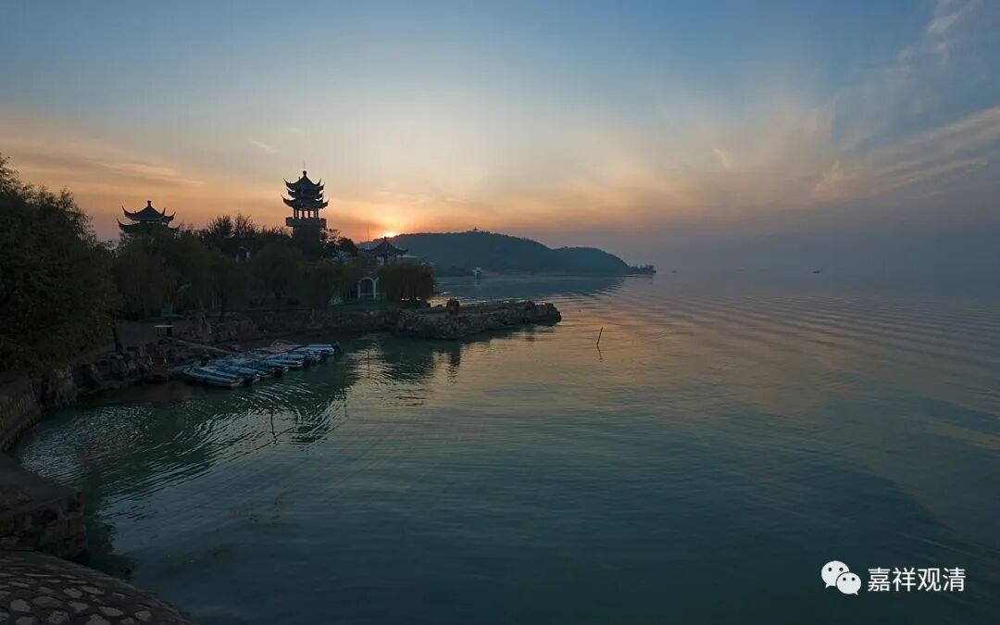

**《微课堂佛教史》58·1**

凭我的记忆，刚才这个故事好像是属于道信禅师和法融禅师两位的，这个可能就是佛教后期的一个传说。虽然三论的禅系和禅宗的楞伽禅系不断地有过各种交流，但是这两位禅师之间是不是存在很明确的师承关系呢？应该说，这么后出的典籍或者传记是不太可信的。当然，也还是有其他原因的。而且，禅宗的有些传记不是很可信。

那么，法融禅师的出身是属于三论宗，所以他也是也会讲经的。曾经有过一段时间，法融禅师专门去到一个现在被称为牛首山的地方，去坐静也好，去禅修也好，去闭关也好。那里附近的寺院有着丰富的经典藏书，法融禅师就表现出三论系统的特征——很喜欢看书。他经常跑去这些寺院看书，还借书抄——以前很多书都是抄的。因此，后来也有人请他去讲经，讲经的内容也比较多。

我们在前面讲过，在三论宗的早期僧诠法师那个时代，基本上就限定了只讲“三论”或者“四论”，基本上就只讲《中论》、《百论》、《十二门论》、《大智度论》，还有《大品般若经》和《华严经》。基本上就只讲这些经论，其它内容是不讲的。后来慢慢地，三论宗也开始讲《法华经》了，《维摩诘经》应该也讲了。到了法融禅师的时候，更开出了其它的内容，凡是请他讲的经典他都讲了。《法华经》、《大集经》、《华严经》……他都讲了。

据僧传当中的记载，我也已经和大家说过，李渊曾经准备禁绝佛教的，而且当时已经下达命令了。法融禅师就在那个时候进京去上书拦阻，传记当中就说是因为法融禅师的拦阻，这个命令没有被执行。其实也不见得是这个原因，应该说他实际上是没有拦阻成功的，李渊的旨意已经颁布。现在我们说他拦阻成功，是从结果上来讲的，结果上，这个“旨意”没有起效。

实李渊的命令没有最后施行，真正的原因是因为李世民很快上位了，禁绝佛教的事情在李世民上位之后就不再施行了。

不管怎么样，这个记载说明了身处南方的三论一系的法融禅师还是到过长安的（也说明李渊禁佛这事儿闹得也不小，不然不会风声一下子传这么远）。此后，他又回到南京附近的牛头山，所以法融禅师也被称为“牛头法融”或者“牛首山法融”，牛头山是他后期待得比较多的地方。

