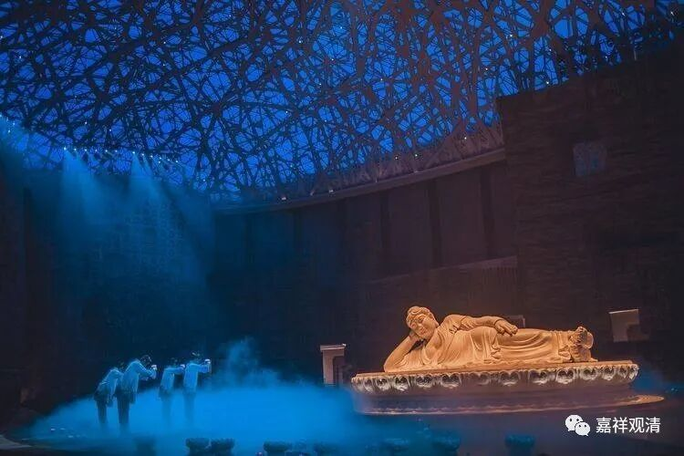

**《微课中观史》59·2**

《百论》和《十二门论》，目前能够看到的版本就只有汉文，在其他的语言当中还没有找到这两部论著。《中论》基本上大家都能看得到，《中论》在中国比较流行的版本还是鸠摩罗什法师翻译的版本。如果把后来清辨论师的《般若灯论》和安慧论师的《大乘中观释论》也算进去的话，其实《中论》在中国还是有过几个版本的，但是其他的那些版本不是很流行，有点可惜。（真谛法师也有过一个译本，但很早就散失了。）以上以49年为限。

那么，三论宗其实就是中观宗了，按今天的说法，就是，“三论宗是中国化的中观宗”，甚至可以说三论宗是最早中国化的大乘佛教宗派。它也是最早传入日本的佛教宗派。传入日本的人是谁呢？传入日本的人，我们现在还是称之为高丽人吧，他的名字叫慧灌法师——智慧的慧、灌溉的灌。

慧灌法师是吉藏大师的亲传弟子，他是以宗派的形式把佛教传入日本，特别是把中国佛教的宗派传入日本的第一人，所以三论宗也是第一个被传入日本的中国佛教宗派。这个时间差不多是在隋唐时期，慧灌法师之前跟吉藏大师问学或者学习的时候，大约是吉藏大师在会稽嘉祥寺的时候，所以称吉藏大师为嘉祥吉藏，也有这个原因在里面——令三论宗在韩日发扬光大的慧灌大师是在嘉祥寺跟吉藏大师学习的。

三论宗传入日本以后，在日本的第二传和第三传，也就是慧灌法师的弟子和后面的第三传弟子，都曾经到中国来学习过，然后就被称为日本三论宗的第二传和第三传。就是说，三论宗第二次和第三次进入日本。这也说明当时的三论宗这一系，在中国汉地的发展还是挺宏大的。三论宗日本的第二传和第三传分别是智藏法师和道慈法师。智藏法师这个名字，我们以前在其他地方也看到过，是吧？还有一位智藏法师是印度的大师，也是中观宗的大师。

这其实还说明，那个时候的日本，跟江南的海路真是比较通畅的——连续三代自由往返。天台宗的连续东传也是走的这条路，今天的宁波、临海、绍兴这一代是他们往来的落脚点。

中观派传入中国，除了我们现在说的鸠摩罗什法师这一系之外，在后期还有其他的传入。但是这些其他的传入呢，很多本身并不是中观师。比如说，我们现在讲到的清辨大师的《般若灯论》，把这部论著翻译过来的人也不是中观师，应该是一位唯识师。

