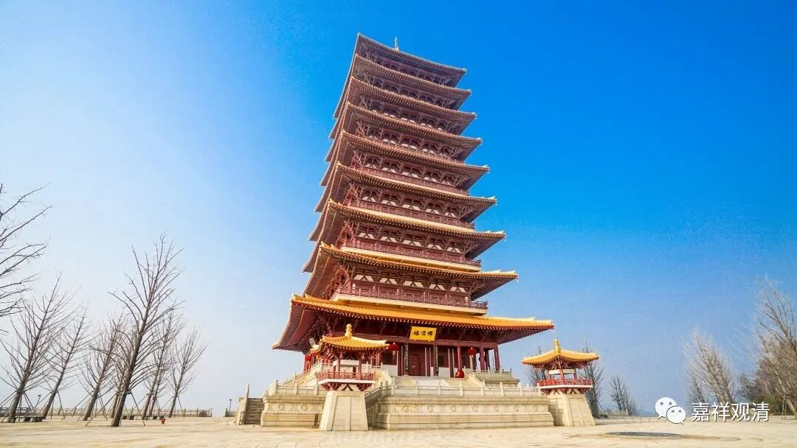

**《微课堂佛教史》060·1**

前面我们先讲了一段印度的中观派历史，然后讲了中国的三论宗的历史。“三论宗”是我们给它的一个名字，实际上我们就把它说成中国的中观宗也完全没问题。但是我们说过，“三论宗”这个名词是从日本引进的，也有一定的道理。我们已经沿用至今了，在我们现在还没有实力的时候，沿用这个名称也就算了。

其实说起来，中国的中观宗应该有个叔伯兄弟的，也是和中观这一系有关的，但是以中观派的人来看可能不那么正宗，这是从中观派来看哦。如果在座的是天台宗的，你们可不要骂我哦。实际上大家应该已经听出来了，我要说的这个叔伯兄弟就是天台宗。

天台宗在中国是非常有名的。中国的文人，包括近现代的许多人，在学习佛教的时候大概有两个极端或者两种方向：一种方向就是走向中观和唯识，其实应该说更多的是走向唯识；还有一种方向就是走向天台宗。为什么呢？因为天台宗的很多观点或者说观点的提出是非常中国化的，所以中国的文人，特别是儒家这一系，特别愿意讲天台宗或者借天台宗来发挥。

比如说牟宗三先生，在他的言论中，至少从文字上我可以看见很多大赞天台的地方，他极度称赞智者大师，大致意思是说康德说到没做到的，智者大师都想到了，而且还在发扬。所以天台这一系在学术界确实挺有名的，特别是在新儒家当中。牟宗三先生写的《佛性与般若》这本书，现在已经有大陆版了，大家有兴趣的话可以去买一下。我以前买的都是港台版的，好贵！现在已经有大陆版了，你们可以去看一下。牟宗三先生在《佛性与般若》中讲到隋唐佛学的这一段，基本上就是按照天台来讲的。当然，我们说牟宗三先生他自己并不是一个佛教学者，他自认为是一个新儒家的人吧。

那么，在天台宗的谱系当中，在它的史传当中，认为三论系统是从天台旁出的。同样地，以中观系统来说，中观会认为天台系统是从中观旁出的。这两家各说各的，你们有些人也不用不高兴。这很正常，每个宗派肯定是各说各的，至于最终是不是这样，我们再说，我们今天讲这个话题的目的不在于吵架。

前面讲了华严宗，华严宗里面也有中观的部分，他的中观部分被称为“新三论”，就是说，华严宗也受到印度中观派的影响，但他和三论宗、天台宗不同，它（主要是法藏大师）的中观内容来自日照三藏，所以说他是“新三论”，新，是相较于罗什系为新。（清凉澄观大师的学历中，有很长时间专门在三论诸师门下学习。）

