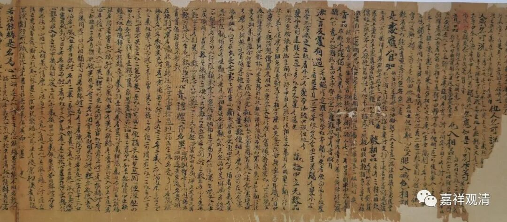

**《微课中观史》61·3**

三论宗和华严宗呢？有没有联系呢？其实是非常有联系的。在学界中有一种说法，说华严宗是属于新三论宗，反正认为华严宗的一些中观的观点是新传入的，是从日照三藏法师那里传入的。但是这种说法就有点有趣的，因为日照三藏法师其实是一个唯识师，而不是一个中观师。

华严宗的确是接触到了一些中观派和唯识派的内容，华严宗和中观一系比较重要的关联，最明显的就表现在澄观法师身上了。澄观法师以前曾经大量地学习过天台和三论，他学习三论的时间其实挺长的，但是没有确切地说过他是跟从哪一位大师学习的。我们可以在他的著作当中很明显地看到，他曾经学过中观的很多痕迹。

确实我们从这位华严宗的澄观法师的作品当中发现，相比汉地的其他法师来说，他的著作相当地庞大、伟大，可以说非常厉害。在注解《华严经》的时候，他用到了中观和唯识两方面的一些经典进行注解，真的是非常了不起啊！大家如果有兴趣的话，可以在学习《入中论》之余，相应地看一看澄观法师的关于《华严经》的《十地品》的讲义，是完全可以用来参考的。

所以我们可以说，三论这一系其实是影响了当时中国佛教界的其他几个宗派，或者应该说是这些宗派之间互相影响。

而三论这一系和成实师之间呢——我们现在很难说成实可以算一个宗派，他们之间就是一种相互竞争的关系。三论宗是以批评成实师为主的，他们主要批评的是成实不是大乘，是小乘。从成实的传承而言，从成实的教法而言，它都不是大乘。这里面并没有讨论他们的发心，发心是另外一回事嘛，主要是从教法上来说。包括吉藏大师也说过，从传承来说，就是鸠摩罗什法师把《成实论》传过来的时候，本身就把它当作小乘的观点引进中国的，而不是大乘。

三论宗的后期，或者说新三论师（这里说的是吉藏大师这一系的三论宗）兴起的时候，可以说它的主要对手是成实师，但成实师在三论一系和天台一系的联手打击下，应该说很快就不行了。这个其实也很可惜啊，成实虽然是小乘，也颇有可观之处，特别是经部的教义，至少在汉地能够以《成实论》的方式被保留下来一些。《成实论》曾经在汉地兴盛过，对应的注解也很多，但是现在藏经里面一部都没有了，实在太可惜了。

（敦煌卷子里有一卷不到《成实论义记》，恐怕是现存唯一的《成实论》的相关注疏了。）

好，今天先讲这些。明天看情况了，我要出门了，要赶回山上了——大王让我去巡山。

快过年了，提前给大家祝福，祝大家吉祥如意！（当时快过年了。）

