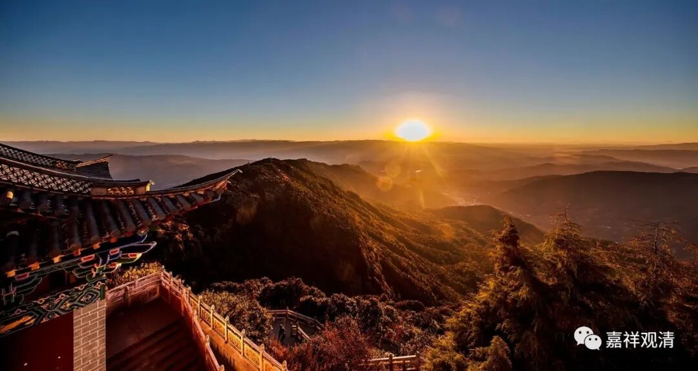

**《微课佛教史》63·3**

无著和弥勒的故事，汉地的主要版本是说：无著论师是修慈心定，然后去天上听课，回来以后就记录成《瑜伽师地论》（可是“天上方一日，地上已千年”，无著大师在天上听课是论秒的吗？……）。也有一种说法，说是无著论师请弥勒菩萨下来，在讲堂里面讲《瑜伽师地论》，然后讲的时候呢，大家也看不到，好像是这样（这个好像更合理一点哦。）。反正故事的版本很多，总的来讲，都跟《瑜伽师地论》有关系，而且它的指向好像是弥勒菩萨是讲课的人，无著菩萨是记录的人或者说整理的人，或者说是秘书性质的。

汉地的《瑜伽师地论》是比较有名的，早先翻译过好几次了，但是都不完整，之前真谛法师也翻译过一部分的，一直到玄奘法师才把它翻译完整的。《瑜伽师地论》中的有些部分，像《菩萨戒》或者《解深密经》这些部分也有单独翻译过的（《解节经》），但都不是一个很完整的形式。是玄奘法师把《瑜伽师地论》以一种非常完整的形式翻译过来的。

按照汉地的说法呢，《瑜伽师地论》的作者是弥勒菩萨，而藏地则说作者是无著菩萨。汉地还有一种说法，是吕澂先生这么说的，他好像是跟顺着真谛法师的说法，说《瑜伽师地论》的前面一半《本地分》是弥勒菩萨所作，而后面是无著菩萨的作品。我个人比较倾向最后一种说法，即：《本地分》五十卷的作者是弥勒，后五十卷的作者是无著。

后期的传说、演绎就越来越多了。我去过云南鸡足山，鸡足山的附近有个大溶洞，据说深不见底。据当地传说——这个洞就是无著菩萨请弥勒菩萨讲《瑜伽师地论》的地方（无著菩萨跑得可够远的啊……）。我去朝拜了一下，果然大而且深，但没有好好开发，很民间宗教，门口有村民“守护”。当地佛协邀请我去“中兴”，而我是了无头绪——这几百尊民间神像咋处理唦？（还有，银子在哪儿？人在哪儿？）

（又，据考古发现，这个溶洞是一个旧石器时代的遗址，有远古人类活动的遗迹。）

今天就先讲到这里吧，谢谢大家。（有银子、想“中兴”祖庭的老板们可以找我联系哦~~）

