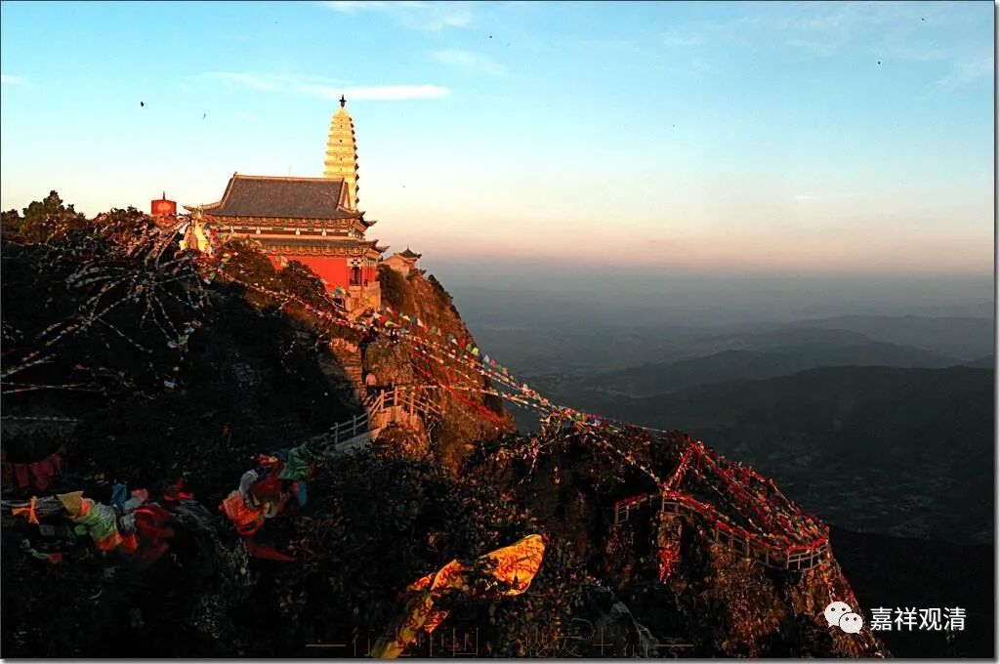

**《微课佛教史》64·3**

那么在密法当中，好像说龙树菩萨和无著菩萨都有他们各种的著作，都有这样的说法。密法我们暂时不讨论，我也没看过。其他人什么情况我不知道，反正我是没看过。

现在有这样一种说法，就是弥勒菩萨著作并且留存下来很多作品以后，无著论师和世亲论师又留下了他们自己的一些作品，这些作品里面对唯识派观点的发挥，应该说三个人有各自不同的方向，或者说他们三位系列的作品有不同的方向。应该说有这样的情况出现，但我倒并不觉得是三个人要特别地举出不同的说法。我们可以想像得出嘛，前一代人在某一方面进行了更多的发挥以后，后人在此基础上就是继续说，我觉得应该是一种“继续说”、“接着说”，而不是一种“改造说”、“全新说”。后人对前人的内容进行补充，就是“接着”前面“继续”讲，“改造”这个词稍稍值得讨论。

唯识的系统是比较宠大的，其中对空的讲法大致就有三种，一种讲法就是通过三性三无性来讲空和有，这个说法我们是把它放到弥勒菩萨的名下的。或者说，早期的唯识系统是以三性三无性为核心来讲空的——我觉得还是这样讲比较好。

那么在“三性三无性”的背后呢，对“三性三无性”的这个空可能还要加以解释，或者说另外一种讨论或者诠释。无著菩萨就在《摄大乘论》这一类的经典当中对空进行了另外一种发挥，就是我们通常所讲的“能取所取异体空”或者“能取所取空”的说法。这个确实是无著菩萨提到比较多的，当然，无著菩萨也会提到“三性三无性”的说法。

到后来，世亲论师则是更多地从“唯识”的角度来讲，就是从“唯识”这两个字来展开，他所讲的就更多的是“外境无而识有”。

应该说，这是同一类瑜伽行派的教法的次第展开，我个人觉得这些讲法之间不是一种层层递进的关系，而是前后不同的说法把相同的教法串起来开演的意思，后者为前者做补充，前前比后后更核心。

有人认为这三种空的讲法当中，后面两种讲法属于新的唯识思想，认为三代人有着三种不同的唯识思想——这些纯粹属于现代人做学术的思维了。

假如我们从历史的角度来看的话，对这些千年以前的论师而言，自己出名、提出自己的观点，这真的并不怎么重要，更加重要的是唯识的教法需要很完整、很严密地展开。弥勒菩萨的作品有无著论师来展开，也有世亲论师来展开的，无著论师的作品也有世亲论师来展开。当然，世亲论师还有他自己的一些著作，我们后面会讲到世亲论师。

今天先到这里，谢谢大家。

