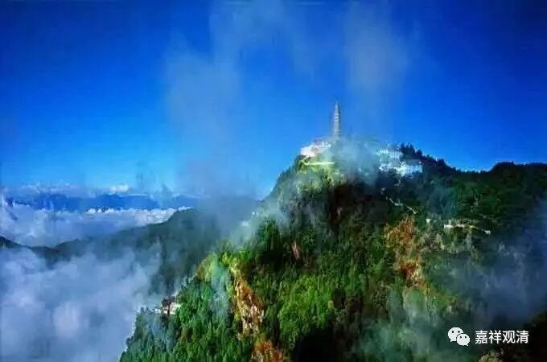

《微课室佛教史》065·1

好，我们今天继续佛教史。

我们已经讲到唯识派，昨天讲的是无著论师，他的论著是比较多的，寿命也比较长。不过，从他的各类传记来看，他应该是曾经闭关、专修了很长一段时间。他后来的年龄也很大，寿命也很长，据说活了一百多岁，也有人说活了一百五十岁的，所以，作品也很多，就像中观派的龙树大师一样（寿命长，作品多）。

如果要把《瑜伽师地论》也算作无著论师的作品的话，那他的作品确实是非常非常多的，就比他的弟弟世亲论师稍微差一点点，世亲论师的作品数量更大。我们昨天讲到无著论师的论典的时候，还忘记了《六门教授习定论》，这部论著的本颂也是无著论师写的。

无著论师有很多弟子，其中最著名的就是他的弟弟世亲论师了。在佛教当中，一般都会认为无著论师是登上圣者位的，通常都说他是三地的菩萨。我们有时候碰到一些朋友或者出家法师也会聊到无著菩萨，一般大家都公认无著菩萨是登圣位的，我们称他为圣无著菩萨嘛。

有一次我去了汉地某个比较知名的寺院，是一个比较注重学习的寺院，和他们聊天的时候就正好聊到无著菩萨。他们就在讨论：无著菩萨到底是不是登圣位的？如果是发光地的话（三地就是发光地），就是登圣位的。但是经典当中看到的是发光定——定就是禅定的定，这个发光定一定就是三地吗？

这个就属于聊天所聊到的话题。那么，在《摄大乘论》的注释当中好像有提到过这个方面，就是无性大师的《摄大乘论无性释》。无性大师可能也是无著大师的弟子吧，据他说，无著菩萨证得的是世第一位——加行道中有暖、顶、忍、世第一位。如果是世第一位的话，那就是加行道，还没登圣。但是一般说世第一位时间很短，一般的声闻部派都说只有一刹那，但大乘有说大乘的加行道的世第一位可以经历很长时间。如果是发光地的话，那就是三地的菩萨了。

一般通常还是认为无著论师是证得三地的。如果要讲龙树菩萨的话，那就说法比较多了，有说登初地的，有说登七地的，有说八地的，有说十地的，甚至说成佛的都有。

如果说龙树菩萨是弘扬中观第一“人”的话，那，无著就是弘扬唯识“第一人”了。“第一人”的公案之前我们聊过了。

那么，无著菩萨的这篇我们基本上就翻过了。

