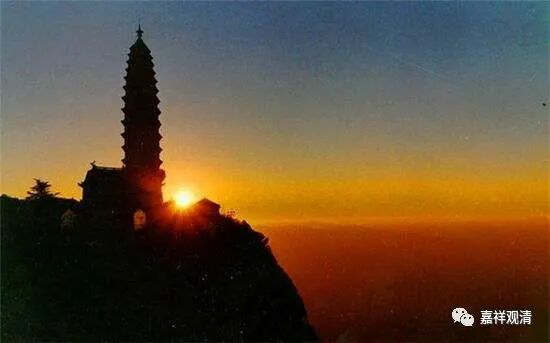

**《微课佛教史》65·2**

无著菩萨的弟子其实挺多的，但是有一位弟子是最最重要的，因为他实在是太有名了，那就是世亲论师。

在经典当中说，世亲论师实际上是无著论师的弟弟，虽然两人的年龄相差比较大。我们在前面讲过，他们的母亲是为了佛教生孩子。古代人也比较能生，是吧？可能一个是十四、五岁生的，另一个是四十四、五岁生的，这样的话，就可以相差三十岁，是吧？他们俩的年龄相差确实比较大。

世亲论师也是在佛教中出家的，但好像和无著论师出家所受的戒律不是一个派别的。我们都知道有个说法，说无著菩萨一开始是学小乘的，在声闻乘当中学了很多的内容，有部、经部都学了，他的故事也比较多。相对无著论师来说，世亲论师的故事就更精彩了。在心理学上也有这样的说法：老二一般是更调皮一点，要引起家里爸爸妈妈的关注，是吧？

世亲论师的故事也确实比较多。首先，他在声闻乘中出家有这样的故事：说世亲论师是在有部出家的，他学东西很快，但是对有部并不是很满意。传说他是专门去了有部的重镇——就是现在的克什米尔，当时是根本说一切有部的重镇。

当时有这样的说法：有部发展到根本说一切有部的时候，它的阿毗达磨系统就非常发达，而根本说一切有部最核心的经典就是迦旃延尼子的《发智论》。可以说，《发智论》是有部所有经典的核心（哪怕《阿含经》可能都不及它的地位）。对《发智论》的解释，所谓的有部四大论师各有不同的见解，甚至其他论师有更多不同的解释。对此，有部举办了一场非常大型的研讨会，传统的说法是有五百罗汉参加，一起编纂了《大毗婆沙论》——“毗婆沙”就是“分别”的意思。

《大毗婆沙论》是一部什么样的作品呢？它其实是对《发智论》的广分别，各种说法都保存在里面，甚至也包含了当时很多部派的一些资料。有部自己的传说是说有五百罗汉参加，其他的一些部派就有不同的说法，有说这五百人中一半是登圣的，一半是凡夫，也有说这五百人全都是凡夫的。

在多罗那他的《印度佛教史》里面——如果我没记错的话，直接说这五百人全都是外道，都是有问题的人。（说全部是外道的话，可能是跟部派分歧有点关系吧？）历史地说起来，实际情况应该还是有比较多的有部论师对有部的系统，特别是对《发智论》进行了广分别——一次大型的《发智论》研讨会。

那么这部《大毗婆沙论》的编纂在克什米尔还是一次比较有名的结集，据传说这部论是不允许被带出克什米尔——罽宾国的。传说当中，世亲论师为了学到这部论典就乔装改扮去到克什米尔，在那里专门学习了有部的经典，他的老师叫悟入阿罗汉，他的同学是众贤论师。

后来他的老师发现有点不对，因为他老师是个罗汉嘛，发现世亲论师好像有问题，就问他：“你到底是谁啊？”最后就说：“你就别在这儿待了。”然后世亲论师就回了中印度。

