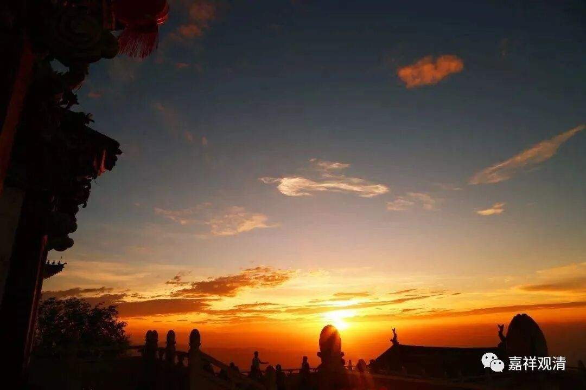

**《微课佛教史》67·3**

印度的辩论或者宗教哲学、思辨是非常发达的，而且他们在辩论的后期就比较强调对辩论规矩的尊重，实际上也就是比较强调逻辑，发展出了套路，所以各派也纷纷发展自己的逻辑学。在辩论获胜以后，可以说是名誉、地位都有了。所以当时印度外道（中的顶尖高手）学习都挺扎实的。

这些各派的大师们，不仅需要学习本门派的知识，还要认真、专业级地学习其他门派的知识。比如当时的佛教徒也要学习数论派、胜论派等其他宗教的内容，而其他宗教想要和佛教辩论的话，也要学习佛教的内容，比如刚刚讲的那个商羯罗，他也学习了很多佛教的内容。

在阿含或者戒经当中就保留有很多佛教和外教辩论、印度各教派之间、各教派内部的辩论故事。看起来很早的时候他们就有很发达的论辩传统，很有趣，差不多同时的咱们春秋、战国时期也有诸子到处游说、发扬各自的主张，也都能靠这个换来地位、产业……虽然在顶尖的“思想家”看来，这些并非他们所追求的……

当时很多佛教的寺院在辩论输掉之后都被迫改宗。按照以前印度辩论的规矩来说，你这个宗派在辩论中输掉的话，你这个寺院就是别人的，你这个人也要改宗。之前我们在讲中观派的时候也讲到过，圣天菩萨在和别人辩论的时候，对方就说如果输了就把头割给你，然后圣天菩萨就说：“我们是不杀生的，我不要你的头，我赢了你的话，你们就把你们的寺院都归给我们，然后你们的人也改宗。”

跳出一般的传说来看，历史上教团、寺院大批的改宗，教派、宗派的迅速崛起和衰弱，这类现象的出现，多半直接和统治者的好恶关系更密切一些，或者说通常政经是一个不能忽视的重要因素，释迦、龙树、玄奘、鉴真……这类顶级大师固然有着改变历史走向的能力，但他们背后，也都站着大力支持他们的国王。说服国王，你就成功了一大半……

