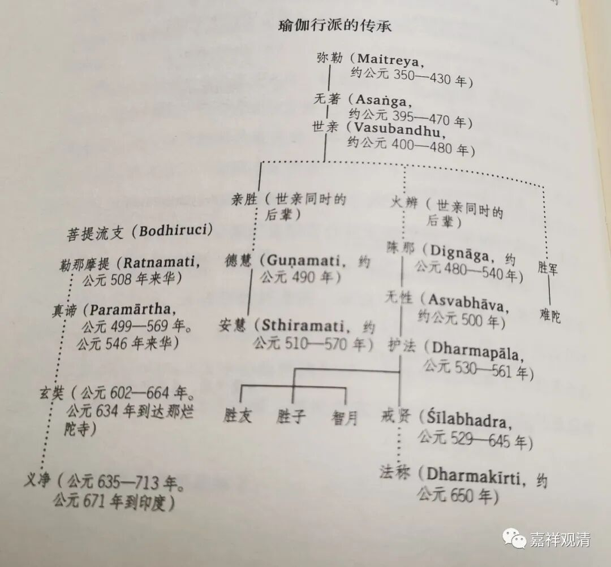
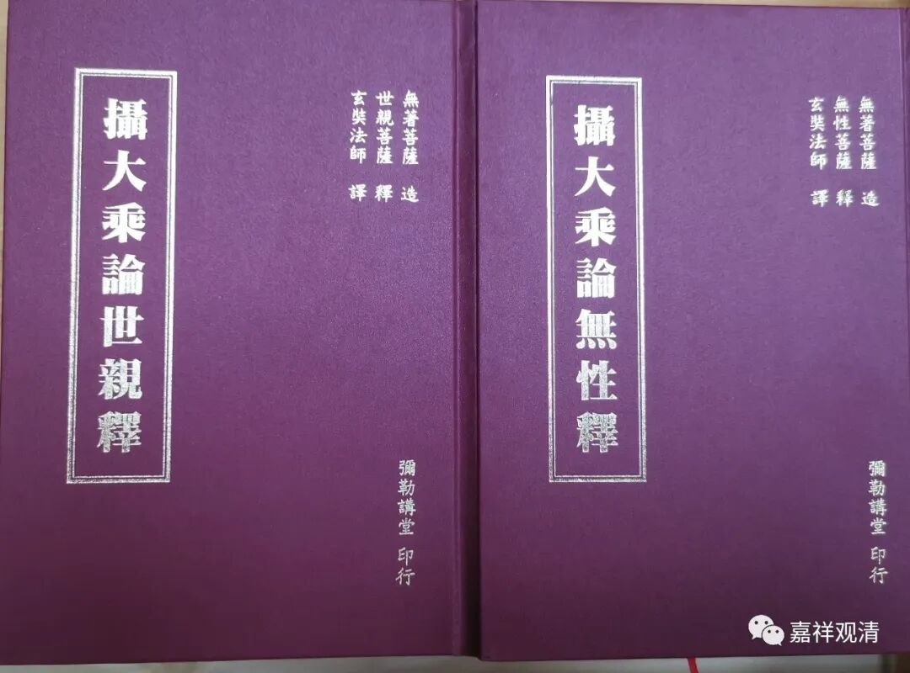

**《微课佛教史》74·3**

《成唯识论》提到的相关的“十大论师”的第八位叫胜友。

第九位是最胜子论师，在汉地有翻译过一部《瑜伽师地论》的注释，只翻译了一卷，就是最胜子论师的注解。藏地好像也有这部《瑜伽释》。

“十大”的最后一位论师叫智月论师。

胜友论师、最胜子论师和智月论师这三位都是护法大师的门人，是他的弟子。

我们前面讲过，玄奘法师是护法大师这一系的，在《成唯识论》的糅译当中，是特别以护法大师为根本注解的背景。当然也经常会用到安慧大师的一些定义，也照顾到了其他的论师。在十大论师中，护法大师这一系是有四位，最后的胜友论师、最胜子论师和智月论师，再加上护法大师本人，《成唯识论》是以这一系为主的。

那么，这十位论师就被称为注解《唯识三十颂》的十大论师，是注解《唯识三十颂》的十大论师，不是唯识派的十大论师。现在有很多人就说这十位是唯识的十大论师，我再一次提醒大家。这十位论师对《唯识三十颂》的注解是都当时重要的流行版本，《成唯识论》是以这十部论著为蓝本而糅译在一起的。现在我们能够看到的十大论师单独的注解好像只有安慧论师的《唯识三十论》，其他论师的注解到现在好像都没有出现，这个也是有点可惜。

“十大论师”中没有陈那，说明他没有《唯识三十颂》的注解，但是他绝对是唯识圈顶尖的存在，地位仅次于弥勒、无著、世亲而已。

下面这个图是平川彰《印度佛教史》里的“瑜伽行派传承表”大家可以看一下。

表里面还有一位无性论师，汉地有《摄大乘论无性释》现存，是《摄大乘论》两个重要印度注解之一，另一部是世亲论师的《摄大乘论释》，都有玄奘法师的译本。

今天《佛教史》的部分就先讲到这里，算是讲得比较多的。谢谢大家，祝吉祥如意！

