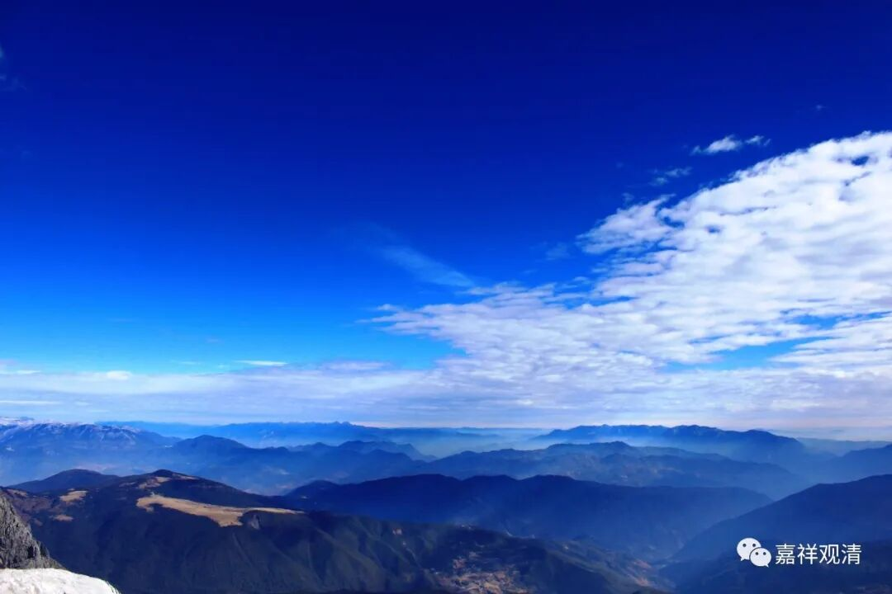

**《微课堂佛教史》076·1**

那么我们刚才讲到，胜军论师也是玄奘法师的一位老师。我们现在不是经常在做擦擦吗？胜军论师就是做了好多擦擦的。藏传佛教说做完擦擦以后要造一个塔，然后把擦擦都放进去，叫“擦龛”什么的。胜军论师就是做了好多擦擦，然后造了十万十万的大塔，平时讲经之外相对空闲的时候就做擦擦（造佛像）、造佛塔。

义净法师后来在他的《南海寄归内法传》中也讲到了做擦擦、造佛塔，说明这在当时是一个非常流行的做功德的形式。小佛像擦擦各种形式都有，做泥塔的也有，做金银铜铁塔的都有，主要是为了培福报。所以西藏的做擦擦也是有传承的，是有说法的。

胜军论师好像也没有特别有名的弟子，至少没有听到过他的其他弟子，玄奘法师可能是比较重要的一个弟子。哦，还要稍微提一下，胜军论师是一位居士。戒贤论师也是一样，他的其他弟子好像也没有什么重要人物。胜军论师是戒贤论师的弟子，然后还有一位叫亲光论师的弟子，好像最重要的弟子就是玄奘法师了。

虽然唯识派在玄奘法师到达前后时那烂陀寺的主流学术，但是唯识派后期名气比较大的论师，或者我们现在比较熟悉的论师，好像有点说不出来。如果在再往后呢，藏传佛教可能就要谈到金洲大师了（但是据巴登大师最新考证，实际金洲大师是中观宗的学者），其他名气大一点的大师好像有点叫不出来了。我们可以说，差不多从这个时候开始，印度唯识派的系统就往中国流传了。（私下和某某仁波切聊天，他的意思是，后期唯识扛不住中观的批评，慢慢演变为中观自续顺瑜伽行派了。）

其实最早把印度唯识系统传入中国的，好像是菩提留支论师（留是留下来的留），之后很快接着的就是真谛法师，就真谛法师的年代来说，要比玄奘法师略早。玄奘法师是戒贤论师的弟子，也可以说，真谛法师可能和戒贤论师的年龄差不多。因为戒贤论师的年龄很大，所以真谛法师大概和戒贤论师差不多或者略早一些，正好能够接上安慧论师。所以唯识圈子里有这个说法，说真谛法师是安慧论师的弟子，看起来是有可能的。所以真谛法师翻译过来的很多说法都是属于安慧大师这一系的。

