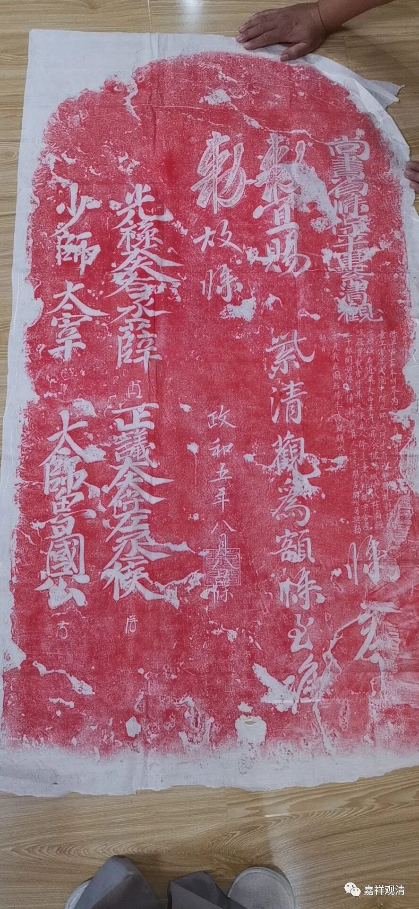

**《北宋政和五年紫清观敕额牒》碑拓**

历代对佛道教等皆有相应的管理制度，这就是一份历史上管理佛道教的文献，是一个碑文的拓本。

“敕牒”，就类似今天的宗教场所活动证书，没有“敕牒”的寺观就是没有造册，理论上不受保护、甚至那啥……。

这个碑，就类似一个法律文书。当然本来“敕牒”就是一个法律文书了，用碑的形式再把它固定下来。有些寺院收购或被捐赠的田产也以碑文的形式固定下来，有两种形式，分别以买家和寺院（或捐赠者）的口吻落笔。

尚书省：是颁发机构。

紫清观：这是这个道观的名称。（跟我没关系。也跟紫青宝剑没关系。）

敕：指皇帝的命令，

牒：指文书。

颁发时间：宋徽宗政和五年（公元1115年）。

签字画押：光禄大夫右丞薛，正议大夫左丞侯，少师太宰鲁国公（蔡京）。

类似的这种碑文，现存还有金代的，据说在山西某博物馆。

中国历史上战乱多，特别是有些长时间的围城战，这时候，城里面守城用的所谓滚木、檑石就有可能拆寺院取木头、卸石碑……所以，理论上这类文献应该很多，但实际却没多少留得下来。

这是其中的一件。

拖鞋又又又抢镜了……

