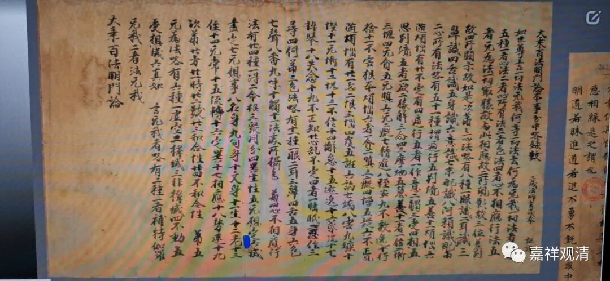

**网上看到一个《百法》写本**

看到中华珍宝网有一件敦煌本的《百法明门论》的写本，粗看一下，有些东西很同行版本不同，稍微记录一下，

随手记录的，不算完整……

经题：通行本作“……略录名数”，此处做“略录数”，皆可通。

通行本“阿赖耶识”，写本作“阿赖识耶”，写本当为误抄。但也有不少藏经同写本，作“阿赖识耶”，可见早期传本就有差异。

“随烦恼十二”之后，通行本作“无愧”，此处做“愧”，此件有误。（也可能所有数字为后来所加，原文可能和“无惭”一起，是“无惭、愧”。）

通行本做“遍行有五”，写本作“遍行五”，二皆可通。

通行本“别境有五”等与上一条类似，多“有”……

别境第四，通行本做“定”，写本作“三摩地”，皆可通。

写本随烦恼之“廿、心乱”，通行本为“散乱”。《显扬圣教论》亦为“心乱”，但《显扬》“心乱”排在第十九。

心不相应行之“无想报”，写本作“无想事”，皆可通。

无为法六中，通行本皆作“真如无为”……“不动无为”等，写本径直作“真如、……不动”，写本更善。

通行本和写本都作“三位差别故”，有些本子上做“三分位差别故”，“分”字当衍。此处很多江湖版本数字标识示有问题，作“三所现影故、四分位差别故、五所显示故”，数字皆误，影响到藏文译本也照此翻译错了。后期很多注释版本中，此处之《百法》原文皆误而注解文字不误，所以这数字标识错误当是晚期出现的，但不晚于宋末，因为译者为南宋末代被大元虏去在萨迦寺出家的皇帝。

随手写一点，有空再继续看看……

