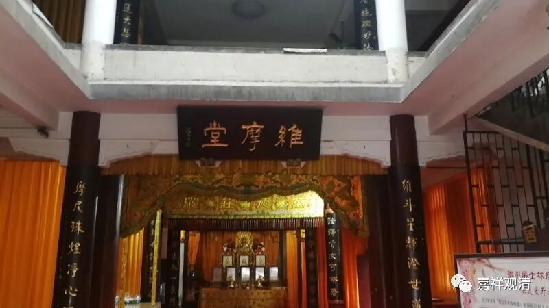
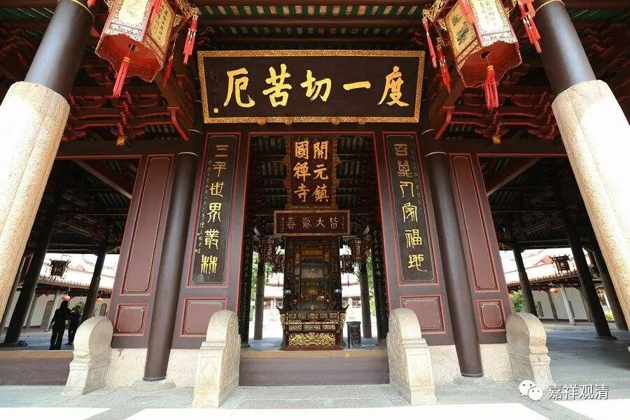
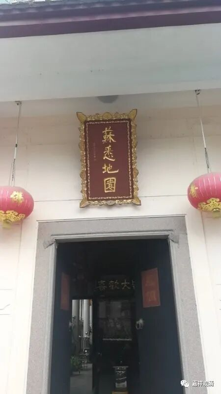
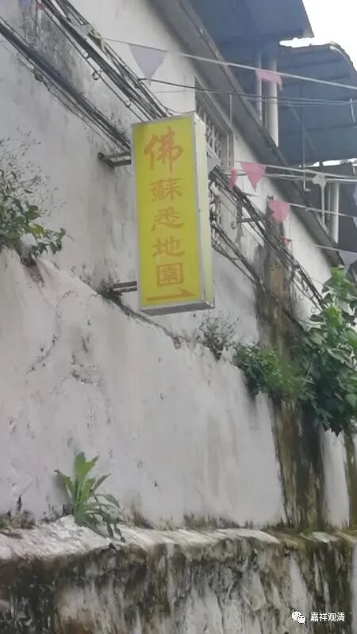
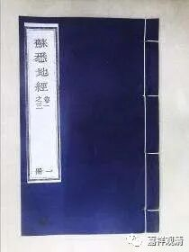

**潮州的苏悉地园**

又来了潮州开元寺

潮州还有个苏悉地园，离开元寺不远，和潮州开元寺也有点渊源。

苏悉地园，这个词一看就明白应该有密宗背景，唐代真言宗主要的三部核心经典就是《大日经》、《金刚顶经》和《苏悉地经》。《苏悉地经》是唐代佛教真言宗“开元三大士”（这个“开元”是唐开元年间的“开元”，不是这里的开元寺。）之一善无畏大师翻译的，“苏悉地”即妙成就的意思。

唐真言宗后由“遍照金刚”空海大师传入日本，后唐宋之际又再再东传，真言宗于汉地隐没后日本这一支一直很兴盛。民国时期在太虚法师八宗并宏的号召下又陆续有僧人赴日本接受东密传承，其中有几位顶尖高手，持松法师是一个（我认为民国佛教，以文笔而言，持松法师第一），还有一位天才型的僧人也在日本学有所成，可惜不寿，名字我一下想不起来了……

民国时期，潮州开元寺在太虚法师领导下办了岭东佛学院，太虚大师担任院长，学员30名。又编辑出版《人海灯》、《海沤集》、《南询集》等佛教书刊。此前，便有开元寺僧纯密赴日本求学真言密宗，回潮州后创“苏悉地园”，园址即今潮州市北马路忠节坊七星桥巷内。今仍有僧人住锡。民国时期另有一位居士弘法的东密传人王弘愿后在此创办“震旦密教重兴会”，后来持松法师和王弘愿还有过一场有名的论辩……

今天广东地区还有东密真言宗的传承，大多都跟王弘愿有关。持松法师后来任上海静安寺方丈，今有文集传世。

潮州开元寺走出的这位真言宗传人纯密法师不知道还有没有文字留下，或者今天苏悉地园的当家和这位法师有没有宗派上的关系呢？有空可以采采风……

