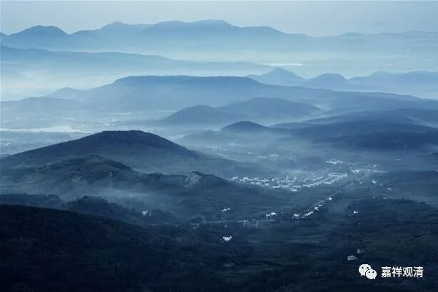

**旻法师、明法师与炅法师**

关于牛头法融禅师的师承，我一直依汤用彤先生的《汉魏两晋南北朝佛教史》，谓即茅山旻法师，亦即兴皇法朗座下大明法师。汤用彤先生引《续高僧传》卷二十一“法融传”作：“入茅山，依旻法师剃除”。

依慧祥《弘赞法华传》，法融有师“第山丰乐寺大明法师”及“钟山定林寺旻法师”。

《弘赞法华传》卷三

** “释法融，俗姓韦氏，丹阳延陵新亭人也……乃依第山丰乐寺大明法师，听三论及华严、大品。大集、维摩、法花等诸经……后有永嘉永安寺旷法师、会稽一音寺敏法师、钟山定林寺旻法师，并当时义海。融遍游座下，忻然独得。”**

案：“第山”，或即“茅山”之误，“第”、“茅”形近。钟山，即今南京紫金山；此钟山定林寺，即紫金山之上定林寺。（南京方山有下定林寺。）茅山、钟山，相去不甚远。

牛头法融有师茅山明法师和定林寺旻法师，旻(min)、明音近，或因而致误。

最近见网络资料及很多新著作“茅山炅(jiong)法师”，和记忆力的不同，遂寻原文。依《大正藏》本《续高僧传》卷二十六《法融传》：

“……遂入茅山，依炅法師，剃除周羅，服勤請道。炅譽動江海，德誘幾神，妙理真筌，無所遺隱……”

复检中华书局版《续高僧传》，则《法融传》在卷第二十一，亦作“炅法师”。

“旻”、“炅”形近，不知何者为确。

印顺法师《中国禅宗史》认为，“炅”(jiong)与“冥”(ming)形近，“冥”、“明”相通，故亦判定“炅法师”即“明法师”。

接下去准备找找看其他藏经版本，看看此处究竟是“炅法师”还是“旻法师”。当然，最终可能都指向“茅山明法师”。

附带提一下，最近有关于牛头禅的专著，误将“庄严寺旻法师”认作法融之师“钟山定林寺旻法师”。当知，“庄严寺僧旻”为成实名师，与“定林寺旻法师”不应混淆。

