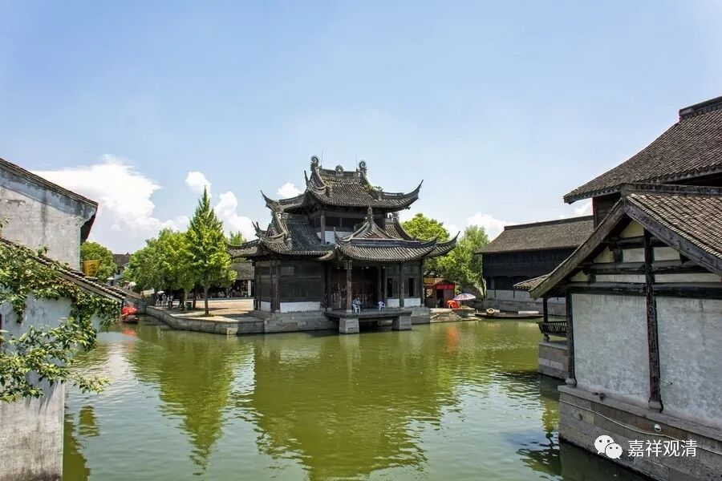
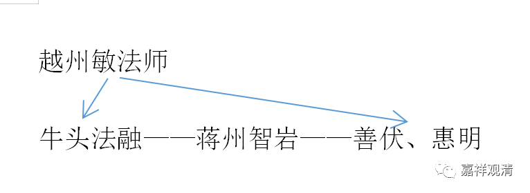

**越州敏法师与牛头法系**

牛头法融曾问学于“会稽一音寺敏法师”。据慧祥《弘赞法华传》卷三：

** “释法融，俗姓韦氏，丹阳延陵新亭人也……乃依第山丰乐寺大明法师，听三论及华严、大品。大集、维摩、法花等诸经……后有永嘉永安寺旷法师、会稽一音寺敏法师、锺山定林寺旻法师，并当时义海。融遍游座下，忻然独得。”**

此“会稽一音寺敏法师”，当即《续高僧传》之“越州敏法師”，会稽、越州，即今之绍兴。隋唐时期，会稽、越州、山阴之行政区划名称数变，后至宋代始名绍兴。

《续高僧传·善伏传》有“越州敏法师”：

** “释善伏，一名等照，姓蒋，常州义兴人……至苏州流水寺璧法师所。听四经三论。又往越州敏法师所。周流经教颇涉幽求……又上荆襄蕲部，见信禅师，示以入道方便……还到润州岩禅师所，示以无生观。”**

** **

此传可著意者有四事：1、苏州流水寺璧法师讲三论；2、越州敏法师；3、道信禅师；4、润州岩禅师。此岩禅师，即智岩禅师，被称为“牛头二祖”，润州人，则与牛头法融为同乡。而牛头法融亦有传说与道信、会稽敏法师有师承关系。

《续高僧传》复有《惠明传》，亦有“越州明法师”与“智岩禅师”：

“** 释惠明，姓王，杭州人。少出家，游道无定所。时越州敏法师聚徒扬化，远近奔随，明于法席二十五年，众侣千僧，解玄第一，持衣大布二十余载，时共目之‘青布明’也。翘勇果敢，策勤无偶。后至蒋州岩禅师所。”**

和善伏法师一样，惠明亦为“越州明法师”与“智岩禅师”之弟子。

《明州阿育王山志》卷二：

** “贞观十九年，敏法师者，禹穴道胜，历览圣迹，依然动神。领徒数百，来寺一月，敷讲经论，士俗咸会。”**

此处之“禹穴道胜”的敏法师，亦即前之“越州敏法师”。“禹穴”，亦为绍兴之别名。

按：牛头初祖法融与善伏、惠明皆师从越州敏法师，而牛头二祖智岩复为善伏、惠明之师，此间三四代之关系似乎颇为密切……

