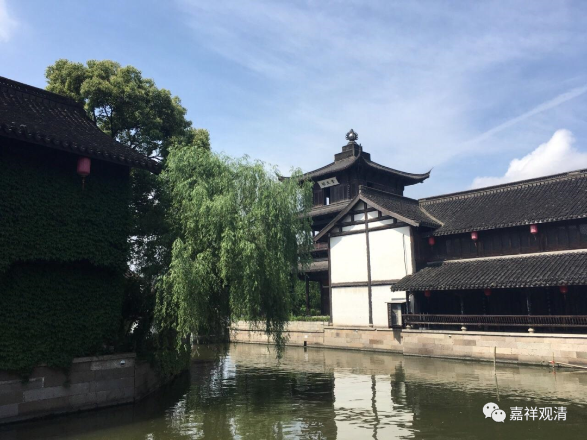

**《微课佛教史》80·3**

唯识这一系的经典，他翻译得就更加完整了。

真谛法师翻译过《瑜伽师地论》的前面一部分，叫《十七地论》；翻译过《决定藏论》，也是《瑜伽师地论》的一部分，是《摄抉择分》当中的一部分；翻译过《辨中边论》，真谛三藏的译作叫做《中边分别论》，同时也给《辨中边论》写了注疏，这些都没了。他翻译过《解深密经》，也是唯识宗很重要的经典，还有《解深密经疏》，也没了。《金刚般若论》是世亲论师的，这个保留下来了。《唯识二十论》，真谛三藏法师翻译的叫《大乘唯识论》，也做了译疏和注解，都没了。

他还翻译过《摄大乘论》和《摄大乘论释》——这个保存下来了，但是他作的《摄大乘论义疏》，没了。翻译过《佛性论》，写过《佛性义》，这个好像也没了。还翻译过《三无性论》和《显识论》，这两部都在，还有《转识论》——就是《唯识三十颂》，这个也有。翻译过《解拳论》——这个可能是《掌珍论》。另外还翻译过《观所缘缘论》的异译——《无相思尘论》。

还有《十八空论》，以前说是他翻译的，现在说也可能是他的注解，对应的可能是 《辨中边论》当中的某一段的讲解，讲的是十八空。

想想真的是很可惜，真谛法师很多的口译、很多的注疏都失传了。他翻译的《中观论》，这么重要的作品都没了……刚才掉线了，本来想总结一下的。真谛三藏法师在中国的翻译史上的作品非常多，涉及的佛学内容也是非常完整的。但是很可惜，他正好碰到了可以说是生不逢时的这样一个时候，几经丧乱，他的作品很少被保留下来，而他的后面有新译的唯识派兴起。真的是很可惜，如果真谛法师的作品全部被保留下来，会对我们有很大的帮助，特别是帮助了解安慧论师这一系的唯识派等等。

总的来说，真谛法师应该是中国历史上四大译经师当中境遇最差的一个，即使算上不空三藏法师，他也仍然是那个境遇最差的一个，很可惜。总算他那些发过誓愿的弟子们没有白白努力，乃至后来的玄奘法师也可以算是他的后学之一，继续去求法，把唯识这一系更加完整地展现在世人的面前，让我们看到印度大乘佛教的又一个高峰。

好，今天的佛教史先讲到这里，谢谢大家！

