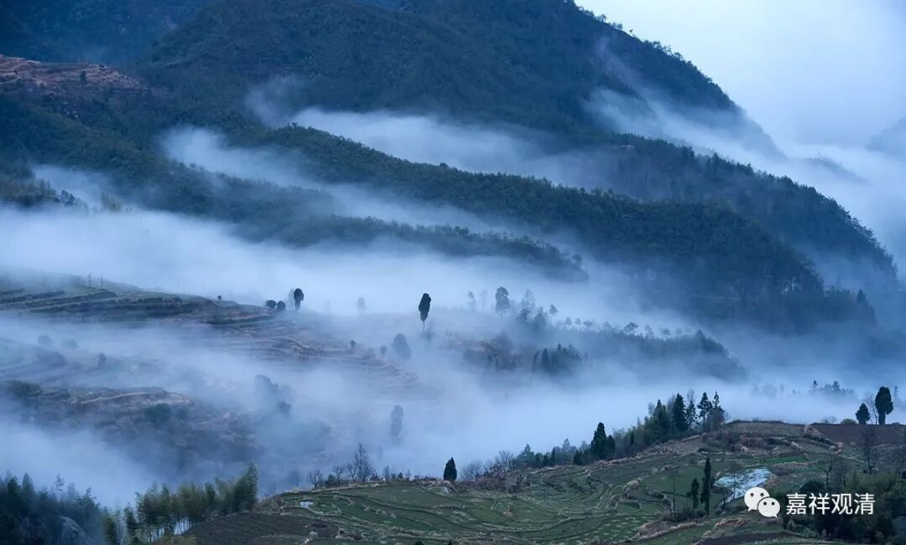

**《微课堂佛教史》081·1**

好，我们继续来讲讲佛教史。之前停了好多天，是吧？中间有点事儿，那今天继续。这两天可能还有点事情要出门。

佛教史的部分我们已经稍微顺了一遍中观宗，现在是讲到唯识宗汉地的这部分了。我们前面谈到唯识宗传入汉地的早期有两大译师——菩提留支法师和真谛法师。真谛法师是可以被列入中国四大译经师之中的，绝非等闲之辈。有些人看不起他，那是因为这些人自己没文化，或者强烈的宗派执，或者二者兼有。真谛法师大家应该要记住。

我之所以讲得有点慢，是因为本来在真谛法师之后打算讲玄奘法师的——玄奘法师的功业实在是太大了，后来又突然想到，其实在这中间还有一个人是应该提起的，而我们大部分的佛教徒对这位大师不是很了解，可能会了解另外一位同名的大师。我要说的就是慧远大师。

慧远这个名字呢，在佛教史当中出现过好几次。其中最重要的一个人物，或者说大家耳熟能详的，尤其是现在净土宗比较兴盛的情况下，就是净土宗的慧远大师，又被称为庐山慧远，就是庐山东林寺的慧远大师，这位大师大家是记得比较清楚的。

那么还有一位慧远大师呢，他的名声和实力都不逊于这位庐山慧远大师，就是我打算要讲的这位净影慧远大师——净是干净的净，影是电影的影，净影是指净影寺。为了区别于庐山东林寺的慧远大师，就称他为净影慧远大师。在历史上好像还有几位法师也叫慧远这个名字的，因为这个名字实在太好用了，吉藏大师的上首弟子中还有一位慧远法师，到宋代的时候又有一位慧远大师。

我们说净影慧远大师的实力应该绝不逊于庐山慧远大师，当时为人称道到什么程度呢？就说在隋唐之际包括唐初，如果哪个人没有看过净影慧远大师的著作，或者说没有好好地去学习过净影慧远大师的著作，那就别想写书了。换作正面的话来讲就是，隋唐时期的这些大师们没有一个不深深地受到净影慧远大师的影响。他的作品非常多，可以说是引领了那个时代的佛教潮流，他的作品比如《大乘义章》等等，也给中国后来的此类佛教作品开辟了先河——就是还有这样的一种写作方式，这种写作方式在以前是没有的。

