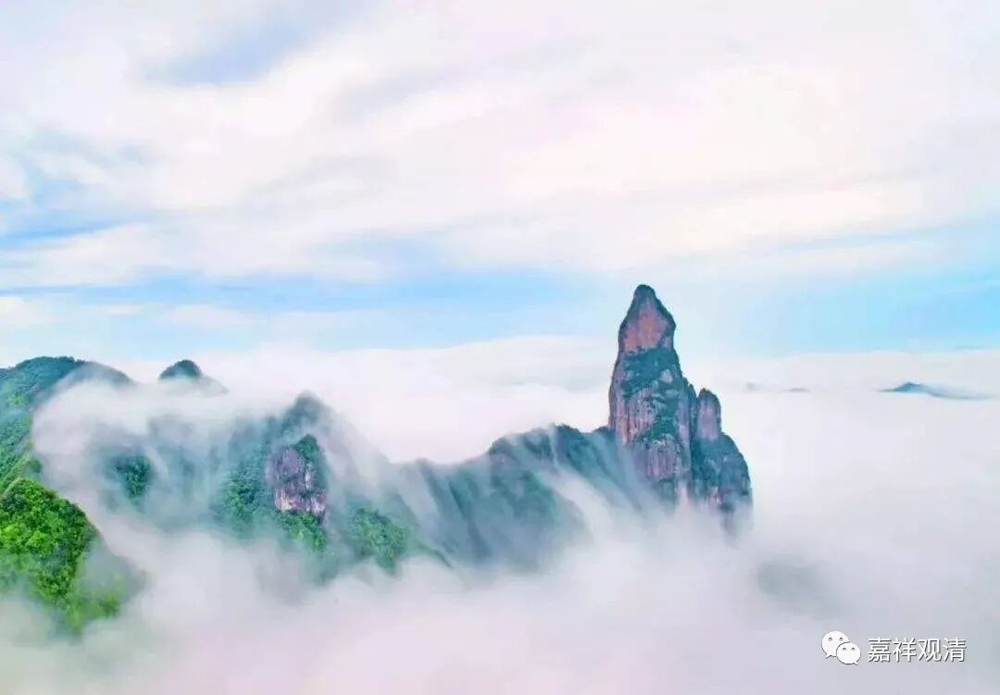

**《微课佛教史》81·2**

那么，我们今天就要谈一谈净影慧远大师。

为什么会在唯识的系统当中谈到净影慧远大师呢？因为他是属于北方的地论师系统的，或者说是属于北方的唯识师系统的。上次我们谈到过南北朝时期唯识方面的译师，其中很重要的一位就是菩提留支论师，他翻译了《十地经论》，对吧？就是对《华严经》的《十地品》的解释。后来这一系的论师就被称为地论师——地就是十地的地，论就是指《十地经论》嘛。慧远论师就是属于地论师的系统，那地论师是属于唯识系统的，因为《十地经论》的作者是世亲论师。地论师往后就发展成为后来的华严宗，所以华严宗和唯识宗的关系就比较深。

好，我们就来谈谈净影慧远大师吧。这位净影慧远大师非常了不起，他俗家姓李，是哪里人呢？敦煌人，和李世民他们家差不多。现在我们觉得敦煌就是个沙漠，是吧？你要知道在历史上敦煌可不是这种地位，它是绿洲啊，相当于今天上海的地位。敦煌是交通要道，是经济重镇。

慧远大师是敦煌人，后来就到了山西一带居住。他很小的时候父亲就去世了，应该是一两岁的时候吧，就由他的叔叔来抚养。他三岁的时候就想出家，七岁就开始学习，非常的聪明，十三岁就出家了。

他的剃度师（百度上写他的剃度师是昙始法师，然后被僧思法师带走的。今天没时间整理了，明天再看一下传记……）叫僧思禅师——僧是僧人的僧，思是思考的思，僧思禅师一看他就觉得不错，就把他剃度了，并且说：“你很聪明，有出家之相，要好好地自爱，好好地学习。”我们由此可以看出，以前觉得某个人聪明就说你有出家之相，今天我们不会这么讲的，是哇？如果我们今天觉得某个人聪明，应该会说你有当老板的前途，是吧？呵呵，说明当时的佛教在中国确实是上上下下都得到了很多的推崇。

净影慧远大师还是小沙弥的时候，学习的速度非常快，然后向老师提出的问题都是所学的内容当中非常精细的地方，老师都觉得能够提出这样问题的学生是非常厉害非常聪明的，将来必成大器。

净影慧远大师十六岁以后就到了大同，跟着大同的名师学习。大同以前是北方很重要的经济重镇，也是政治重镇，有很多的名师。现在怎么说呢，衰弱了，不过最近应该说又要兴起了吧。我们可以想象一下，在大同有云冈石窟，可见当时有多兴盛了。

