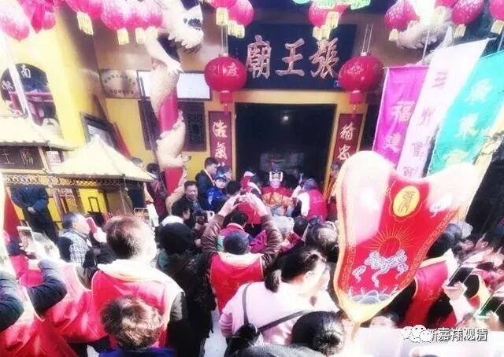
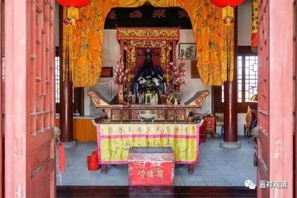
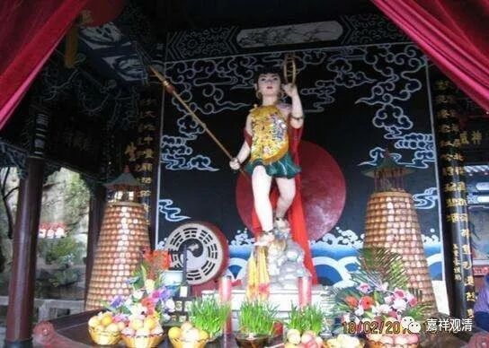
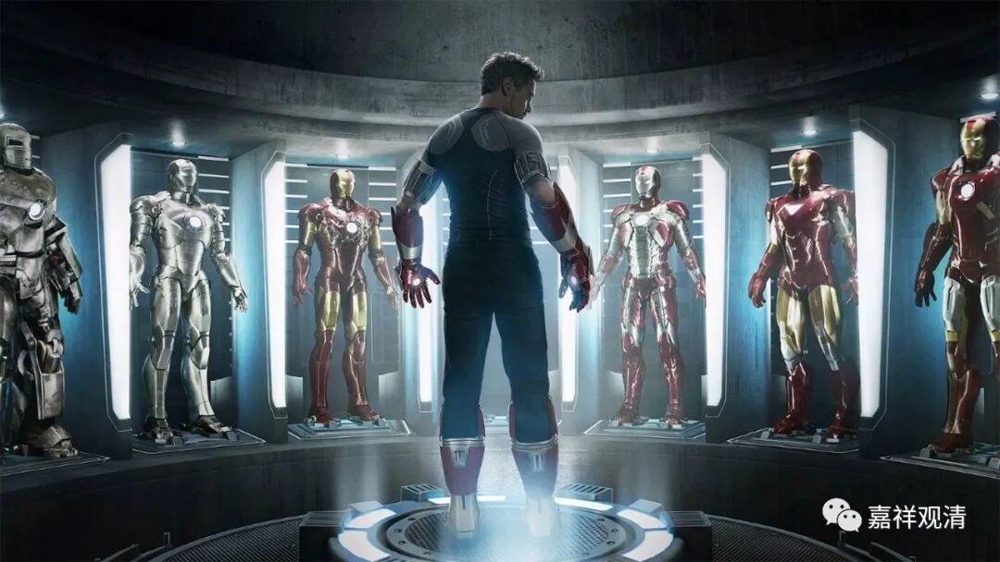

**人创造了神**

这里不是谈神学（神创造了人），也不是说没有六道（我是佛教徒），我们聊聊民间的、民俗角度的“神”的建立。

神的确立，不取决于其神力的大小，而是取决于，信众！这个“神”有没有人拜，有没有“香火”，才是“成神”的关键因素。《复仇者联盟》里面的一众角色，神力惊人，就其“神迹”而言，秒杀绝大多数民族的绝大多数神灵，但他们不是神，其原因就是，没有人拜，中国人的话说，“不受香火”。

鄱阳的“安澜王张巡”，原本是大唐睢阳的烈士，因为有官方的册封、民间的祭祀，现在的“神格”已经超出原始的册封；

上海·金泽·杨震庙

东汉的名臣、陕西的杨震（杨修的曾祖），因为一直有香烟“供奉”，在上海郊县他的大殿里挂满了“妙手回春”，死后“活”出了另一种格调；

再比如《封神》里的哪吒死后也要靠小庙的香火恢复身形，都说明了就民间层面、世俗的理解，“神是靠凡人的香火”立住的！如果拜的人多了，“神格”也会相应地提升，族神也可以流通到全世界，成为“唯一创世真神”，或者可以借用一个佛教名词，“神”和“拜神”者，是相依、相待而存在的。

如果想让钢铁侠、黑寡妇、超人、蝙蝠侠成神，很简单，造个庙，塑个像、立个牌位，香火燃起来，水果供起来……然后直播出去。不用多久，“钢铁侠”们就会显灵了！

