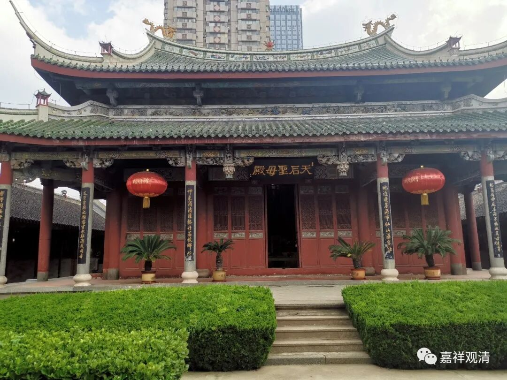
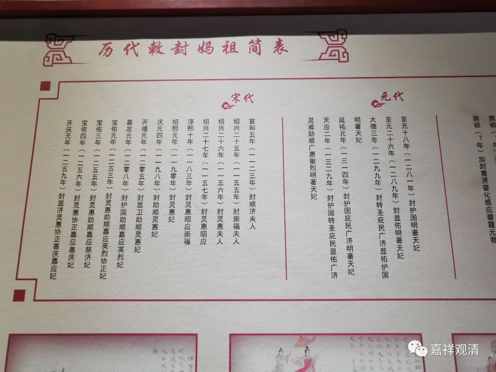
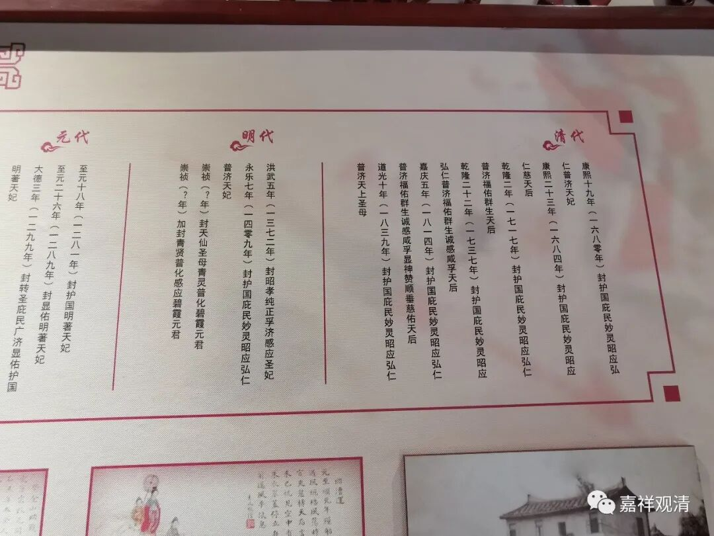
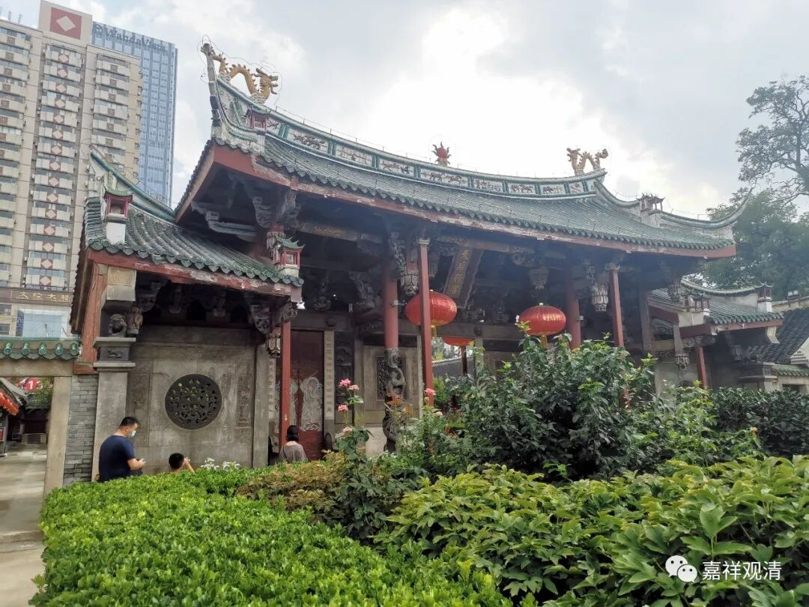
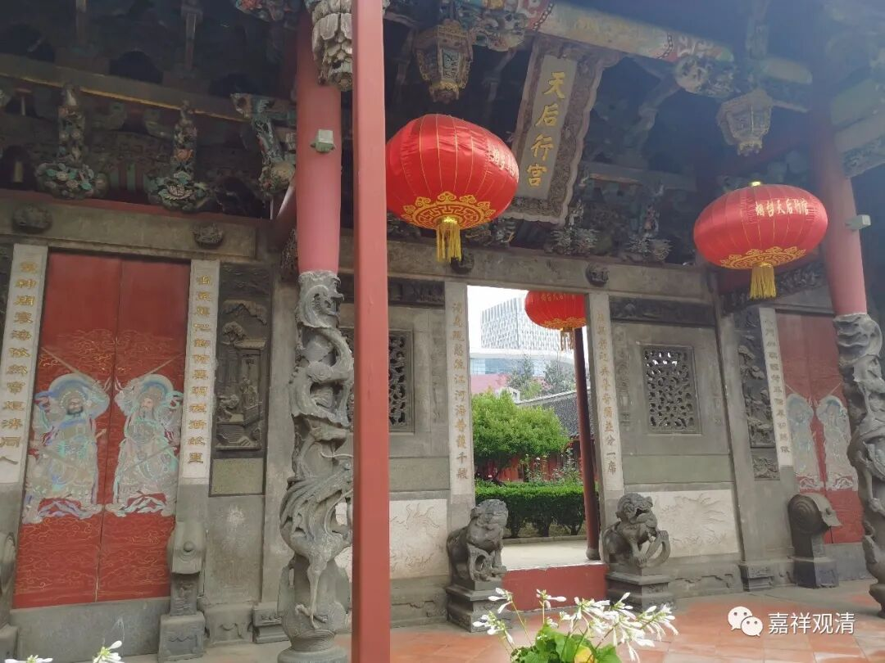

**烟台的天后行宫**

今天去了烟台的天后宫。

天后，就是妈祖娘娘。其实这里本来是烟台的福州会馆，福建人供妈祖，在会馆里辟大殿供奉，每年祭祀不绝，便俗称为天后宫了。

天后，又叫妈祖、天妃、碧霞元君、天后，各地都有供奉，大概看它叫“天妃”、“碧霞元君”或者“天后”，你就可以大致判断这个庙是啥时候建的。天后和关羽一样，也是一个逐渐被加封的神灵。

我们来看一下她历代被封的过程。

这是烟台天后宫里的一个陈列表，但是，排列的格式不太对，朝代从左向右，每个朝代下面的年代又从右向左，没办法，大家凑合着看看吧。知道个意思就行。

烟台这个叫“天后宫”，正说明它建立的时间很晚，因为“天后”这个名字是直到清代才封上的。

妈祖信仰是一个从民间兴起而后被官方化的信仰，获得了朝廷正祀的地位，民间和官方的两重身份让妈祖信仰迅速沿海岸线铺开，并走向东南亚。民国以后，它的官方身份脱落，又回归民间信仰本身了，但仍然还有生命力。

我问了一下，宁波奉化沿海一代的渔民，他们原先并不拜妈祖（可能是因为离普陀山近，观音信仰很兴盛的缘故吧），最近十几年，因为看到别人（可能是福建的渔民）拜，奉化的渔民也开始拜妈祖，搞庙会，而且活动越来越成建制，仪式感也越来越强了。

烟台的“天后行宫”是从福州“分灵”过来的。“分灵”就是一个很官方的标志：州府、县城的享有官方祭祀资格（比如火神、城隍、东岳大帝）的庙堂是固定的，神灵也是各有品级，乡镇里所本不具备供奉的“官方程序”。如果要供奉，那就要从官方庙堂去“分灵”，“请”去某地方享受香火、保佑一方。这种“分灵”的小庙有一个很常见的名字——“行宫”（县级以下的“城隍庙”其实都是“行宫”，不列入国家正祀）。烟台的福州会馆“天后宫”，官方的叫法就是“天后行宫”，这是它的“官方”身份，不能“逾制”。

