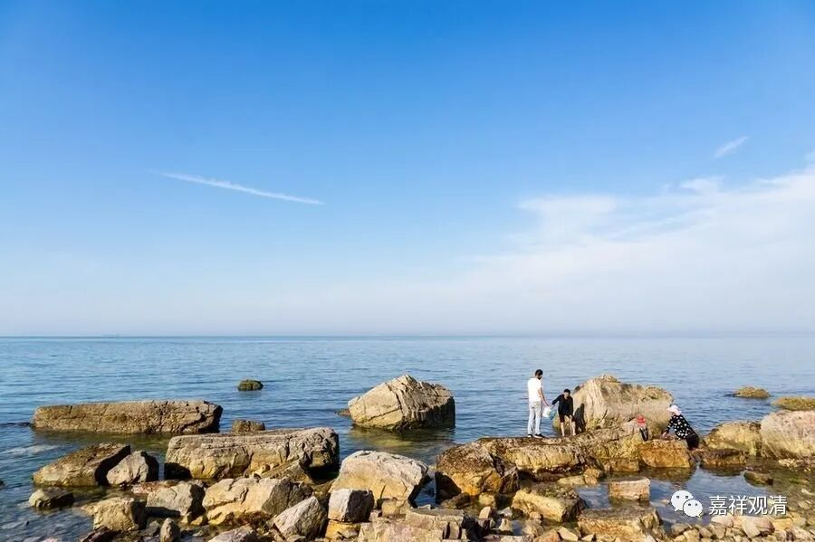

**《微课佛教史》85·3**

净影慧远大师年轻的时候生过场大病，是什么病呢？就是晚上睡不着觉，失眠，很痛苦，因为学习太累造成的。在藏地也有这个说法，藏地一些大寺院的老和尚的经验认为，学习太过分用功的话，有时候心脏、脾气都会不太好，“风大不调”，这时候需要休息一下。老师父们也举例说，某某同学，年轻时过分用功，后来生病，导致学业不能继续……

净影慧远大师年轻时也很用功，因为学习用心过度而身体不适，晚上睡不着觉，长期失眠。慧远大师就非常地痛苦，气上心头，心如刀割，吃也吃不下，身体也非常瘦弱，都快要死了。（看起来确实很像老师父们说的风症。）

这个时候呢，他就游历名山（也是一样的放松、放假的调整方法），到当时的禅修大师门前去学习。之前我们也讲过，南北朝的时候北地的佛教是非常见重禅修的，当时北朝佛教的非常重要的内容就是小乘的禅观和对戒律的重视。慧远大师就跟从这些禅师们学习，主要学习的是数息观。经过半个月以后，就觉得睡觉好一点了，也觉得佛教的禅修确实有道理——这是得到受用了。

差不多一整个夏天的三个月左右时间，慧远大师都在专门修习禅定，感觉身心愉悦，睡眠也好了，然后他就用自己的禅修体验去问询当时北地著名的禅修大师——僧稠法师。我们曾经在讲到三论宗和禅宗的时候提到过这位僧稠法师，他是当时北朝佛教禅修方面的一位大师，可以说是排前两位或者前三位的人物。

净影慧远大师去拜访僧稠大师的时候，僧稠大师就类似于印证地对他说：“你应该到达了禅修利根的境界，如果你再好好地继续禅修下去，对你的禅观或者毗钵舍那，对你在佛教的学习和观行都会有帮助。”此后，慧远大师在每次讲经的时候，提到禅定的相关章节就非常地赞叹，反反复复地赞美，以他自己修学的背景给大家一种经验式的现身说法。

但是很可惜，慧远大师本来是不想当佛协会长的，因为忙于政务就无睱调心。所以他说（天台宗的智者大师是一样的），如果不领众的话，可能可以证到更高的境界。

大家有兴趣的话，可以去看一下慧远大师的《大乘义章》。

我们知道，南北朝时候的北地师是非常重视《十地经论》的，在江湖上还有一种说法，说《大乘起信论》的作品性质有一点像北地论师。有人也提出来，这部论可能就是出自净影慧远大师的门下或者师承。

那么，净影慧远大师我们就讲到这里了，谢谢大家。

