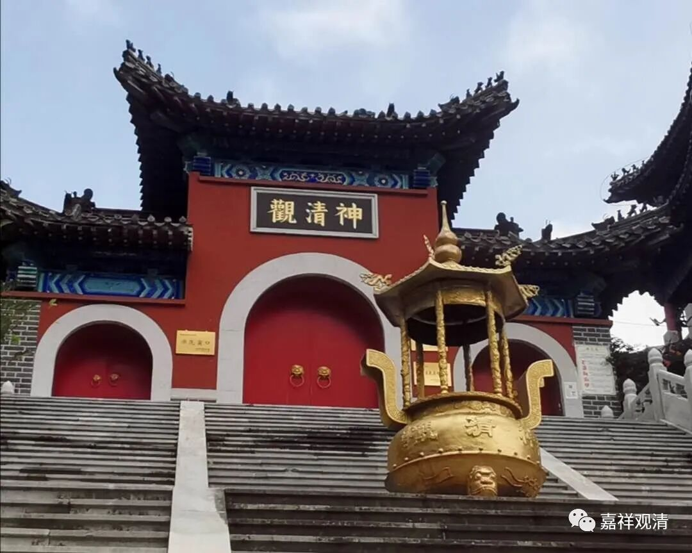

**全真祖庭——神清观**

在烟台博物馆，偶然发现道教的全真派是发祥于烟台的，便想去“一探究竟”。好在不算太远。

我印象里，以为道教全真派是出自陕西的，因为记得王重阳出自终南山（武侠小说里也是在终南山，还有林朝音和“活死人墓”。历史上，“活死人墓”是王重阳自己的），郝大通在华山凿禅窟而悟道……现在到了地头了，才知道，王重阳出终南山后便是在烟台的昆嵛山收的全真七子，创的全真教。

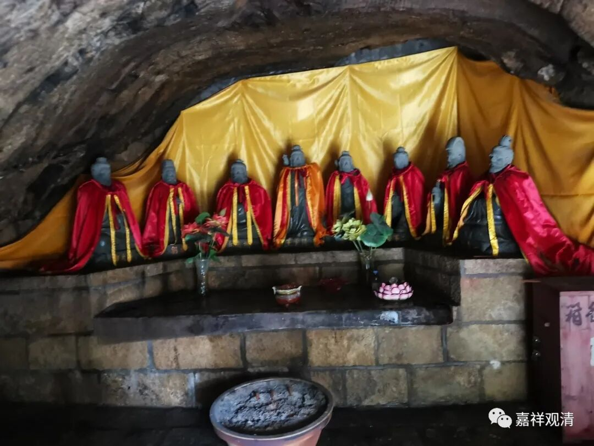

昆嵛山烟霞洞供奉的全真七子像

全真七子，早先是包括了王重阳的，即：王重阳、马钰、谭处瑞、王处一、郝大通、刘处玄、丘处机七人。后来，王重阳身份提了，全真七子里就加上马钰的妻子，女丹孙不二。其实，其中丘处机实际基本上是马钰辅导的，他的年龄比旁人要小得多。

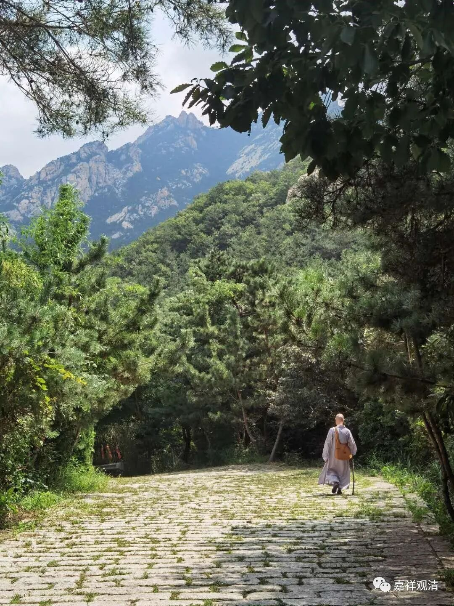

到了昆嵛山景区，就全靠腿子了。疫情期间没什么人，景区门票打二折。

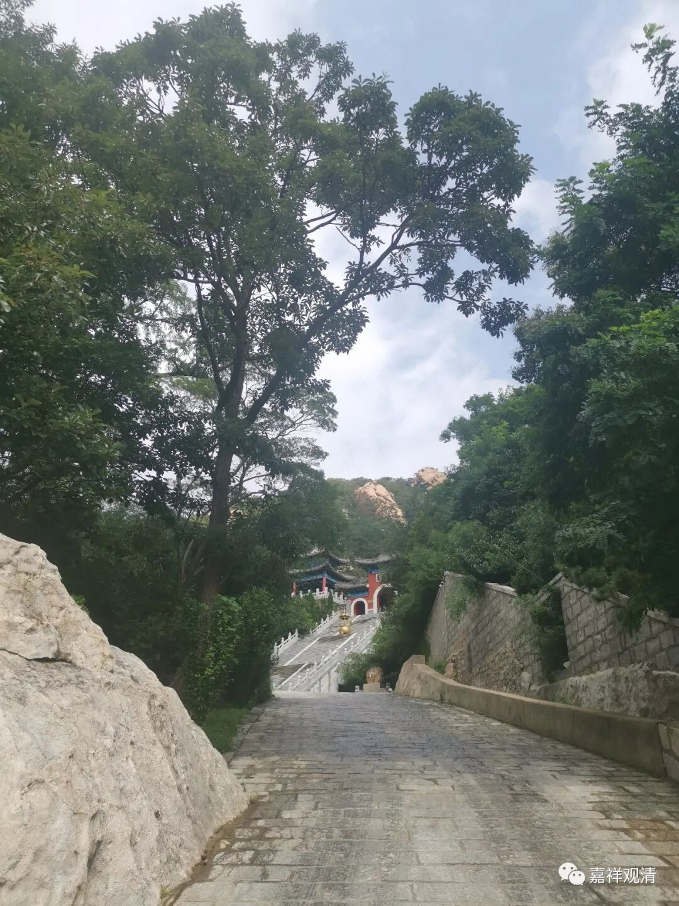

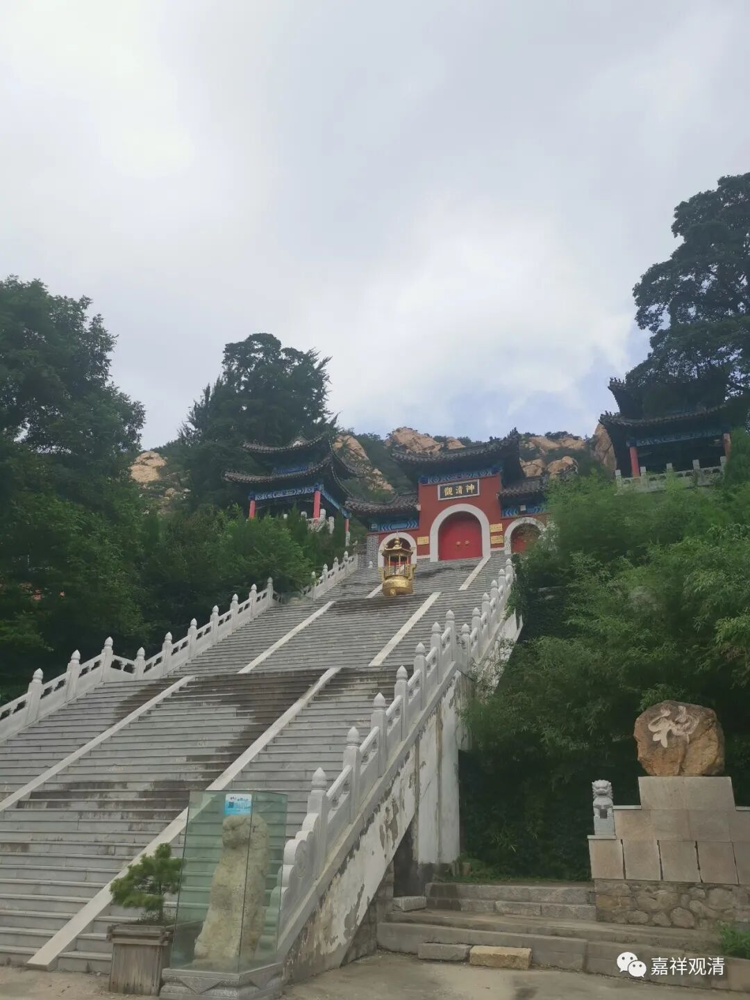

远远的看到……我的心情……大家应该知道（我事先不知道叫这个名字）。

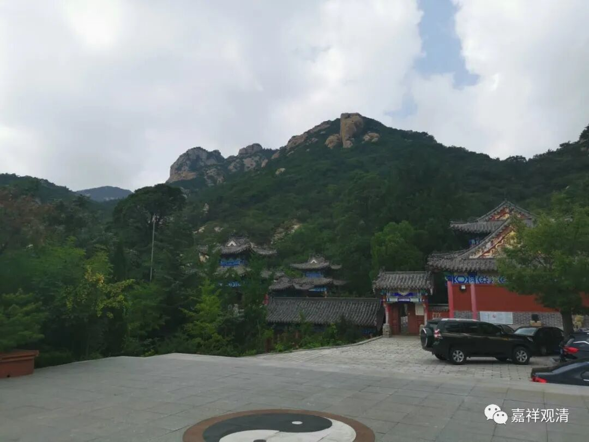

偶然地被道长请去喝茶，还被赠了三个大水果。（说实话，我之前还在想景区到处没人，午饭没有着落，有了这水果，今天不用饿肚子上山了。）道长们都比我慈祥，非常客气，我觉得我要好好学学人家。

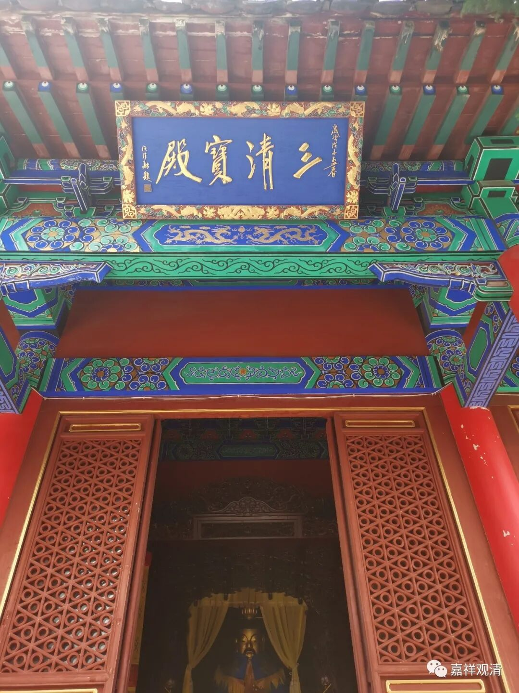

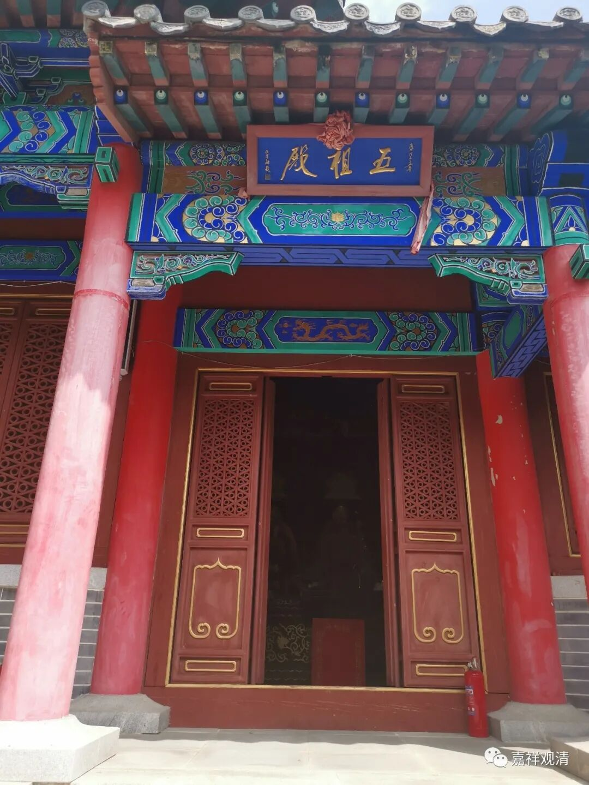

中国传统社会里面，道士和和尚关系一般情况下都是不错的，全真道和禅宗之间以前是可以互相开放“挂单”三天的。零八年我去镇江的茅山，人家看我有戒牒，免了我门票直接让把车开上山，道长还很客气地问我要不要挂单住几天，真是冬天里送来的温暖啊（那天很冷）。

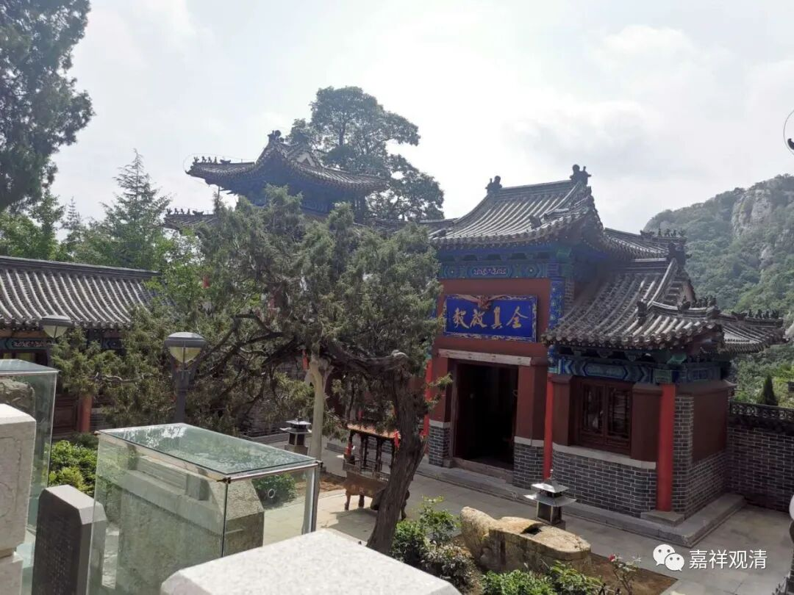

（“全真启教"匾）

神清观是最正宗的全真道的“祖庭”了，毕竟全真七子全都在这里办道，全真派实际是在这里创教的，所以理论上它相当于少林寺之于禅宗。但是“神清观”只比我们白云寺早恢复了两三年，现在虽小具规模，但就其在道教里的根本地位而言也要算是“百废待兴”了。

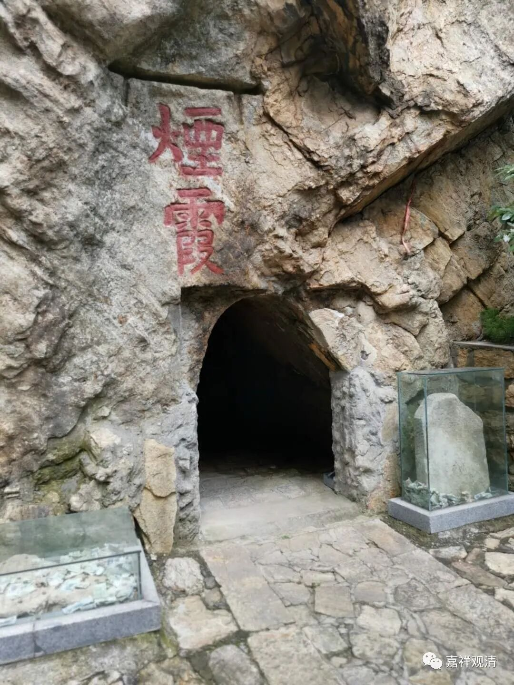

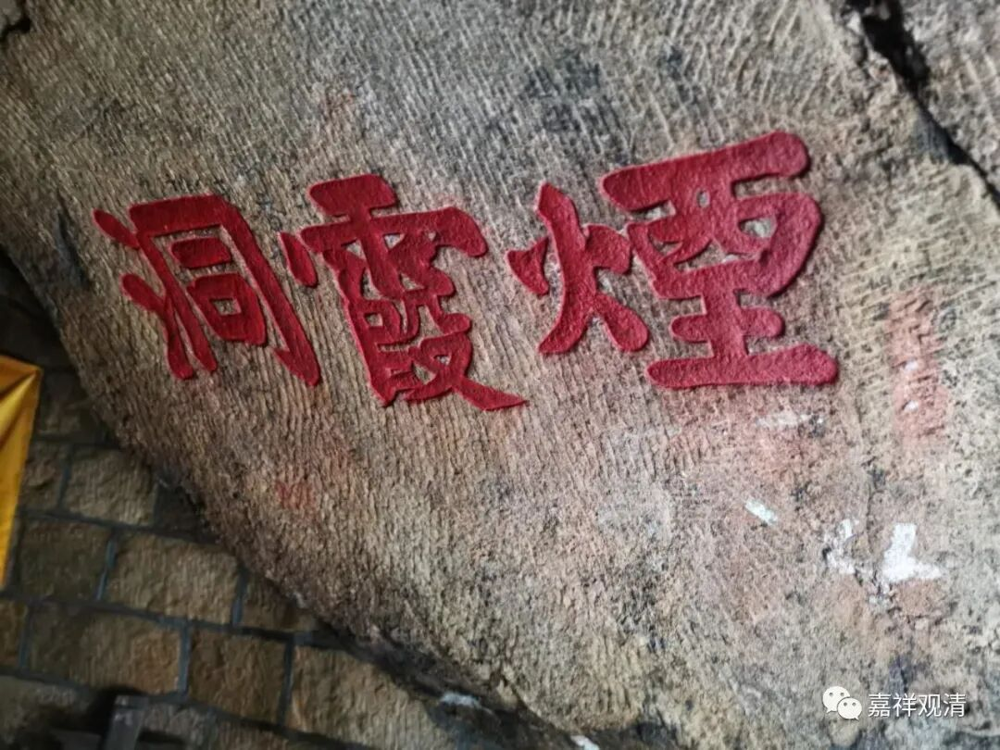

烟霞洞，就是当年全真七子（包括了王重阳那版的）最早在此处传道、修道之所。

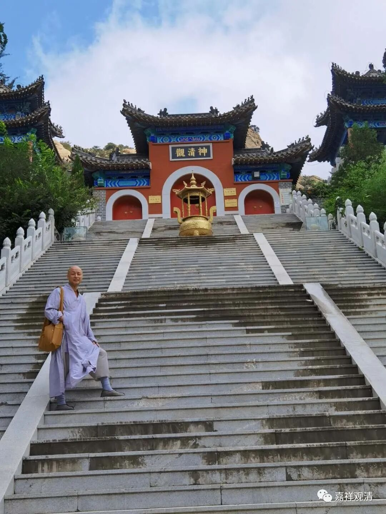

我来和它合个影吧。虽然大家都知道我是很低调的……

