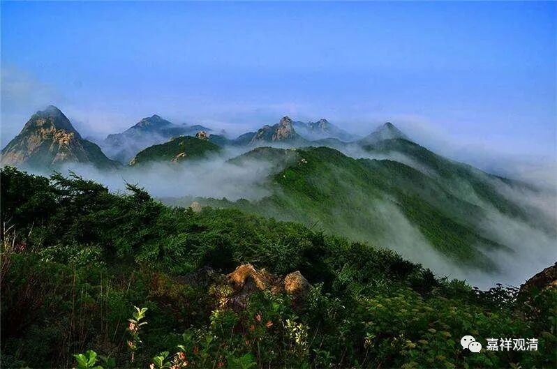

**《微课佛教史》86·2**

我们先说一下他的出生吧。他是哪里人呢？他出生在河南的洛阳附近，叫缑氏——这个字是念shī还是念zhì？哦，这个字念gōu。缑氏，属于偃师县。我曾经坐绿皮火车去洛阳和开封，我记得很清楚，这个缑氏镇是在洛阳和开封的中间。路过的时候就看到偃师这个地名，马上就想到玄奘法师了。“偃”就是偃旗息鼓的偃，“师”就是师长的师，老师的师。

玄奘法师是偃师县的缑氏人，他的父亲姓陈。在大正藏当中，一般称玄奘法师为唐三藏玄奘法师，对吧？有一个地方写的是“陈玄奘”法师，我曾经写过一篇文章提到这个地方写错了，不是陈代……后来想想应该是指他姓“陈”，就是这个陈玄奘法师的意思是指玄奘法师在家的时候姓陈。一般我们说唐玄奘，是指大唐的三藏法师，是唐代的玄奘法师。

玄奘法师出生的时候适逢隋文帝当政，我们前面讲过，佛教在此之前是受到了极大的伤害。我们在讲净影慧远大师的时候就谈到过，在南北朝时期的北魏和北周，都发生过灭佛的运动。而北周时期是离玄奘法师比较近的。

在这个时代谈到这些法师的时候，我们其实都要考虑到灭佛运动这件事情，因为灭佛运动对当时的影响是非常大的。我们现在可能也稍微有一点这样类似的事件，比如我们也有差不多十几年的“问该”等等。那么，当时也是一样，因为之前刚刚发生过灭佛运动，在后来佛教兴盛的时候确实会激起一部分人护法、卫道的激情。

在玄奘法师出生的前一年，恰好就是隋文帝登基的那一年。我们前面讲过，隋文帝小时候是在庙里长大的，所以等到他一掌权以后，就马上推翻了之前北周的灭佛运动。他在掌权以后就下诏书恢复佛教，可以说佛教从此就得到了很大的发展，甚至有报复性的发展。

隋文帝发布命令说，天下的人想出家的都允许出家，而且有点像征税一样，要求每户人家都要出钱，每个家里有男丁的，就按照男丁的人数摊派捐钱，捐了的钱用以重新建造寺院、建造佛像。因为佛像是铜的嘛，捐的钱是铜的嘛，这样就用来铸造佛像，因为隋文帝自己是非常非常信佛的。于是在各大城市都开始兴建（或者说）大型的寺院，因为之前的寺院和佛像都被毁了，所以要重新兴建寺院。

那么之前灭佛运动的时候，好多经书也被毁了，隋文帝就发布诏书说收集经书。结果收上来很多经书，然后再对这些收上来的经书进行编录，那时候就出现了《长房录》，费长房编撰的经书目录。但是这个费长房的经书目录，我们现在一般不太信任，因为这里面的错误很多，为什么呢？你要知道，在一个灭法运动之后，突然之间开始收集资料的时候，就会有很多的伪经、伪论被收上来。据说当时收上来的经书，比儒家的经典要多上六倍。

费长房就对收上来的经书进行了编目，然后写了这部目录学的书籍——我们称之为《长房录》。在这个当中，可以说伪经或者来源不清的经论非常非常多。不过，因为有了这样一个目录呢，大家就可以按照这个来找经书。照着抄写流通，所以以前编撰经书的目录有这个好处。就是我要建设图书馆的时候，我就先找到一本经书的目录，然后就吩咐馆藏按照这个目录里面的经书去寻找、抄写——因为以前的书都是抄写的嘛，所以这个经书的目录是蛮重要的。

