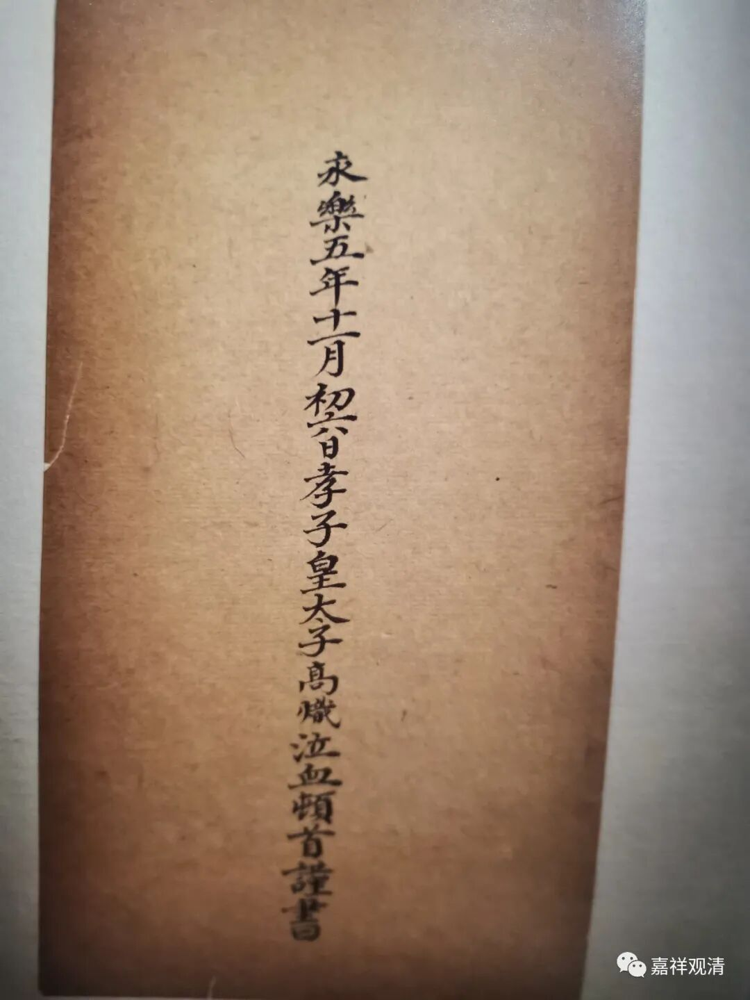
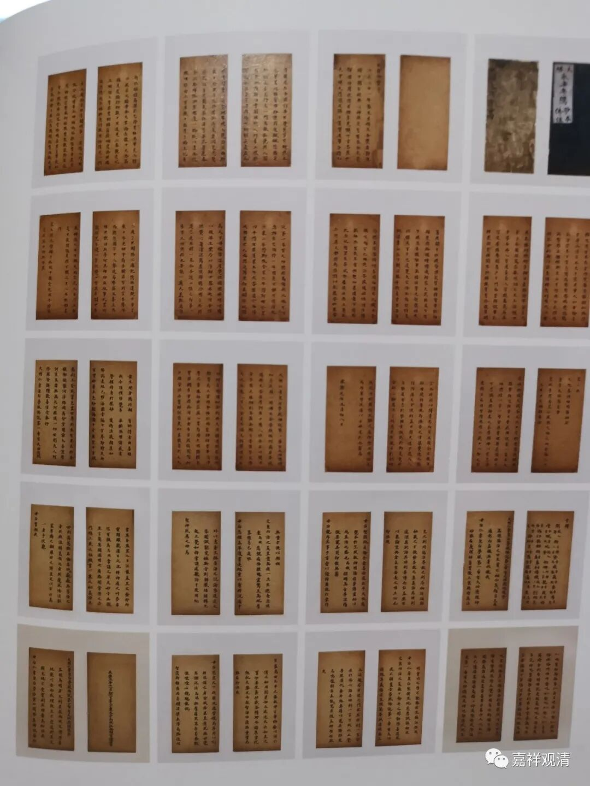
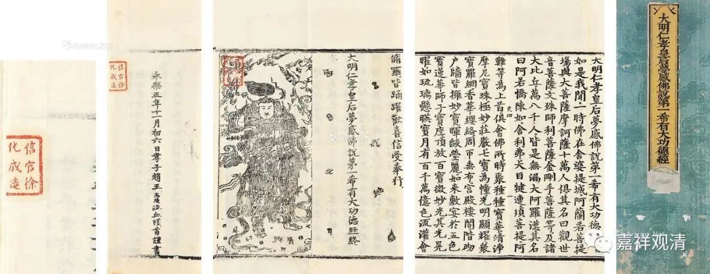

**皇帝一家参与创作的一本“疑伪经”**

上周在烟台万达酒店进行的荣宝斋古籍拍卖会上，有一件明·朱高炽款的《大明仁孝皇后梦感佛说第一希有功德经》，就是这件

朱高炽，后为明仁宗，此件为他还是皇太子时，于永乐五年十一月初六抄写的。

这部经，实际上是一部伪经，就是“大明仁孝皇后”“梦感”“佛说”的，醒了记录下来，就是这部《梦感功德经》（简称）了。因为是伪经，所以我兴趣不大，举了一次牌就没继续拍。对别的藏家而言，皇帝抄写的母后的经典，也是有故事的。对了，这一件抄本前面的序言是永乐帝“御制”的。皇帝一家三口都在一件文物里，也是一个说法了。

《梦感功德经》入了《永乐南藏》，后来在编《永乐北藏》的时候，被剔除了。永乐十八年，北藏的编撰者一如就《梦感功德经》是否入藏的问题请示永乐皇上，圣旨：“荒唐之言，不要入！”后来到万历年间《北藏》续编的时候，“圣慈皇太后”又把它补进去了。

清代雍正朝开始编、刻《龙藏》的时候，最初是依《永乐北藏》刊刻编入的，后来乾隆查出毁版了，所以前后期的《龙藏》里，会有不同。前些年复制《龙藏》的时候，又把它补进去了。进进出出的，也是挺忙活的。

《二十二种大藏经通检》里说，除了上述诸藏以外，《嘉兴藏》、《频迦藏》、《弘教藏》、《续藏》里也都有收录。

一家三口都参与了创作，其实这件东西也算有点噱头，但是咱没银子，就由他去吧……

除了朱高炽以外还有两位皇子也在这天抄写了这部经，制了后序，汉王朱高煦（xu）和赵王朱高燧都制了后续，下面这个就是刻印的本子了。

