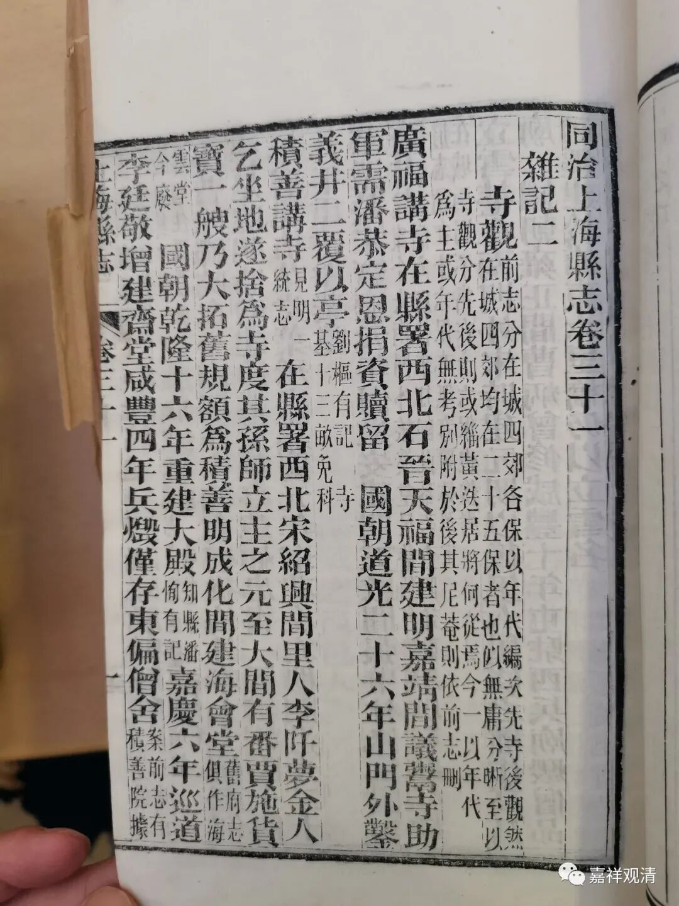
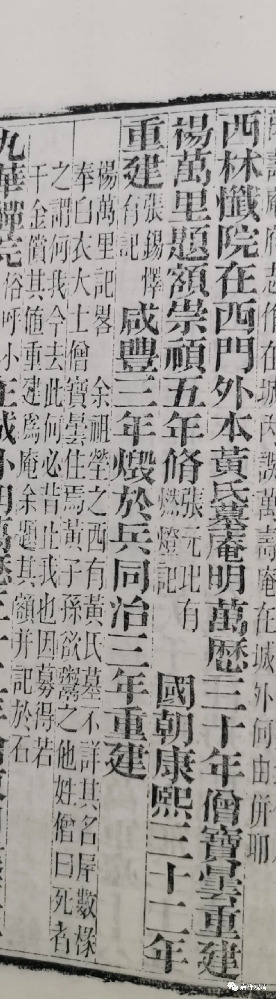
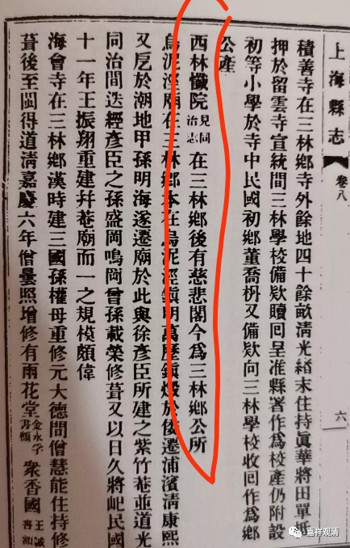

**《同治上海县志》所记载之“西林忏院”**

去年有过一段时间曾专门聊到过上海的一些寺院的历史，关于这个话题，有机会准备一点点做下去。现在已经收集了很多上海的地方志。

在这些寺院里面，聊到过一个“西林忏院”，当时考出《同治上海县志》有误，但在《中国地方志集成》中没有找到《同治上海县志》，只能引用二手资料了。

这次上海博古斋拍卖会上有《同治上海县志》，我没有拍到此件，但已经查到相应的记载。即如下

《同治上海县志》卷三十一《寺观》“西林忏院”条说：“在西门外，本黄氏墓庵，明万历三十年僧宝昙重建，杨万里题额”并附小注“杨万里《记略》：“余祖茔之西有黄氏墓，不详其名。房数橼，奉白衣大士，僧宝昙住焉……因募得若干今偿其值，重建为庵……”，此盖误明万历之“僧宝昙”为杨万里相关之“僧宝昙”。这一失误当延自西林忏院的所谓“杨万里题额”（当为好事者伪造）。

《民国上海县志》说：“（西林忏院）在三林乡，后有慈悲阁……”，可能是已经发现这一错误，而未沿袭《同治上海县志》之说。

按：

临时写两句算是记录一下，关于这个“西林忏院”，可以再仔细看看前后的《上海县志》的差异。

