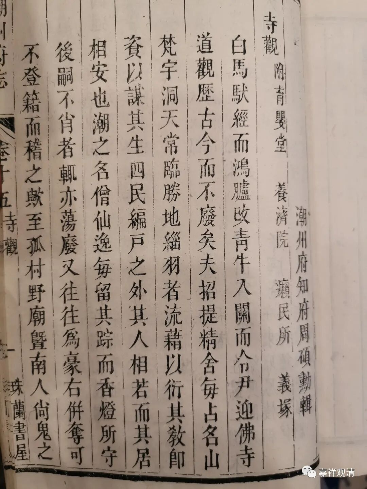
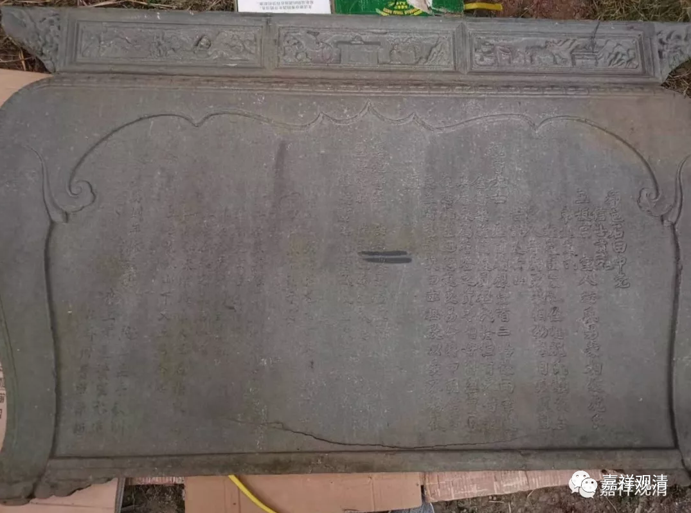
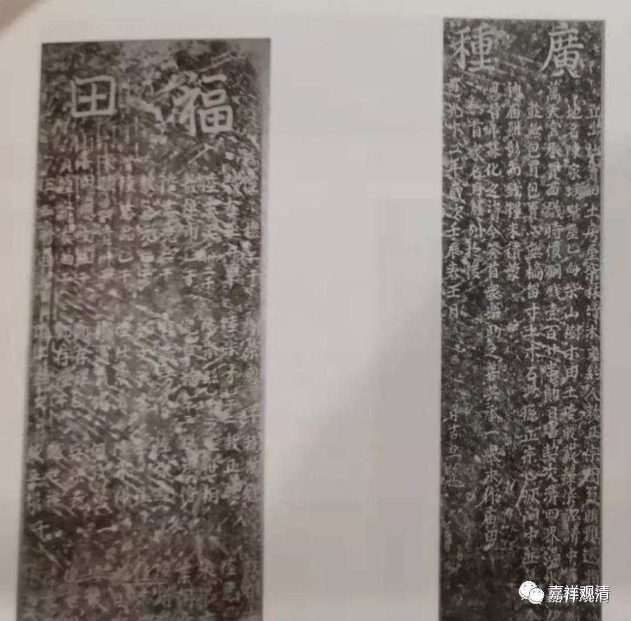

**地方豪强往往侵占乡村寺观**

《潮州府志》（清·乾隆周硕勋志）之《寺观》在卷十五，篇首有个小序。

《序》里说到：“……潮之名僧、仙逸每留其踪，而香灯所守，后嗣不肖者辄亦荡费；又往往为豪右并夺，可不登籍而稽之欤？……”

这是说，潮州的名僧、高道留下了踪迹，建立了寺观道场，而后人继承无能，寺观场所徒然废置……并且这些（公益性质的寺观场所）地产家业往往又被当地的豪强劣绅所霸占，所以呢，在编写志书的时候就把这些现有的正规寺院编籍，方便将来查考……

这一段有一个是我以前没想到的——地方豪右势力侵占寺观的行为。我以前读寺院的碑文，其中往往有涉及地产买卖的，这类碑刻类似一种地方性（乡村）的法律文书，文字中总觉得它们对寺院产权限定地太清晰。

原先认为，勒石刻碑是限制寺院把寺产流通出去，现在据此《序》文看来，还有约束当地的豪强避免其侵占寺产的作用。

