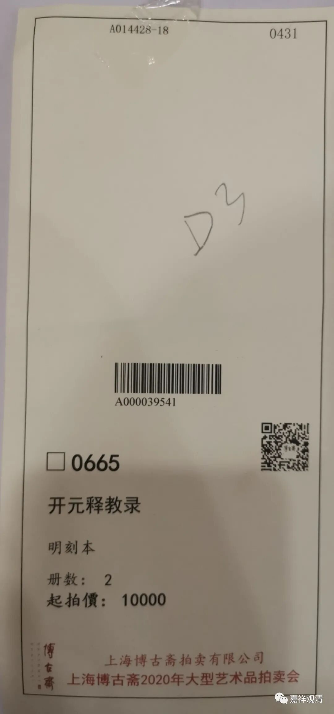
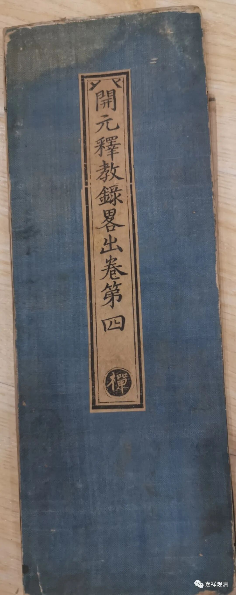
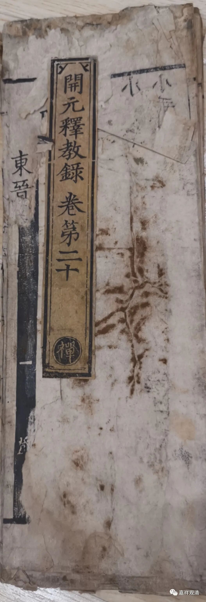
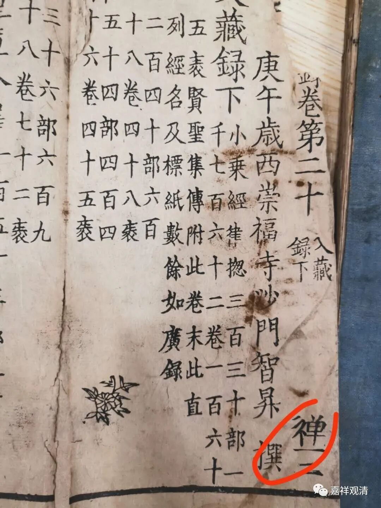
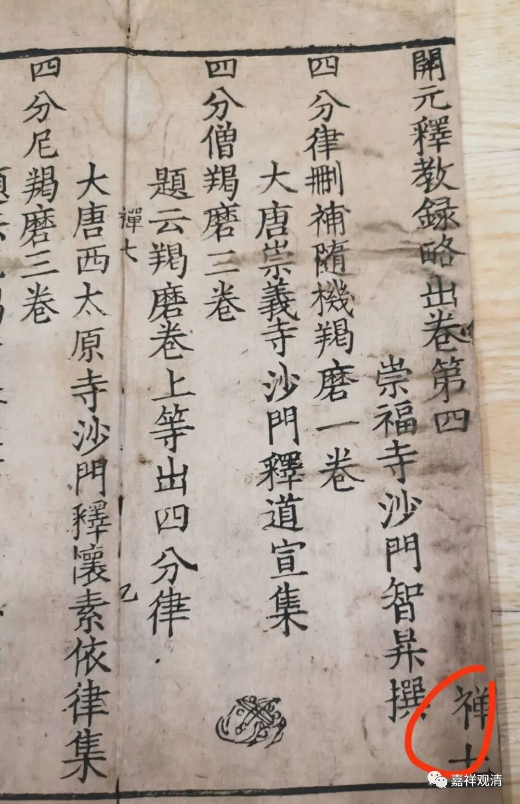
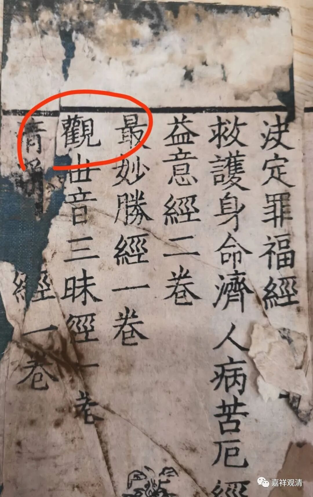

上海博古斋的这次2020春季拍卖会（因为疫情问题，都到秋天了），拍得了一件《开元释教录》。

这一件中间其实分两件，分别是《开元释教录》卷二十和《开元释教录略出》卷四。

拍卖的图录说是明刻本，具体来说，应是明永乐南藏本。《开元释教录》和《开元释教录略出》一般很少有单行本，此两卷又见千字文标号，分别是“禅三”和“禅七”，查《二十二种大藏经通检》，《开元释教录》永乐南藏千字文标号是“（宗—禅）”，《开元释教录略出》永乐南藏千字文标号是“（禅）”，正相符合（其他藏经版本的千字文编号则都不符合）。

预展的时候，我翻到《開元釋教錄略出》这一件的最后一页，突然就，眼前一亮！

这必须要拍下来啊！

上面的“最观清”一段，是《开元释教录略出》提出的疑伪经部分，原文如下：

“最妙胜经一卷

观世音三昧经一卷

清净法行经一卷

高王观世音经一卷

……并是古旧录中伪疑之经。《周录》虽编入正，文理并涉人谋，故此《录》除之不载……”

原来本来是“观清高”啊！

有机会查一下《永乐南藏》，看看这两件究竟是不是《永乐南藏》的本子。

