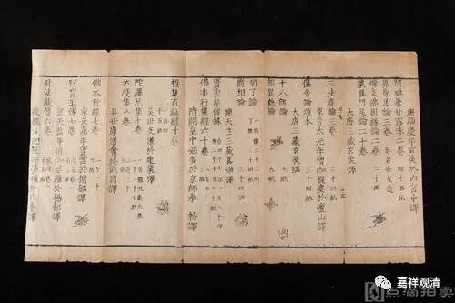

**《开元释教录》和猪八戒的九齿钉耙**

《百度百科》“《开元释教录略出》”条说：

“《开元释教录略出》是智升创作的宗教哲学类书籍。

凡二十卷。唐代智升编于开元十八年（730（庚午年））。又作开元录、开元目录、智升录。收于大正藏第五十五册。全书分成前后两部分……”

词条的这两段都错了。

首先，《开元释教录略出》不是“宗教哲学类书籍”，它是佛经目录类的书籍，跟哲学不沾边。

第二，《开元释教录略出》不是《开元释教录》（百度这个词条的编纂者抄写的是《百度阅读》），词条的编纂者混淆了《开元释教录》和《开元释教录略出》。《开元释教录略出》仅有四卷，《开元释教录》才是二十卷。《开元释教录略出》也有五卷本的，《开元释教录》也有三十卷本的，但《开元释教录略出》没有二十卷本的，它的篇幅就那么点。

《开元释教录略出》和《开元释教录》有关而不全同，《开元释教录略出》是《开元释教录》的《入藏录》（卷十九~卷二十）部分，加上千字文编号。如《开元释教录·入藏录》作：

“大般若波羅蜜多經六百卷(十六會說六十帙)一萬五百八十一紙”

同样的部分，《开元释教录略出》作：

“大般若波羅蜜多經六百卷 唐三藏玄奘法師於玉華宮寺譯

六十帙計一萬六百四十九紙　【天】字起至【柰】字止。”

《开元释教录》录经1124部，5048卷，后来5048这个数字乃至民间皆知，《西游记》里的唐僧取回的就是5048卷经书，乃至猪八戒的九齿钉耙、沙僧的降妖宝杖也都是5048斤。

5048这个数字，在中国文化的“记忆”里，早就和佛教不可分割了，而它的最初出处，便是《开元释教录》了。

