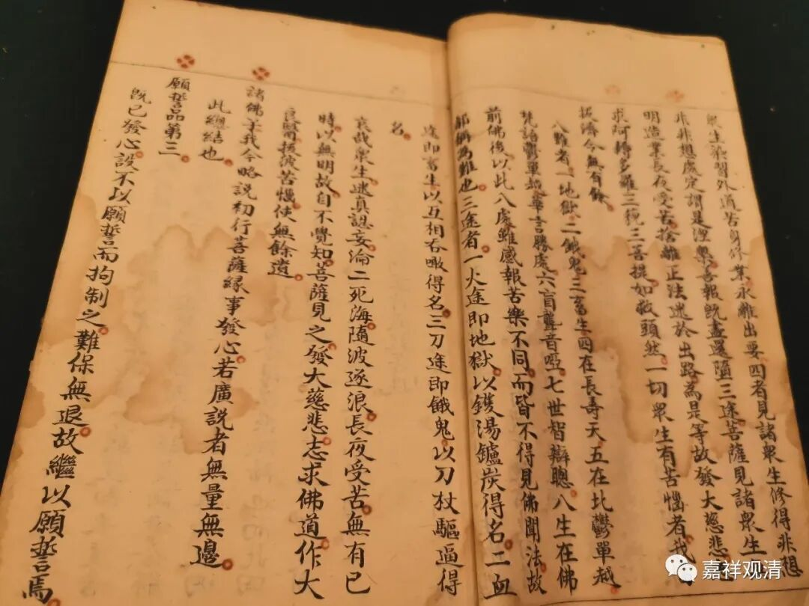

三途：“火途”、“血途”和“刀途”？

今天在拍卖会看到民国时期空也法师（当时被称为湖南四大高僧之一）的《发菩提心论略释》，看到如下这段，心里颇感意外。

空也（1885-1946）《发菩提心论略释》卷上：

**“‘三途’者，一、‘火途’，即地狱，以锅汤炉碳得名；二、‘血涂’，即畜生，以互相吞噉得名；三、‘刀途’，即饿鬼，以刀杖驱逼得名。”**

此处称“三途”为“火途”、“血途”和“刀途”，虽也指向地狱、饿鬼、畜生，但这“火途”、“血途”、“刀途”之“三途”和相应的解释，却是我初次得见。

遂查验藏经，发现这种说法原来出自智者大师的《摩诃止观》。

《摩诃止观》卷一：

** “若其心念念专贪瞋痴，摄之不还，拔之不出，日增月甚，起上品十恶，如五扇提罗者，此发地狱心，行火途道；**

** 若其心念念欲多眷属，如海吞流，如火焚薪，起中品十恶，如调达诱众者，此发畜生心，行血途道；**

** 若其心念念欲得名闻，四远八方称扬钦咏，内无实德，虚比贤圣，起下品十恶，如摩犍提者，此发鬼心，行刀途道。”**

这是现在能查到的最早出典了。

唐·湛然《止观辅行传弘决》卷一说：

 ** “《四解脱经》以‘三途’名‘火’‘血’‘刀’也。”**

这是说以“火”“血”“刀”为‘三途’之说出自《四解脱经》。

** **

《祖庭事苑》“三塗”和“三毒”条亦说：

 ** “《四解脱经》以‘三涂’对‘三毒’：一．火涂嗔忿；二．刀涂悭贪；三．血涂愚痴。**

** 《四解脱经》云‘三毒’感‘三涂’：嗔忿，火涂；悭贪，刀涂；愚痴，血涂。”**

《止观辅行传弘决》、《祖庭事苑》乃至《翻译名义集》等皆说“火”“血”“刀”“三途”之说出自《四解脱经》。但《四解脱经》，历代经录皆不载，或系伪经。（《翻译名义集》说有人以为“三途”“三涂”亦有差别，文繁不录。）

其实，途就是道，就是指的下三道呗。

“火”“血”“刀”为“三途”之说，名词新鲜，应该算是中国人自己消化以后的结果，也算是“中国化的佛教”的案例了。

