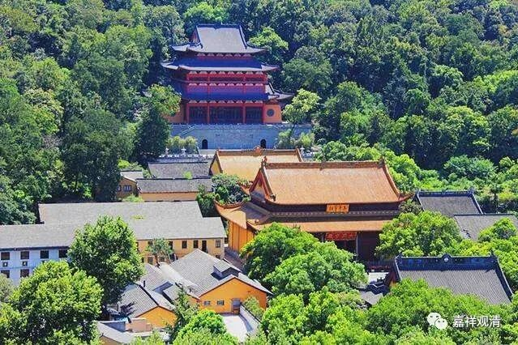
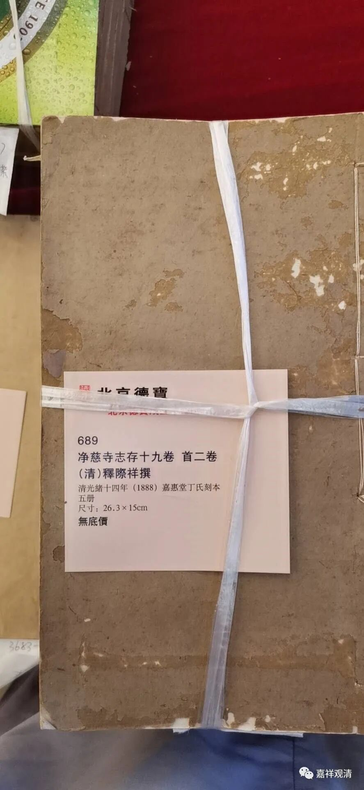
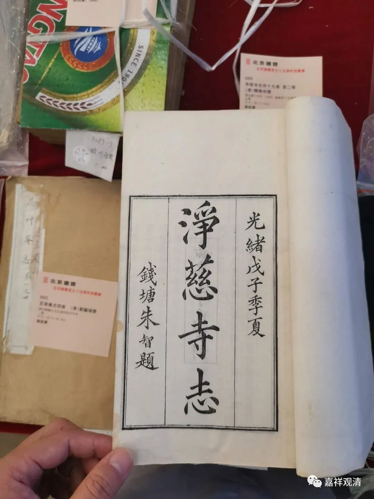
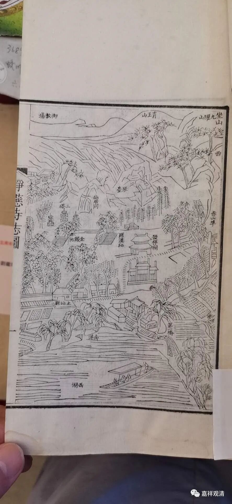
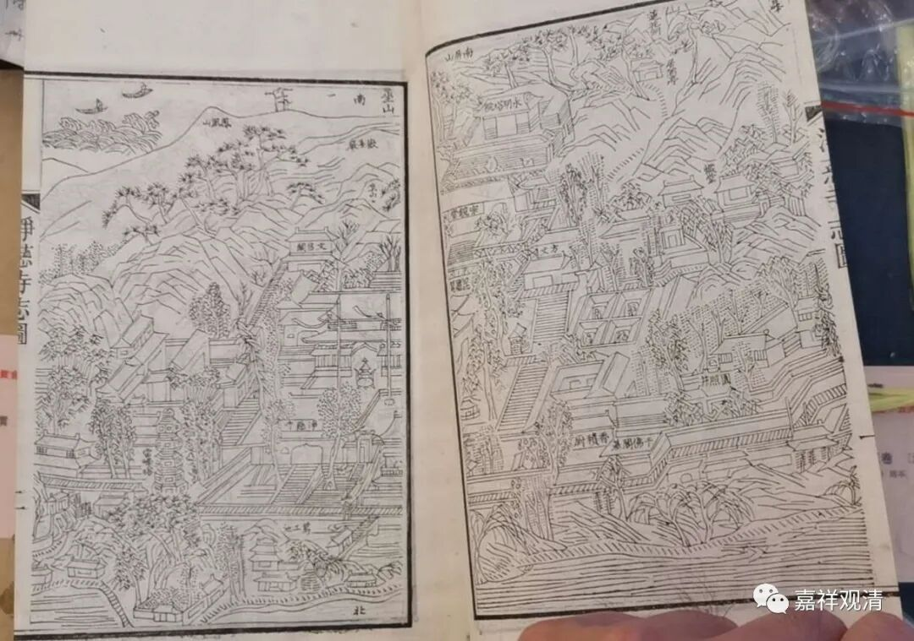
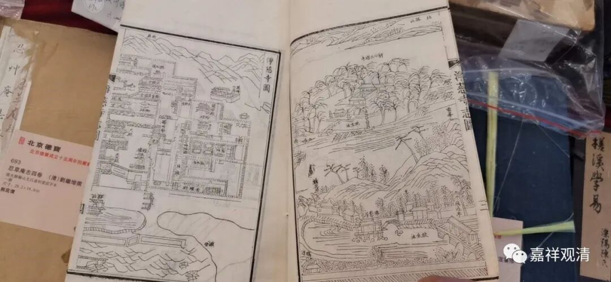
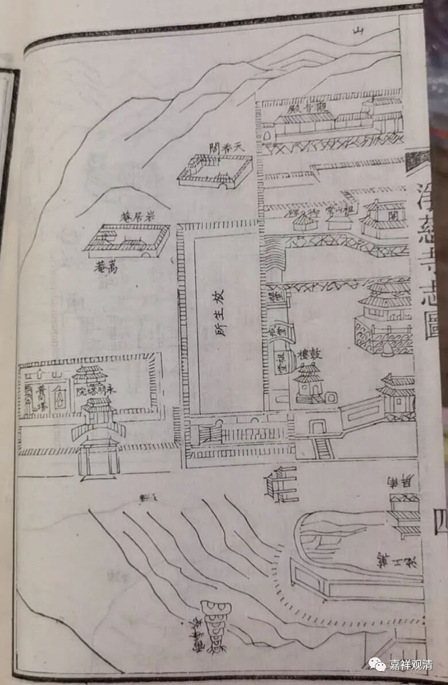
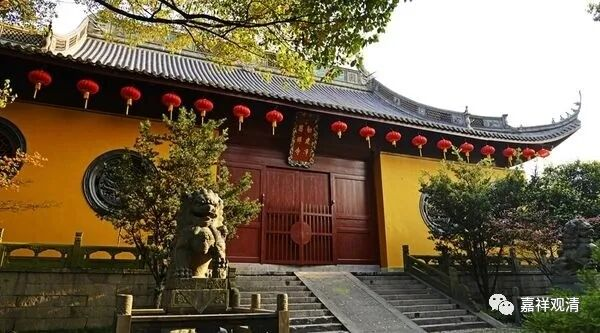
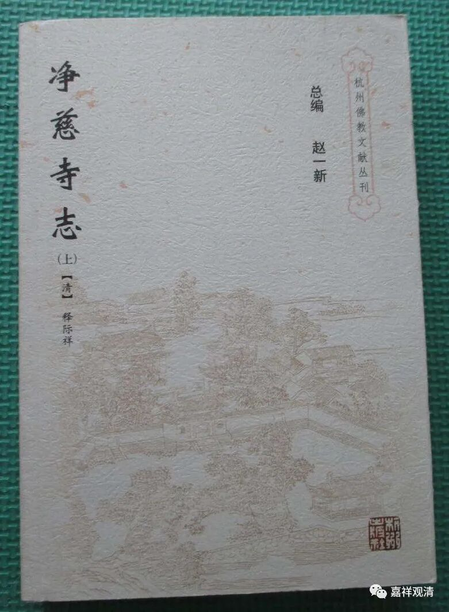

忙里偷闲，今天还去看了一下德宝古籍拍卖的预展。

佛教的经书以外，最近还关注了一下相关的地方志和一些寺院的寺志。这次看到这本——《净慈寺志》。

西湖十景中的“南屏晚钟”说的就是这个净慈寺。那首《晓出净慈寺送林子方》想必大家还记得，说的也是这个净慈寺。

我做过一个愚庵智及禅师的《年谱》，愚庵智及禅师就曾担任过杭州净慈寺的住持，所以我对净慈寺还是有点关注的，看到这本书还有点小激动，颇有准备明天去举牌的“冲动”。

书的版式、版画真是不错。

所以想先查一下净慈寺的高僧住持历代祖师，看看有没有关于愚庵智及禅师的记载。于是按卷翻检……

还好今天仔细了这么一回，翻检之下，这本《净慈寺志》对我而言那可以称得上“精华全无”了——因为中间缺了四卷，而这四卷正是寺院的历代住持和法脉传承的那部分！——原来这里的是一个残缺的本子，怪不得会“无底价拍卖”呢。

我记得我们图书馆有现代印刷本的《净慈寺志》.

这次回去我要认真读读这段，找找看愚庵智及禅师，看看有什么新的资料可以编进年谱的（之前是忘了这茬儿了）。

