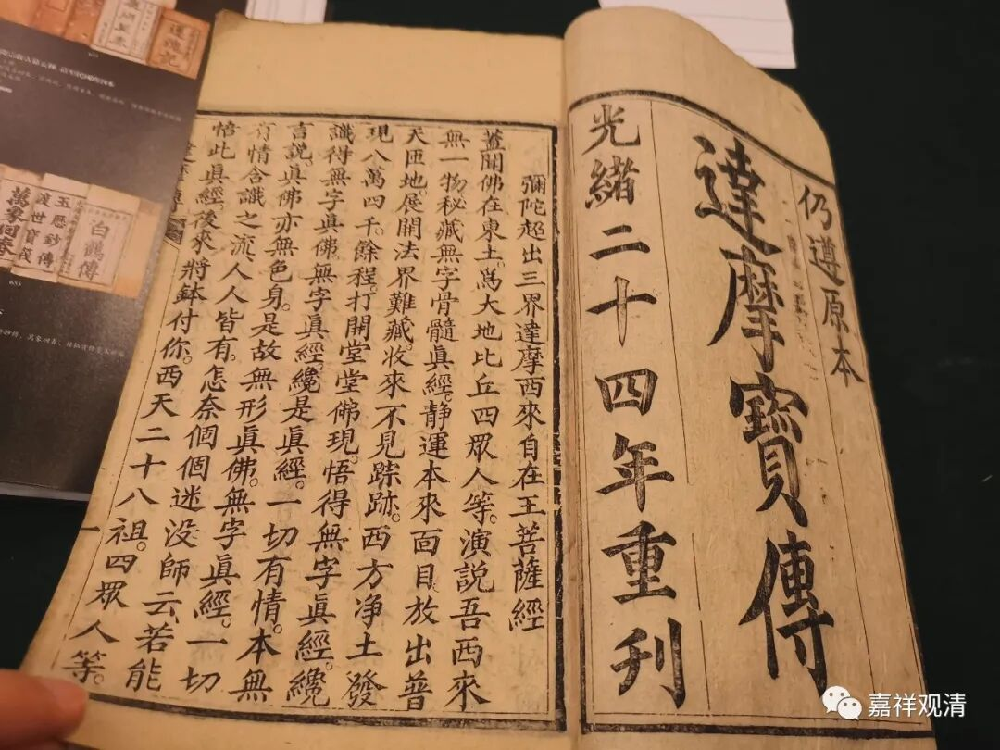
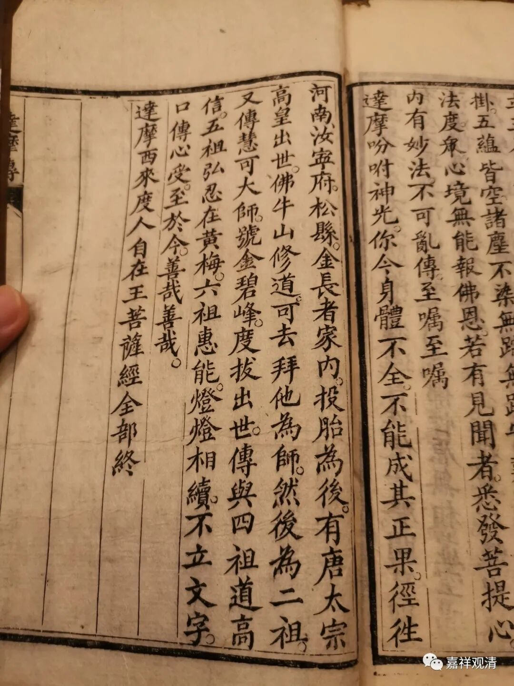

看到一部清末刊刻的《达摩宝传》（《宝传》，当即《宝卷》《宝传》和《宝卷》何种为其最初的形式，我颇怀疑《宝传》更对题。），据说这件民间宗教的“宝卷”来自云南……

翻到最后一页，令我有了“意外”的惊喜，关于禅宗最初六代授受原来还有这样一个民间版本。

《达摩宝传》说：

**“达摩吩咐神光：你今身体不全，不能成其正果。径往河南汝宁府松县金长者家内，投胎为后，有唐太宗高皇出世，佛牛山修道，可去拜他为师，然后为二祖。又传慧可大师，号金碧峰，度拔出世，传与四祖道高信，五祖弘忍在黄梅。六祖慧能，灯灯相续，不立文字，口传心授至于今。善哉善哉。”**

这是说，

一：神光断臂了，身残，不能成正果；

二：神光你去投胎，下辈子再去修行

三：唐太宗转世在佛牛山（伏牛山），他是初祖

四：你去拜他为师，你是二祖

五：你把法传给慧可，他叫金碧峰（民间传说中重要的禅宗祖师）他是三祖（禅宗的三祖确实语焉不详。）

五：四祖道信。（“道—高—信”，就是“道信”这两个字念长了音的结果），五祖弘忍，六祖慧能。

这里，民间记忆里的禅宗传承是这样的：

初祖唐太宗转世（不是达摩本人，达摩是授记者）；二祖是转世的神光；三祖是慧可，又叫金碧峰；四祖道信；五祖弘忍；六祖慧能。

真是没想到，禅门的“六祖授受”，还有这个民间版本，真是有趣得很。

