查阅古籍拍品的时候，有人问我这写的是什么。

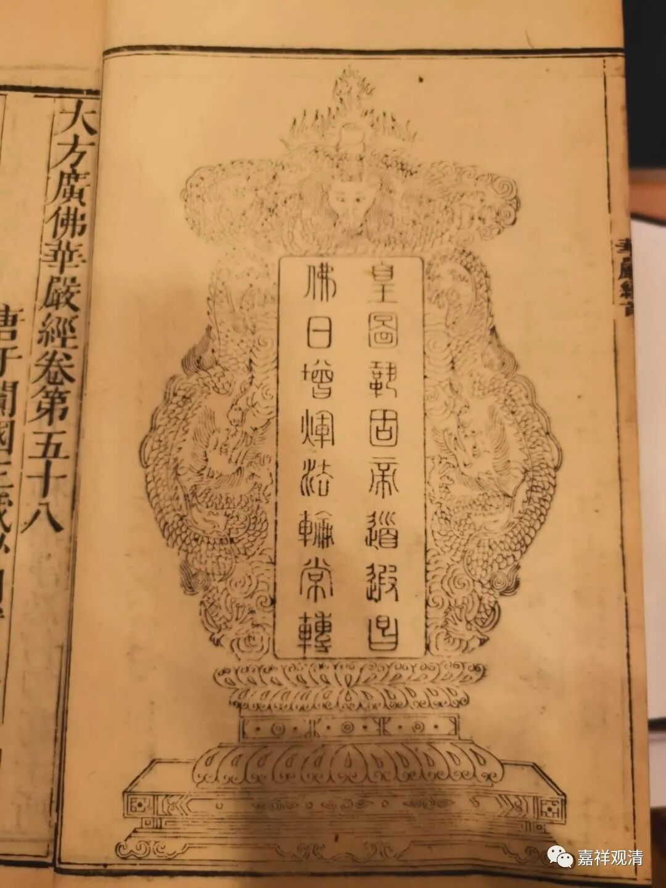

这是佛教刻经当中常见的一个牌子，一般放在经文前面的，记得也有放在最后的，写的是“皇图巩固，帝道遐昌，佛日增辉，法啥常转”。帝制时代，这是常见的，是标配。

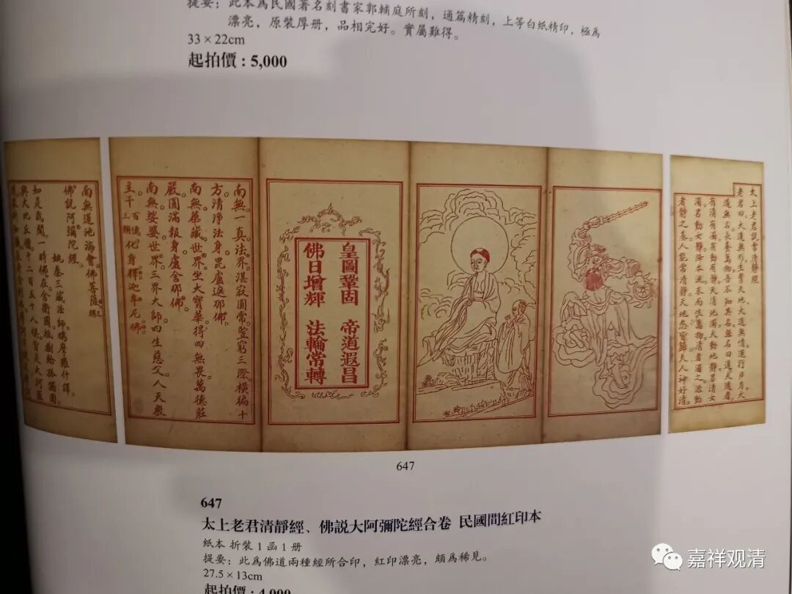

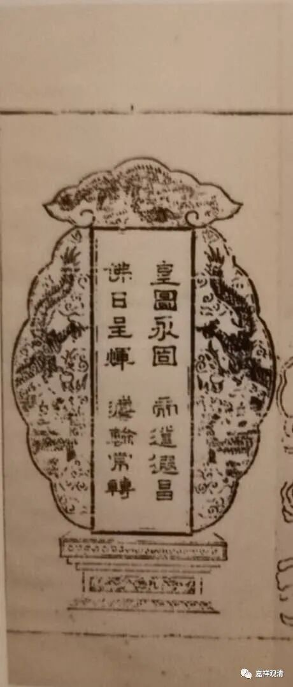

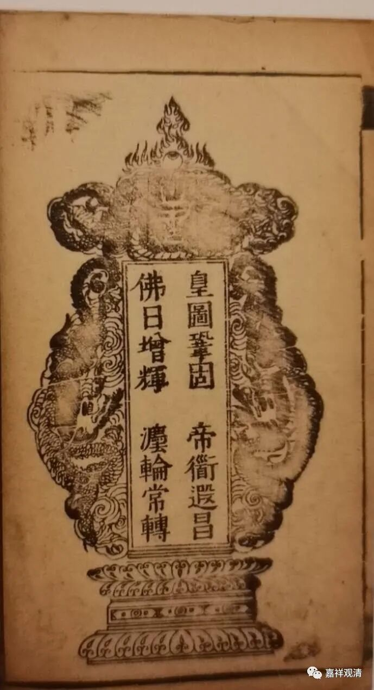

这不仅在刻印的佛经当中有，也有其他的样式，比如：

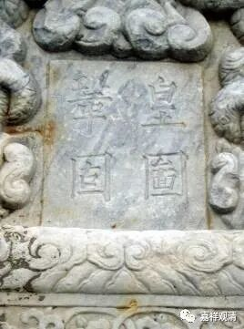

寺院碑刻篆额

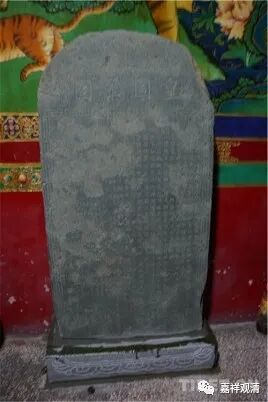

日喀则关帝庙的碑刻篆额

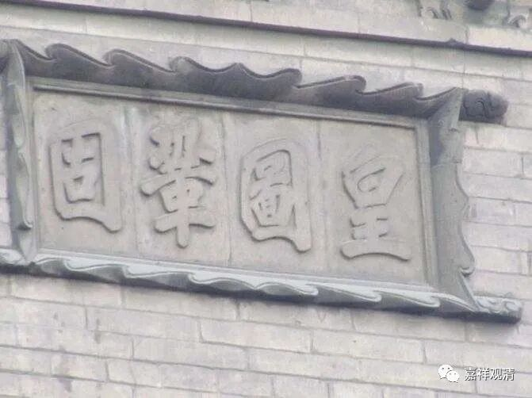

砖雕

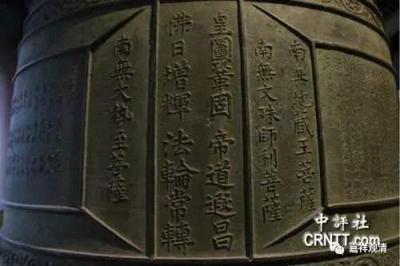

寺院铜钟

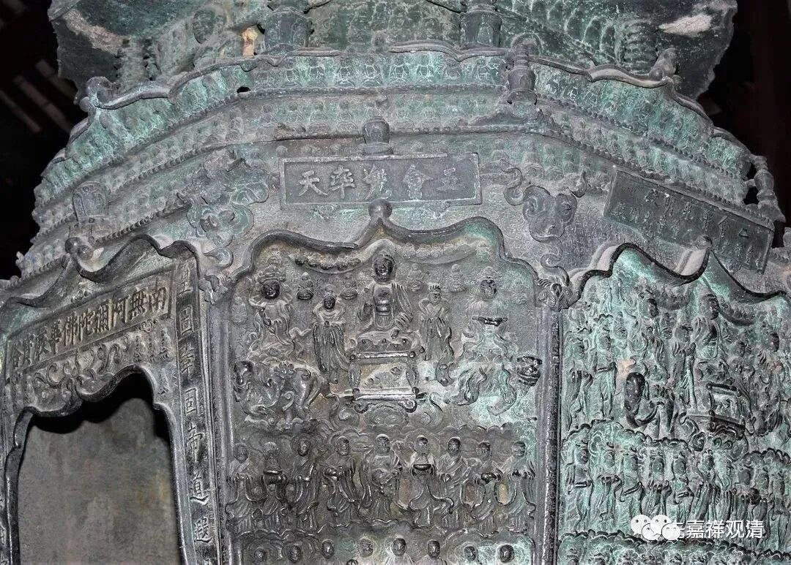

甚至还有道教版本：

《玄门日颂》（类似我们《禅门日颂》《佛教念诵集》）：

“上坛齐举步虚声，祝国迎祥竭寸诚。

当日陈情金阙内，今朝香霭玉炉焚。

皇图巩固山河壮，帝道遐昌日月明。

万民瞻仰尧舜日，岁稔丰登乐太平。”

我见过有民国时期的版本，是：

“国基巩固，民道遐昌”

还有很多由此衍生出的新版本：

“国图巩固，治道遐昌……”

“国图巩固，证道遐昌……”

“国基永固，治道遐昌……”

“国基永固，正道遐昌……”

一般，这个牌还会搭配一个“万岁牌”

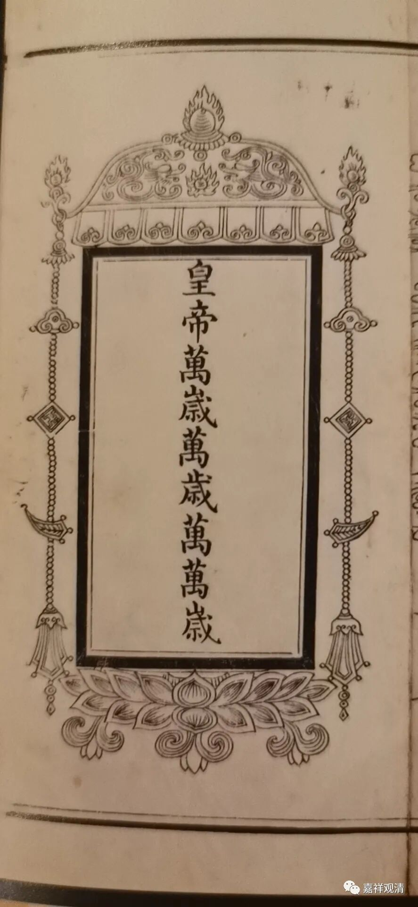

“万岁牌”也有其他版本。

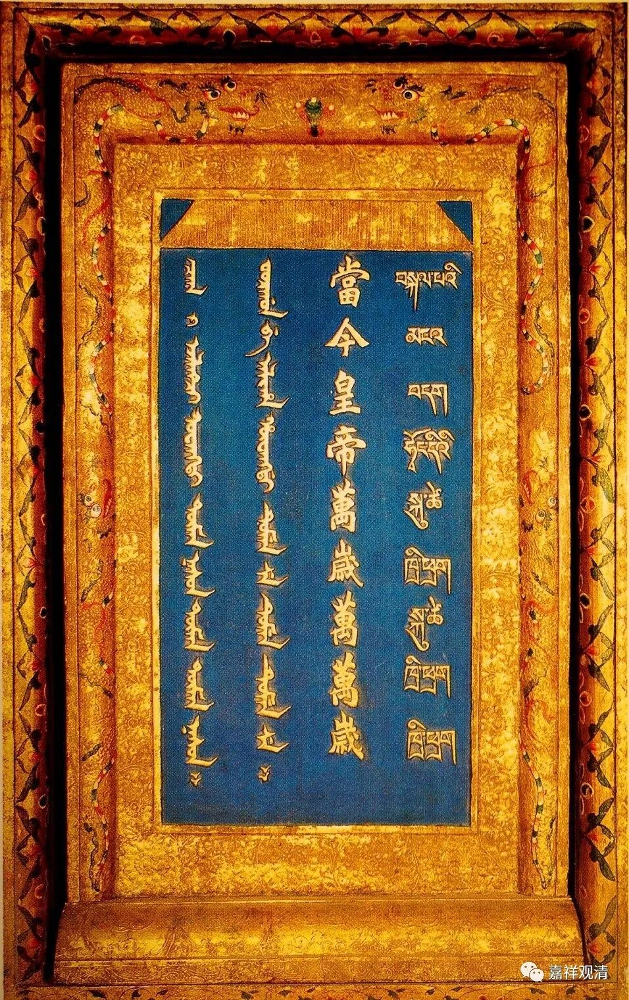

这是像匾一样挂着的。

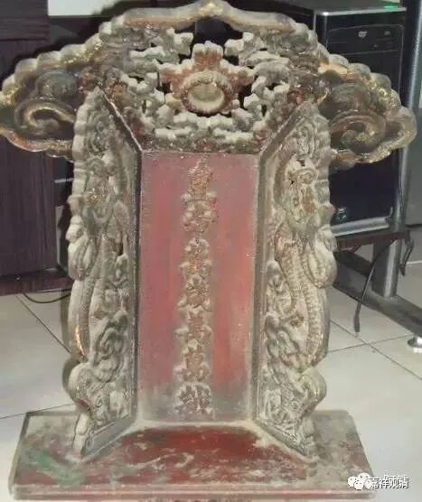

这是放桌上供着的。

 这都是做人……

