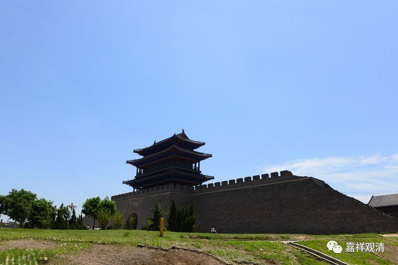

**《微课佛教史》90·3**

玄奘法师从成都出发，往东，过了三峡，就来到了荆州——就是今天的湖北荆州那一带。荆州现在的重要性已经不像以前了，以前荆州是非常重要的地点。我们现在好像听说沙市这个名字还更多一点，荆州——沙市。

玄奘法师那个时候在江湖上已经很有名气了，学习的时间也很长了。他来到荆州以后，当地的僧俗就留他讲经，他就在荆州停下来了。这样看起来的话，应该是春天下来，夏天的时候估计是在夏安居，然后一直到冬天。从夏天到冬天，就一共讲了三遍的《摄大乘论》和阿毗达磨（毗昙）。具体是什么毗昙呢？好像不是很清楚，很有可能是《杂心论》这一类，有部的毗昙，讲了三遍。

如果以现在的角度来看《杂心论》或者《摄大乘论》，三、五个月要讲三遍还真不容易。其实我们一直谈到这个问题的，玄奘法师很有可能就是讲玄义——就是讲这些经论的主要内容，或者导论性质的。我们经常看到隋唐时期的法师们，说他们一生讲某部经几百遍，讲其它部经几百遍，应该都是讲玄义这种性质的，只是讲其中的部分内容，不一定是一个字一个字地全部讲。

玄奘法师在荆州讲经的时候已经引起了唐王朝上层的关注，所以当时的二字王（我们小时候听评书里说又“一字并肩王”，是吧？一个字的王比如秦王，就比两个字的王，比如汉中王，要“大”）——汉阳（两个字）王李瓌也来听他的课，而且供施得很多，但是玄奘法师都没有接受，按照传统来说，这些供施就留在寺院里面用于建设寺院。因为整个隋末国家大乱，寺院里有很多的东西要恢复，而且之前又经历了北周的灭佛运动。（估计玄奘法师应该也是这么想的。）我碰到有些传统的师父也是这样，讲经以后的供养并不带走，全部留在当地做寺院建设、僧院开支，这也是一个传统……现在，这种传统正在隐没中……

好，今天的佛教史就讲到这里，谢谢大家！

