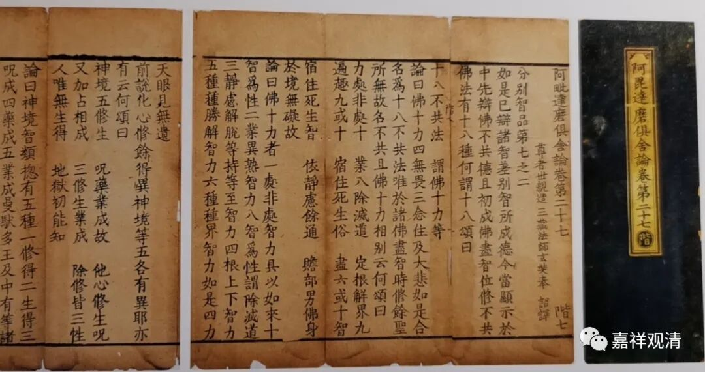

新闻说，某地两女争子，一女提供卵子，一女怀胎生子（二者为女同）。法院将孩子判与怀胎者。

类似的事情，一千五百年前的佛教就讨论过。

据玄奘译世亲（公元四世纪到五世纪）《阿毗達摩俱舍論》卷第十八说：

**“母谓因彼血……**

** 设有女人羯剌蓝堕，余女收取置产门中生子。杀，何成害母逆？因彼血者身生本故。诸有所作应谘后母，能饮能养能长成故。”**

《俱舍论》提出“母谓因彼血”，就是说，世亲论师认为：确定是否是“生母”，是看基因（因彼血），不是看怀胎。文中举了一个例子，说，假如有女人刚怀上几天就“掉”了，被另一个女性置入胎中，而后产子，那么这两个女子，谁是孩子的生母呢？《俱舍论》说，杀“因彼血者”成逆罪——就是说，提供基因的是孩子的生母。但是《俱舍论》继续补充说，这个孩子所有的事情应该听后面那位女子的，因为恩养的恩情重。

也就是说，如果照《俱舍论》来判上面的“二女争子案”，会是这样的结果：认定提供卵子的那个是“生母”，而把孩子判给怀胎者（“生养”之母）——因为“诸有所作应谘后母”，显然“后母”的想法是由自己获得抚养权。

众贤论师的意思和世亲论师基本差不多（而做了“补充”。）

如《顺正理论》说：

** “设有女人羯剌蓝堕，余女收取置产门中生，子杀何成害母逆因？彼血生者，识托方增故。第二女人但如养母，虽诸所作皆应谘决，而害但成无间同类。”**

及《显宗论》说：

** “设有女人羯剌蓝堕，余女收取置产门中，生子杀何成害母逆？因彼血生者，识托方增故。第二女人但如养母，虽诸所作皆应谘决，而害但成无间同类。故唯人趣结生胜缘，害成害母逆，非唯持养者。”**

《顺正理论》说“上座”室利逻多有异议，他认为** “设有如斯，害后成逆，弃重恩故；害前不然，于子重恩非关彼故。”**室利逻多的意思是：如果真有这类事情，也是后面那个怀胎的女子算“生母”，因为重要。室利逻多的观点被众贤论师批评没分清楚主要原因和次要原因。

记得后来戒律中间还真的举出了一个类似的实例，来证明可以有如此奇特之事：有女人怀孕没几天就“掉”了，另一个女人偶然捡到洗洗塞……后来还真生出来了——说实话我很怀疑这个故事是编得符合“考题”，但今天的现实中确实有这样的实例了……

